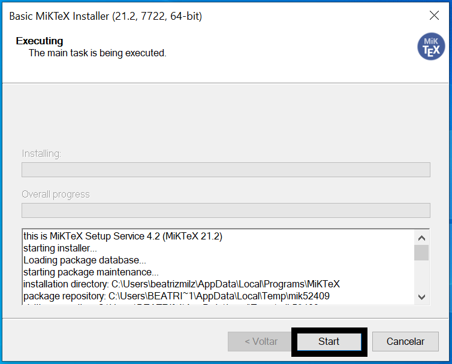

# Instalação {#instalacao}

Nesta seção, abordaremos como instalar o R e o RStudio no Linux e no Windows. Também discutiremos sobre a instalação de pacotes no R.

## Instalação do R {#instalacao-do-r}

A instalação padrão do R é feita a partir do CRAN, uma rede de servidores espalhada pelo mundo que armazena versões idênticas e atualizadas de códigos e documentações para o R. 

> Sempre que for instalar algo do CRAN, utilize o servidor (*mirror*) mais próximo de você.

### No Windows

Para instalar o R no Windows, siga os seguintes passos:

1. Acesse o CRAN: https://www.r-project.org/

2. No menu à esquerda, encontre a opção **Download** e clique em **CRAN**.

3. Escolha a opção de servidor (*mirror*) mais próxima de você. 

4. Clique na opção **base**.

5. Na nova página, clique em **Download R x.x.x for Windows*, sendo x.x.x o número da versão que será baixada. Se você teve algum problema com o download, tente escolher outro servidor no passo 3.

6. Feito o download, clique duas vezes no arquivo baixado e siga as instruções para instalação.

> Na etapa de escolher a pasta de destino da instalação, se você escolher um local que não esteja dentro da sua pasta de usuário, você precisará de acesso de administrador. Se escolher uma pasta dentro da sua paste de usuário, não precisará.

### No Linux

Como a instalação no Linux depende da distribuição utilizada e, em geral, pessoas que utilizam Linux são mais experientes, vamos informar apenas as coordenadas até as instruções/arquivos. Se você tiver alguma dificuldade durante o processo, por favor envie a sua dúvida para a nossa [comunidade](https://discourse.curso-r.com/). Faremos o possível para ajudar.

1. Acesse o CRAN: https://cran.r-project.org/

2. No menu à esquerda, encontre a opção **Download** e clique em **CRAN**.

3. Escolha a opção de servidor (*mirror*) mais próxima de você.

4. Clique em *Download R for Linux*.

5. Clique no link referente à distribuição que você utiliza.

6. Siga as instruções contidas na página para instalar o R. Se você teve algum problema com o download, tente escolher outro servidor no passo 3.

### No Mac

Para instalar o R no Mac, siga os seguintes passos:

1. Acesse o CRAN: https://www.r-project.org/

2. No menu à esquerda, encontre a opção **Download** e clique em **CRAN**.

3. Escolha a opção de servidor (*mirror*) mais próxima de você.

4. Na nova página, clique em **Download R for (Mac) OS X*.

5. Clique na versão do R que você quer baixar (geralmente queremos baixar a mais recente). O objetivo aqui é baixar um arquivo do tipo "R-x.x.x.pkg", sendo x.x.x o número da versão que vamos instalar. Se você teve algum problema com o download, tente escolher outro servidor no passo 3.

6. Feito o download, clique duas vezes no arquivo baixado e siga as instruções para instalação.


## Instalação do RStudio {#instalacao-do-rstudio}

Agora vamos instalar a versão *open source* do RStudio, a IDE que utilizaremos para escrever e executar códigos em R. 

Para instalar o RStudio no Windows, siga os seguintes passos:

1. Acesse a página de downloads da RStudio: https://rstudio.com/products/rstudio/download/#download

- Se você tiver acesso administrador, baixe a versão referente ao seu sistema operacional que está na lista de *All Installers*.

- Se você não tiver acesso de administrador, baixe a versão referente ao seu sistema operacional que está na lista de *Zip/Tarballs*.

#### Instalando se você for administrador {-}

2. Clique duas vezes no arquivo que você baixou da página do RStudio e siga as instruções de instalação.

#### Instalação se você não for administrador {-}

2. Descompacte o arquivo baixado no passo anterior. Geralmente isso pode ser feito clicando no arquivo compactado com o botão direito do mouse e clicando na opção *descompactar* ou *extrair*.

3. Após a descompactação ter sido finalizada, você terá uma pasta chamada: `RStudio-x.x.x`, em que x.x.x é o número da versão baixada. Abra essa pasta e entre na subpasta com nome `bin`. 

4. Procure pelo arquivo chamado `rstudio` e clique duas vezes. Isso abrirá o RStudio. Recomendamos fixar o programa na barra de tarefas para não precisar repetir essa etapa sempre que for abrir o programa.

**Observação**: se você excluir a pasta que extraímos, o RStudio irá parar de funcionar.


## Instalação de softwares adicionais {#instalacao-adicionais}

Os softwares descritos anteriormente são suficientes para realizar as tarefas básicas em R. Porém, principalmente quando tratamos de [relatórios com R](#relatorios), alguns softwares adicionais podem ser necessários em casos específicos! A seguir citamos alguns destes softwares, em quais casos eles são necessários e/ou úteis, e instruções sobre como instalá-los.

### LaTeX

O $\LaTeX$ é um software para renderização de documentos PDF e também uma linguagem de programação. É bastante usada na academia para produção de artigos científicos. 

No R, o LaTeX aparece quando queremos gerar relatórios e apresentações em PDF, a partir de um documento RMarkdown. Na prática, o RMarkdown é transformado para LaTeX através do software [*Pandoc*](https://pandoc.org)[^pandoc], que por sua vez é processado para gerar o PDF. Portanto, para gerar um relatório em PDF através do RMarkdown, precisamos ter alguma ferramenta de LaTeX instalada.

[^pandoc]: O Pandoc já vem dentro do próprio RStudio, então não é necessário instalar este *software*.

A recomendação das pessoas que desenvolvem o RMarkdown é a utilização do [`tinytex`](https://yihui.org/tinytex/), uma distribuição leve do LaTeX. 

```r
install.packages('tinytex')
tinytex::install_tinytex()  # instalar o TinyTeX
```

Caso você encontre algum problema para instalar o TinyTex, também é possível instalar outros editores de LaTex. A seguir estão apresentadas algumas opções!

#### No Windows

Uma distribuição de LaTex que apresenta versão para Windows é o MiKTeX. 

1. Para instalá-lo, primeiramente faça o download do arquivo `.exe` [através deste link](https://MiKTeX.org/download#win), escolhendo a versão de instalação para Windows. 

2. Abra o arquivo baixado. Uma janela irá abrir, e a primeira etapa de instalação é a "Copying Conditions". Nesta etapa você deve selecionar a opção **"I accept the MiKTeX copying conditions"** e clicar em **"Avançar"**.

```{r echo=FALSE, out.width="80%", fig.align='center'}

```

3. A próxima etapa da instalação, chamada de "Installation Scope",  você deve escolher em qual usuário o software deve ser instalado. Selecione a primeira opção (**"Install MiKTeX only for me.**") para que o MiKTeX seja instalado apenas no seu usuário atual no computador. Essa é a opção recomendada. Então clique em **"Avançar"**. 

```{r echo=FALSE, out.width="80%", fig.align='center'}

```

4. Na etapa "Installation Directory", escolha o diretório em que o MiKTeX será instalado. Caso tenha dúvidas sobre isso, não altere nada e utilize o caminho padrão de instalação. Então clique em **"Avançar"**. 

```{r echo=FALSE, out.width="80%", fig.align='center'}

```

5. Na etapa "Settings", utilize as configurações padrão e clique em **"Avançar"**. 

```{r echo=FALSE, out.width="80%", fig.align='center'}
knitr::include_graphics("img/instalacao/miktex_windows/win_miktex4.png")
```

6. Na etapa "Review", é apresentado as configurações escolhidas anteriormente. Clique em **Start** para que a instalação seja começada. 

```{r echo=FALSE, out.width="80%", fig.align='center'}
knitr::include_graphics("img/instalacao/miktex_windows/win_miktex5.png")
```

7. O processo de instalação será realizado, e pode demorar alguns minutos. Duas barras verdes aparecerão para demonstrar a porcentagem da instalação já realizada. Quando essa etapa terminar, as barras ficarão cinza e o você deverá clicar no botão **Start**.

```{r echo=FALSE, out.width="80%", fig.align='center'}

```


8. Na etapa "Update Check", apresentará a opção de buscar por atualizações. Mantenha o botão **"Check for updates now"** selecionado, e clique no botão **Start**.

```{r echo=FALSE, out.width="80%", fig.align='center'}

```

9. A próxima janela mostrará uma mensagem dizendo que a instalação foi completa. Clique no botão **Close** para fechar essa janela.

```{r echo=FALSE, out.width="80%", fig.align='center'}
knitr::include_graphics("img/instalacao/miktex_windows/win_miktex8.png")
```

10. Abra o MiKTeX console através do menu Iniciar do Windows. No menu lateral, escolha a opção "Updates". Clique em **"Check for updates"**, e o MiKTeX buscará informações sobre as possíveis atualizações necessárias. Então clique em **"Update now"**, para que as atualizações sejam baixadas e instaladas. Essa etapa também pode demorar um pouco! 


```{r echo=FALSE, out.width="80%", fig.align='center'}

```

11. Após instalar as atualizações, o MiKTeX avisará que ele precisa ser fechado. Abra-o novamente. Após este processo, o MiKTex estará pronto para uso.

#### No Linux

No linux, a forma mais direta de garantir que temos o LaTeX na máquina com todas as dependências é instalando o `texlive-full`. No Ubuntu, basta rodar

    sudo apt install texlive-full

> **Importante**: o texlive-full é uma fora "bruta" de instalar tudo do LaTeX, e pode ocupar mais do que 5GB do seu disco! Então tome cuidado e procure alternativas, como as descritas [neste site](https://linuxconfig.org/how-to-install-latex-on-ubuntu-18-04-bionic-beaver-linux).

#### No Mac
 
Uma distribuição de LaTex que apresenta versão para Mac é o MikTex. Para instalá-lo, primeiramente faça o download do arquivo `.dmg` [através deste link](https://miktex.org/download#mac). [Este tutorial](https://miktex.org/howto/install-miktex-mac) apresenta todos os passos de instalação no Mac, porém abaixo também vamos descrever os passos:

1. Faça o download do arquivo `.dmg` [através deste link](https://miktex.org/download#mac), escolhendo a versão de instalação para Mac.

2. Abra o arquivo baixado. Uma janela irá abrir, e você deve arrastar o ícone "MiKTeX Console" para a pasta "Applications" (como mostrado na animação abaixo, sendo necessário arrastar apenas uma vez). 

```{r echo=FALSE, out.width="50%", fig.align='center'}

```


3. No Launchpad (menu de arquivos instalados), procure o ícone do "MiKTeX Console" e abra-o. Você também pode usar a pesquisa do Mac (utilizando o atalho Command + Barra de espaço), pesquisando por MiKTeX para abrir o software.

4. Ao abrir pela primeira vez, o MiKTeX solicitará que você selecione uma opção para que a instalação seja completada. Selecione **"Finish private setup"**, e isso fará com que o MiKTeX esteja disponível apenas no seu usuário do computador. Após selecionar essa opcão, ele terminará a configuração, e aparecerá uma mensagem dizendo que o MiKTex será reiniciado. Espere até que ele reinicie. Ao final, aparecerá uma mensagem dizendo que é necessário fazer atualizações no MiKTeX.


```{r echo=FALSE, out.width="80%", fig.align='center'}
knitr::include_graphics("img/instalacao/miktex_mac/miktex-instalacao-1.gif")
```

5. No menu lateral, escolha a opção "Updates". Clique em **"Check for updates"**, e o MiKTex buscará informações sobre as possíveis atualizações necessárias. Então clique em **"Update now"**, para que as atualizações sejam baixadas e instaladas. 


```{r echo=FALSE, out.width="80%", fig.align='center'}
knitr::include_graphics("img/instalacao/miktex_mac/miktex-instalacao-2.gif")
```


6. Após instalar e atualizar, o MiKTeX está pronto para uso!


### Office

No R, os arquivos do pacote office também são gerados a partir do Pandoc. Por isso, não é necessário instalar nenhum software adicional para gerar os documentos.

No entanto, para abrir documentos do Office, como `.pptx` e `.docx`, é necessário ter o Office ou alguma alternativa aberta instalados.

Além disso, por conta das particularidades desses tipos de documentos, muitas vezes é necessário instalar pacotes adicionais, que não vêm com o `{rmarkdown}`. Abaixo, segue uma lista de pacotes usualmente utilizados nesse contexto:

- `{officedown}`.
- `{officer}`, que é uma dependência do `{officedown}`.
- `{flextable}`, para geração de tabelas.
- `{svglite}`, para renderizar gráficos em SVG.

> Uma dica adicional: É possível gerar gráficos *editáveis* nos documentos Office! Dessa forma, você pode gerar o relatório bruto e depois editar manualmente. Para isso, siga o tutorial deste [vídeo do YouTube](https://www.youtube.com/watch?v=Yprmq8AUf8g). Referência: [link](http://www.sthda.com/english/wiki/saving-high-resolution-ggplots-how-to-preserve-semi-transparency).

#### No Windows

O LibreOffice pode ser instalado através [deste link](https://pt-br.libreoffice.org/baixe-ja/libreoffice-novo/), escolhendo o sistema operacional "Windows" e clicando em "Baixar" e executando o arquivo baixado.

#### No Linux

No linux, a forma mais fácil de abrir documentos provenientes do Office é utilizando o LibreOffice:

    sudo apt install libreoffice

> O LibreOffice possui algumas limitações quando comparado ao software da Microsoft. Por exemplo, as tabelas que saem bonitas no Office podem ficar desformatadas no LibreOffice.

> o LibreOffice 7.1 não está ainda no aptitude. Se quiser instalar essa versão, é possível baixar o arquivo `.deb` no [site da ferramenta](https://www.libreoffice.org).

#### No Mac

O sistema operaciona MacOS disponibiliza o [iWork](https://www.apple.com/br/iwork/), que é composto pelas ferramentas Numbers, Pages e Keynote.  Esses programas possibilitam abrir arquivos provenientes do Office.

Outra opção é a utilização do LibreOffice. 
1. Primeiro, faça o download do arquivo `.dmg` de instalação, através [deste link](https://pt-br.libreoffice.org/baixe-ja/libreoffice-novo/), escolhendo o sistema operacional "MacOS" e clicando em "Baixar". 

2. Após baixar o arquivo, abra-o. Uma janela irá abrir (como na imagem a seguir).  Você deve arrastar o ícone "LibreOffice" para a pasta "Applications" (como mostrado na animação abaixo, sendo necessário arrastar apenas uma vez). 

```{r echo=FALSE, out.width="50%", fig.align='center'}

```

3. O LibreOffice será instalado e você poderá utilizá-lo abrindo através do Launchpad (menu de arquivos instalados), ou também  utilizando a pesquisa do Mac (utilizando o atalho Command + Barra de espaço), pesquisando por LibreOffice para abrir o software.


### Pagedown e Chrome

O `{pagedown}` é uma alternativa recente para produzir arquivos em HTML utilizando o [`paged.js`](https://www.pagedjs.org/), uma biblioteca em JavaScript que torna um arquivo HTML muito parecido com um PDF. Com a ajuda do Chrome, é possível, inclusive, exportar o arquivo para PDF.

O `{pagedown}`, portanto, apresenta o melhor de dois mundos: a praticidade da extensão HTML e a portabilidade de arquivos PDF. Dessa forma, é possível gerar documentos PDF com formatos agradáveis sem depender do LaTeX.

No entanto, para gerar documentos PDF, é preciso utilizar um navegador. O navegador recomendado pelo `{pagedown}` é o [Chrome](https://www.google.com/intl/pt-BR/chrome/), tanto que o pacote já vem com a função `pagedown::chrome_print()`, que pode ser utilizada para transformar um arquivo HTML ou RMarkdown em PDF.

> Se você já tiver o Chrome instalado na sua máquina, provavelmente tudo funcionará sem problemas. Se não tiver e não quiser instalar, é possível instalar somente o [headless Chrome](https://developers.google.com/web/updates/2017/04/headless-chrome).

> No linux, uma alternativa é instalar o projeto Chromium, que é quase que totalmente open source.

### Renderizando HTML widgets

Os HTML widgets são formas de ligar bibliotecas do JavaScript com pacotes do R. Isso permite gerar relatórios dinâmicos em HTML diretamente do R. O pacote `{htmlwidgets}` possui um conjunto de melhores práticas para criação dessas soluções.

No entanto, é comum utilizar HTML widgets em relatórios estáticos. Para isso, o R precisa de uma estratégia para tirar fotos estáticas dos widgets. Isso é realizado através do pacote `{webshot}`.

Você pode instalar o `{webshot}` executando o código abaixo:

```r
install.packages("webshot")
```
    
Para que o `{webshot}` funcione, no entanto, também é necessário ter o PhantomJS instalado na máquina. O PhantomJS é basicamente um navegador que roda totalmente no plano de fundo, possibilitando a captura de tela.

Para instalar o PhantomJS, execute o código abaixo:

```r
webshot::install_phantomjs()
```

### Blogdown

Para criar blogs utilizando o pacote `{blogdown}`, também é necessário instalar o Hugo, programa que renderiza sites estáticos.

Felizmente, essa tarefa é bem tranquila pois o `{blogdown}` já vem com um helper para isso. Basta executar o código abaixo e reiniciar a sua sessão do R para que o Hugo seja instalado:

```r
blogdown::install_hugo()
```

### Rtools

<!-- Adicionar explicação sobre o rtools. O que é? Quando é necessário? -->

Em algumas situações, é solicitado a instalação do software Rtools. Este software é apenas necessário para computadores que utilizem o sistema operacional Windows. Para instalá-lo, clique [neste link](https://cran.r-project.org/bin/windows/Rtools/) e faça o download do arquivo instalador referente à sua versão do Windows (32 ou 64 bits). Abra o arquivo baixado para realizar a instalação. 

