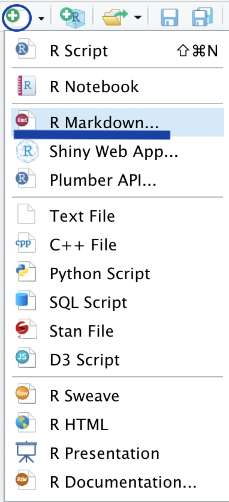
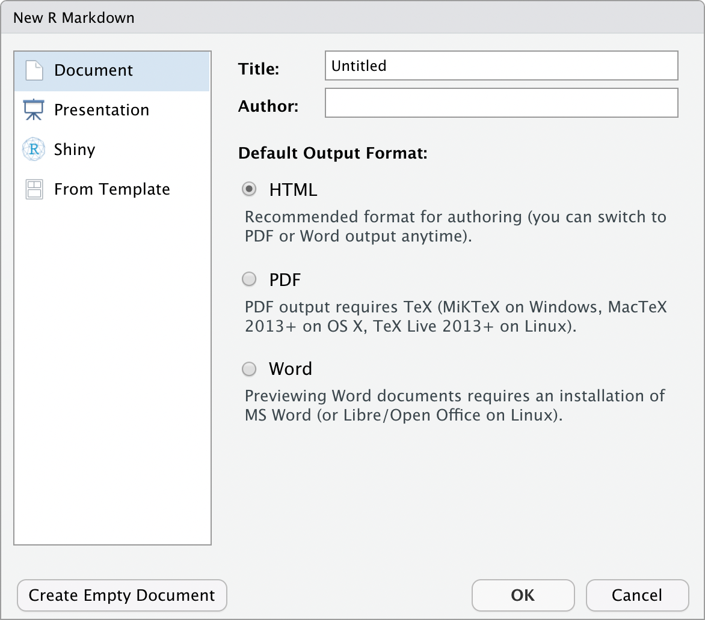
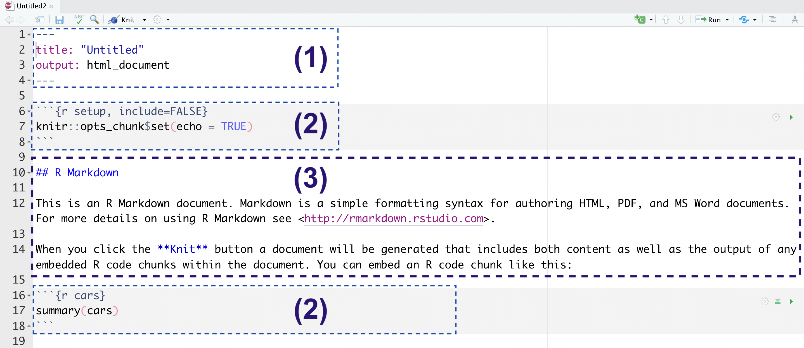

## R Markdown

O R Markdown é a junção da linguagem Markdown com o poder de códigos em R. A mágica acontece em arquivos do tipo `.Rmd`, onde é possível adicionar textos, códigos, resultados de códigos e muito mais!


### Criando um arquivo `.Rmd`

Falamos que mágica acontece em arquivos do tipo `.Rmd`, porém, como podemos criar esses arquivos?  Primeiramente, no menu superior, clique em **File** > **New File** > **R Markdown**, ou utilize os botões da interface gráfica, como mostrado na imagem a seguir:

```{r echo=FALSE, fig.align="center", fig.cap="Captura de tela da IDE RStudio", fig.alt="Captura de tela da IDE RStudio, mostrando os ícones usados para criar um arquivo R Markdown"}

```

Uma janela será aberta, chamada **New R Markdown**. Neste momento, iremos focar na seção inicial (**Document**). Nessa janela, é possível informar o título do relatório, o nome das pessoas autoras, e o formato em que deseja criar o relatório (sendo HTML, PDF ou Word). Caso queira gerar um PDF, será necessário instalar o LaTeX (saiba como no [capítulo sobre instalações adicionais](#instalacao-latex)).


Para facilitar o aprendizado, recomendamos que escolha a opção HTML, sendo que é possível alterar todos esses campos posteriormente. Para que o arquivo seja criado, é necessário clicar no botão **OK**.


```{r echo=FALSE, fig.align="center", fig.cap="Captura de tela da IDE RStudio", fig.alt="Captura de tela da IDE RStudio, mostrando a janela de escolha de opções para criar um arquivo R Markdown"}

```


### Estrutura do arquivo R Markdown

Quando criamos um novo arquivo `.Rmd` (como descrito na seção anterior), o arquivo vem com alguns conteúdos para nos ajudar a organizar corretamente.

O arquivo `.Rmd` possui a seguinte estrutura, ilustrada pela figura a seguir:

- 1) **YAML** - Uma seção de metadados, que apresenta códigos `YAML`. Essa seção apresenta informações que serão usadas para gerar o arquivo final, como por exemplo: título do relatório, autoria, data, formato gerado, etc. É necessário cuidado ao editar essa seção, pois coisas simples como indentação incorreta, fechamento incorreto de textos, etc, podem resultar em um erro ao gerar seu relatório. Essa seção deve estar sempre ao início do documento, e é delimitado por três traços no começo e no final: `---`.

- 2) **Chunks** - Nos campos de código (também chamados de *chunks*) podemos adicionar códigos em R (ou em algumas outras linguagens). Os chunks são delimitados por três crases, e a linguagem deve ser especificada entre chaves. Caso queira adicionar chunks com código em Python, é necessário ter o pacote [{reticulate}](https://rstudio.github.io/reticulate/) instalado. Exemplo de um chunk que apresenta código em R:


````md
```{r}`r ''`
1 + 1 
```
````


- 3) **Markdown** - Textos marcados com Markdown podem ser adicionados ao longo do relatório, fora das demarcações do YAMl e dos Chunks. Caso queira saber mais sobre como marcar textos com Markdown, é possível ler mais [na seção anterior deste capítulo](#markdown).


```{r echo=FALSE, fig.align="center", fig.cap="Captura de tela da IDE RStudio", fig.alt="Captura de tela da IDE RStudio, mostrando um novo arquivo R Markdown"}

```


### Adicionando conteúdo

Nesta seção, utilizaremos como exemplos alguns códigos envolvendo a base de dados de pinguins. A versão original deste dataset (em Inglês) está disponível no pacote [palmerpenguins](https://github.com/allisonhorst/palmerpenguins), e a versão traduzida para Português está disponível no pacote [dados](https://cienciadedatos.github.io/dados/).

```{r echo=FALSE, out.width="80%", fig.align='center', fig.cap="Conheça os Pinguins do dataset PalmerPenguins! Ilustração por <a href='https://github.com/allisonhorst/stats-illustrations'>Allison Horst</a>."}
knitr::include_graphics("assets/img/relatorios/lter_penguins.png")
```

Caso não tenha o pacote [dados](https://cienciadedatos.github.io/dados/) instalado, é possível instalar com o seguinte código:

```{r eval=FALSE, include=TRUE}
install.packages("remotes")
remotes::install_github("cienciadedatos/dados")
```


Agora carregue os pacotes necessários:

```{r pacotes, echo=TRUE}
library(dados)  # Pacote com bases de dados em Português
library(magrittr)  # Pacote para utilizar o Pipe %>%
```


#### Códigos em R

Ao analisar dados, escrevemos códigos que calculam estatísticas descritivas, geram gráficos e tabelas, entre outros.
Para adicionar esses resultados nos relatórios, não é muito prático adicionar manualmente o resultado final (copiando e colando, por exemplo), pois em caso de alguma mudança na base de dados, será necessário gerar novamente estes resultados e adicioná-los novamente!

<!--# Acho que esse trecho abaixo pode ser aprimorado. tem algumas palavras que repetem bastante! -->

Com RMarkdown, podemos adicionar códigos nos nossos relatórios que geram os resultados, assim a cada vez que compilarmos o relatório os códigos que geram estes resultados serão executados, e o relatório terá sempre os resultados atualizados.

Caso você queira que o código seja executado como código R, existem duas possibilidades:


-   **chunks de código** ou **campos de código** ( _chunks_ em Inglês), quando o código é executado em um campo de código em R.


-   **código em linha** (ou '*inline code*' em Inglês), quando o resultado aparece junto ao texto;

##### Campos de código (chunks) {-}

É possível adicionar campos de código utilizando a seguinte sintaxe:

````md
```{r}`r ''`
codigo em R aqui
```
````

Um exemplo de campo de código é o campo abaixo, onde é possível executar o código e visualizar o resultado.

**Exemplo:**

````md
```{r}`r ''`
 # calcula a média
media_massa_g <-
  mean(pinguins$massa_corporal, na.rm = TRUE) 

 # converte de gramas para kilogramas
media_massa_kg_completo <-
  media_massa_g / 1000 

 # arredonda o valor para ter uma casa decimal
media_massa_kg <- round(media_massa_kg_completo, 1)

 # exibe o resultado
media_massa_kg 
```
````

**Resultado:**

```{r echo=TRUE}
# calcula a média
media_massa_g <-
  mean(pinguins$massa_corporal, na.rm = TRUE) 

# converte de gramas para kilogramas
media_massa_kg_completo <-
  media_massa_g / 1000 

# arredonda o valor para ter uma casa decimal
media_massa_kg <- round(media_massa_kg_completo, 1)

# exibe o resultado
media_massa_kg 
```

Veja que no resultado obtivemos o código em R e também o resultado deste código. Dependendo do público alvo do relatório, não queremos mostrar códigos. É possível escondê-los (e fazer muito mais!) alterando as opções de chunks (ou _chunk options_ em Inglês). Veremos mais sobre isso posteriormente!

##### Inline code  {-}

Para que um resultado de código apareça ao longo do texto, é possivel usar a seguinte estrutura: `` `r ` `` .

**Exemplo:**

````md
A média da massa corporal dos pinguins é `r knitr::inline_expr('media_massa_kg') ` kg.

````


**Resultado:**

> A média da massa corporal dos pinguins é `r media_massa_kg` kg.


#### Imagens

Na seção anterior (sobre [Markdown](#markdown)), mostramos como é possóvel adicionar uma imagem em um relatório utilizando Markdown.

Porém, quando utilizamos arquivos RMarkdown também podemos adicionar imagens usando código em R, com a função `include_graphics` do pacote `knitr`.

Usando o  `knitr` é possível personalizar de forma mais intuitiva como a imagem aparecerá no arquivo final: você pode adicionar uma imagem utilizando como primeiro argumento a url da imagem ou o caminho onde ela está no projeto. Além disso, com as opções de chunks (ou _chunk options_ em Inglês), poderemos personalizar diversos atributos da imagem, como: legenda, tamanho, alinhamento, entre outros.

Veja o exemplo abaixo:

```{r echo=TRUE, out.width='30%', fig.align='center'}
knitr::include_graphics("assets/img/relatorios/dados-hex.png")
```

#### Tabelas

Na seção anterior (sobre [Markdown](#markdown)), foi apresentado como adicionar uma tabela utilizando Markdown.

Porém quando utilizamos arquivos R Markdown também é possível adicionar tabelas que resultam de códigos em R. 

Existem algumas funções diferentes para fazer isso. Para apresentar alguns exemplos, primeiramente vamos salvar uma versão  da base pinguins:

```{r message=FALSE, warning=FALSE}
media_massa <- pinguins %>% # usamos a base de pinguins
  # agrupamos por especie e ilhas
  dplyr::group_by(especie, ilha) %>%  
  # calculamos a média da massa corporal 
  dplyr::summarise(media_massa = mean(massa_corporal, na.rm = TRUE)) %>% 
  # criamos uma nova coluna, com a massa em kg, e arredondada com 2 casas decimais
  dplyr::mutate(media_massa_kg = round(media_massa / 1000, 2)) %>%  
  # removemos a coluna da massa em gramas
  dplyr::select(-media_massa)

# Apresentamos o resultado da tabela:
media_massa
```


Acima, a tabela é apresentada como ela é escrita no console do R. Porém essa forma não é elegante de ser apresentada em um relatório! Podemos utilizar funções de diferentes pacotes para que as tabelas fiquem formatadas de uma forma mais atraente:

- Utilizando o pacote `knitr`: função `kable()`

```{r exemplo-kable}
media_massa %>%
  knitr::kable()
```


-  Utilizando o pacote `DT`: função `datatable()`

```{r exemplo-DT}
media_massa %>%
  DT::datatable()
```

Os exemplos anteriores são as formas mais simples de apresentar as tabelas, porém cada pacote possibilita diferentes personalizações (por exemplo, alterar o nome das colunas, etc). Existem outros pacotes que permitem adicionar tabela nos relatórios em RMarkdown, como por exemplo:

  - [gt](https://gt.rstudio.com/) 

  - [reactable](https://glin.github.io/reactable/index.html) 
  
  - [flextable](https://davidgohel.github.io/flextable/articles/overview.html)
  
  - [kableExtra](https://cran.r-project.org/web/packages/kableExtra/vignettes/awesome_table_in_html.html) 
  
  <!-- Quais mais? -->
  
  
<!-- ### Opcoes de chunk - Adicionar depois -->

<!-- colocar depois: dicas - sobre ser reprodutivel, erros, caminhos, etc -->

<!-- erros comuns.. -->
<!-- #title: "Untitled' -->


### Dicas para o RStudio

A versão mais recente do RStudio possui uma ferramenta de edição de Markdown visual, que disponibiliza botões para editar o texto com Markdown.

Veja mais [neste post no blog da RStudio](https://blog.rstudio.com/2020/09/30/rstudio-v1-4-preview-visual-markdown-editing/), e também a animação disponível neste post:

```{r, echo=FALSE, out.width="80%", fig.cap="Demonstração do RStudio versão 1.4", fig.align='center'}
if (!knitr::is_latex_output()) {
  knitr::include_graphics("assets/img/relatorios/visualmode-demo.gif")
}
```

### Exercícios {- #exercicios-rmd}

**1.** Leia o [guia de referência do RMarkdown](https://rstudio.com/wp-content/uploads/2015/03/rmarkdown-reference.pdf) até o final.

**2.** Qual o propósito do YAML do documento?

**3.** Quais são as opções e resultados do parâmetro `results=`?

````md
```{r results='markup'}`r ''`
knitr::kable(head(cars))
```
````


