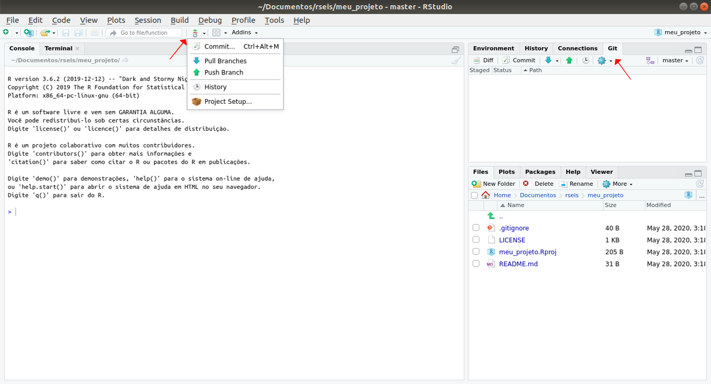
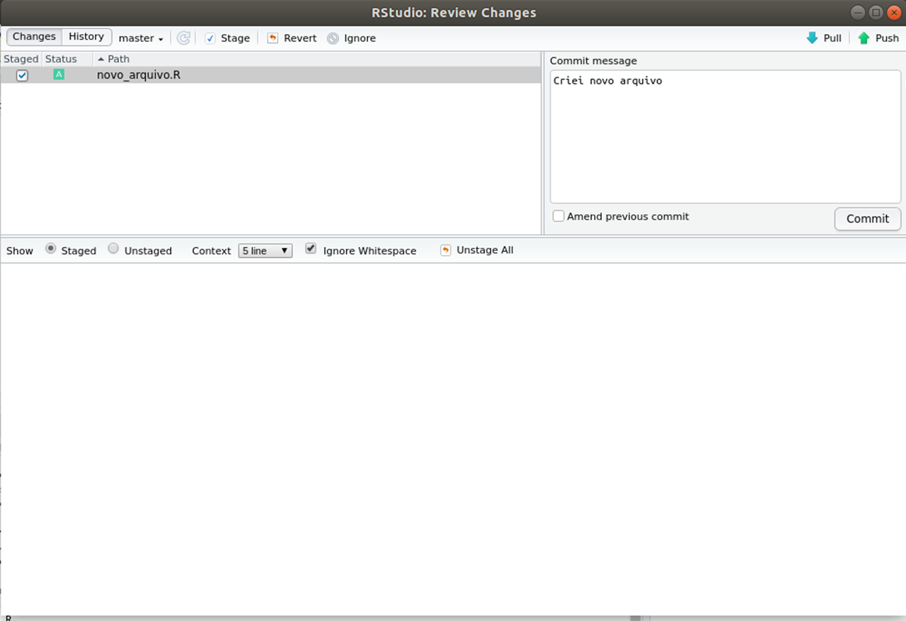

# RStudio {#rstudio}

O RStudio é sem dúvidas o mais completo ambiente de desenvolvimento para programação em R. Descubra aqui as funcionalidades do RStudio que nos permitem escrever códigos e analisar resultados de forma muito mais eficiente.

## Telas

Ao abrir o RStudio, você verá 4 quadrantes. Observe a figura abaixo.


Esses quadrantes representam o **editor**, o **console**, o **environment** e o **output**. Eles vêm nesta ordem, mas você pode organizá-los da forma que preferir acessando a seção *Pane Layout* da opção `Global options...` no menu `Tools`.

O editor e o console são os dois principais painéis do RStudio. Passaremos a maior parte do tempo neles.

- **Editor/Scripts**: é onde escrevemos nossos códigos. Repare que o RStudio colore algumas palavras e símbolos para facilitar a leitura do código.
- **Console**: é onde rodamos o código e recebemos as saídas. O R vive aqui!

Os demais painéis são auxiliares. O objetivo deles é facilitar pequenas tarefas que fazem parte tanto da programação quanto da análise de dados, como olhar a documentação de funções, analisar os objetos criados em uma sessão do R, procurar e organizar os arquivos que compõem a nossa análise, armazenar e analisar os gráficos criados e muito mais.

- **Environment**: painel com todos os objetos criados na sessão.
- **History**: painel com um histórico dos comandos rodados.
- **Files**: mostra os arquivos no diretório de trabalho. É possível navegar entre diretórios.
- **Plots**: painel onde os gráficos serão apresentados.
- **Packages**: apresenta todos os pacotes instalados e carregados.
- **Help**: janela onde a documentação das funções serão apresentadas.
- **Viewer**: painel onde relatórios e dashboards serão apresentados.

## Atalhos

Conhecer os atalhos do teclado ajuda bastante quando estamos programando no RStudio. Veja os principais:

- **CTRL+ENTER**: avalia a linha selecionada no script. O atalho mais utilizado.
- **ALT+-**: cria no script um sinal de atribuição (<-). Você o usará o tempo todo.
- **CTRL+SHIFT+M**: (%>%) operador *pipe*. Guarde esse atalho, você o usará bastante.
- **CTRL+1**: altera cursor para o script.
- **CTRL+2**: altera cursor para o console.
- **CTRL+ALT+I**: cria um chunk no R Markdown.
- **CTRL+SHIFT+K**: compila um arquivo no R Markdown.
- **ALT+SHIFT+K**: janela com todos os atalhos disponíveis.

No MacBook, os atalhos geralmente são os mesmos, substituindo o **CTRL** por **command** e o **ALT** por **option**.

## Projetos

Uma funcionalidade muito importante do RStudio é a possibilidade de criar **projetos**. 

Um projeto nada mais é do que uma pasta no seu computador. Nessa pasta, estarão todos os arquivos que você usurá ou criará na sua análise. 

A principal razão de utilizarmos projetos é **organização**. Com eles, fica muito mais fácil importar bases de dados para dentro do R, criar análises reprodutíveis e compartilhar o nosso trabalho.

> Você que está começando agora no R, já se habitue a criar um novo projeto para cada nova análise que for fazer.

Para criar um projeto, clique em `New Project...` no Menu `File`. Na caixa de diálogo que aparecerá, clique em `New Directory` para criar o projeto em uma nova pasta ou `Existing Directory` para criar em uma pasta existente. 

Se você tiver o `Git` instalado, você também pode usar projetos para conectar com repositórios do Github e outras plataformas de desenvolvimento. Para isso, basta clicar em `Version Control`.


Criando um projeto, o RStudio criará na pasta escolhida um arquivo `nome-do-projeto.Rproj`. Você pode usar esse arquivo para iniciar o RStudio já com o respectivo projeto aberto.

Quando um projeto estiver aberto no RStudio, o seu nome aparecerá no canto superior direito da tela. Na aba **Files**, aparecerão todos os arquivos contidos no projeto.


Você pode criar livremente novas pastas dentro da pasta do projeto. Por padrão, o R sempre começará a procurar arquivos na pasta raiz do projeto (é a pasta que contem o `nome-do-projeto.Rproj`).

Uma maneira fácil de navegar entre projetos é utilizar o menu disponibilizado quando clicamos no nome do projeto. Veja a figura a seguir.


Nesse menu, além de podermos criar novos projetos ou abrir projetos já existentes, também temos um acesso rápido a projetos abertos recentemente. Basta clicar em qualquer um deles para trocar de projeto, isto é, deixar de trabalhar em uma análise e começar a trabalhar em outra.

A seguir, apresentamos algumas estruturas de organização de projetos no RStudio.

**Estrutura 1**. Por extensão de arquivo.


```bash
nome_do_projeto/
  - .Rprofile   # códigos para rodar assim que abrir o projeto
  - R/          # Código R, organizado com a-carrega.R, b-prepara bd.R, c-vis.R, d-modela, ...
  - RData/      # Dados em formato .RData
  - csv/        # Dados em .csv
  - png/        # gráficos em PNG
  - nome_do_projeto.Rproj
```

**Estrutura 2**. Típico projeto de análise estatística.


```bash
project/
  - README.Rmd   # Descrição do pacote
  - set-up.R     # Pacotes etc
  - R/           # Código R, organizado com 0-load.R, 1-tidy.R, 2-vis.R, ...
  - data/        # Dados (estruturados ou não)
  - figures/     # gráficos (pode ficar dentro de output/)
  - output/      # Relatórios em .Rmd, .tex etc
  - project.Rproj
```

**Estrutura 3**. Pacote do R.


```bash
project/
  - README.md    # Descrição do pacote
  - DESCRIPTION  # Metadados estruturados do pacote e dependências
  - NAMESPACE    # importações e exportações do pacote
  - vignettes/   # Relatórios em .Rmd
  - R/           # Funções do R
  - data/        # Dados estruturados (tidy data)
  - data-raw/    # Dados não estruturados e arqs 0-load.R, 1-tidy.R, 2-vis.R, ...
  - project.Rproj
```

## Git e versionamento

O Rstudio possibilita que projetos possam ser utilizados em conjunto com controle de versão. As ferramentas de controle de versão salvam todas as versões dos seus arquivos ao longo do tempo. Desta forma, se um erro for cometido, podemos olhar as versões anteriores, observar as diferenças entre as versões e arrumar o arquivo. É claro que podemos salvar manualmente essas versões no computador se quisermos, mas estaremos muito suscetíveis a erros. Podemos, por exemplo, nos esquecer qual a última versão feita e sobreescrevermos os arquivos.

Um controle de versão comumente utilizado ao desenvolver códigos no Rstudio é o Git. Ele é especialmente interessante quando o conectamos com algum repositório online, como por exemplo, o Github. Desta maneira, não precisamos nos preocupar em perder os arquivos por alguma falha do computador.

Quando estamos trabalhando em grupos, o emprego do Git e Github é muito útil. Além de todos os indivíduos terem acesso à última versão dos arquivos, o controle de versionamento também ajuda a coordenar o processo de unir as mudanças feitas por diferentes indivíduos quando estão trabalhando simultaneamente no mesmo projeto. 

De forma prática, para usar o Git e Github no R, você primeiro deve ter uma [conta o Github](https://github.com/join) e o [Git instalado](https://git-scm.com/download/) no seu computador. Então, entre na sua conta do Github e crie um repositório clicando em `novo repositório` no menu `+`. Você vai ser redirecionado para uma nova página.


Preencha os dados do seu novo repositório e clique em `Create Repository`. 

> **Observação**: Um arquivo README é uma forma de documentar seu projeto de forma simples para que outras pessoas possam saber mais dobre ele. Você também pode incluir uma [licença](https://opensource.guide/legal/#which-open-source-license-is-appropriate-for-my-project), MIT por exemplo, para deixa claro que as outras pessoas podem usar seu código.

Copie a URL do reporistório (ela deve estar da forma  https://github.com/<nome-do-usuario>/<nome-do-projeto>). Em seguida entre no Rstudio e clique em `New Project...` no Menu `File`. Clique em `Version Control` e então em `Git`. Cole a URL do repositório do Github e clique em `Create Project`. Observe que há uma nova aba `Git` no painel auxiliar ao lado de **environment** e **history** e um Git dropdown na barra de ferramentas principal.



Agora você já tem o projeto do Github clonado no seu Rstudio. Faça as alterações necessárias no projeto, e quando você decidir, grave as mudanças realizadas fazendo commit. Para isso, clique em `Commit` na aba `Git`. Marque as caixas de seleção ao lado dos arquivos alterados, escreva um breve comentário sobre as mudanças feitas e clique em `Commit`.



Uma vez "commitado", você pode mandar essas mudanças "commitadas" para o repositório remoto do Github dando **push**. Basta clicar na setinha para cima da aba `Git` no painel auxiliar. 


Para ficar sempre atualizado com a última versão do projeto, principalmente quando você está trabalhando em grupo, é importante nunca se esquecer de clicar no **pull** na aba `Git`. Ele "puxa" as mudanças do repositório remoto para o seu computador. 


## Cheatsheets

O RStudio tem à disposição algumas *folhas de cola*, as **cheatsheets**. Elas trazem um resumão de como utilizar diversos pacotes e até o próprio RStudio.

Para acessá-las, basta clicar no menu `Help` e então em `Cheatsheets`.


## Addins


## Snippets

