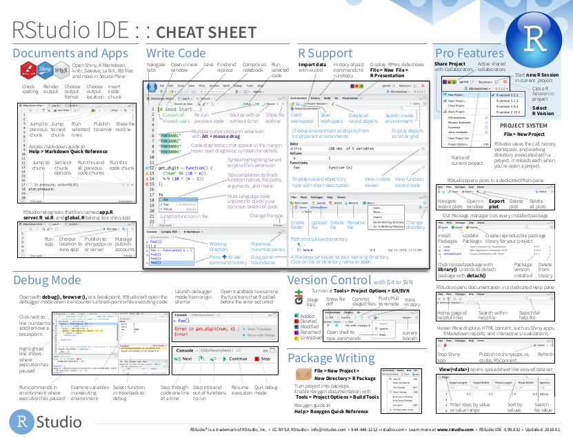

# RStudio {#rstudio}

O RStudio é sem dúvidas o mais completo ambiente de desenvolvimento para programação em R. Descubra aqui as funcionalidades do RStudio que nos permitem escrever códigos e analisar resultados de forma muito mais eficiente.

## Telas

Ao abrir o RStudio, você verá 4 quadrantes. Observe a figura abaixo.


Esses quadrantes representam o **editor**, o **console**, o **environment** e o **output**. Eles vêm nesta ordem, mas você pode organizá-los da forma que preferir acessando a seção *Pane Layout* da opção `Global options...` no menu `Tools`.

O editor e o console são os dois principais painéis do RStudio. Passaremos a maior parte do tempo neles.

- **Editor/Scripts**: é onde escrevemos nossos códigos. Repare que o RStudio colore algumas palavras e símbolos para facilitar a leitura do código.
- **Console**: é onde rodamos o código e recebemos as saídas. O R vive aqui!

Os demais painéis são auxiliares. O objetivo deles é facilitar pequenas tarefas que fazem parte tanto da programação quanto da análise de dados, como olhar a documentação de funções, analisar os objetos criados em uma sessão do R, procurar e organizar os arquivos que compõem a nossa análise, armazenar e analisar os gráficos criados e muito mais.

- **Environment**: painel com todos os objetos criados na sessão.
- **History**: painel com um histórico dos comandos rodados.
- **Files**: mostra os arquivos no diretório de trabalho. É possível navegar entre diretórios.
- **Plots**: painel onde os gráficos serão apresentados.
- **Packages**: apresenta todos os pacotes instalados e carregados.
- **Help**: janela onde a documentação das funções serão apresentadas.
- **Viewer**: painel onde relatórios e dashboards serão apresentados.

## Atalhos

Conhecer os atalhos do teclado ajuda bastante quando estamos programando no RStudio. Veja os principais:

- **CTRL+ENTER**: avalia a linha selecionada no script. O atalho mais utilizado.
- **ALT+-**: cria no script um sinal de atribuição (<-). Você o usará o tempo todo.
- **CTRL+SHIFT+M**: (%>%) operador *pipe*. Guarde esse atalho, você o usará bastante.
- **CTRL+1**: altera cursor para o script.
- **CTRL+2**: altera cursor para o console.
- **CTRL+ALT+I**: cria um chunk no R Markdown.
- **CTRL+SHIFT+K**: compila um arquivo no R Markdown.
- **ALT+SHIFT+K**: janela com todos os atalhos disponíveis.

No MacBook, os atalhos geralmente são os mesmos, substituindo o **CTRL** por **command** e o **ALT** por **option**.

## Projetos

Uma funcionalidade muito importante do RStudio é a possibilidade de criar **projetos**. 

Um projeto nada mais é do que uma pasta no seu computador. Nessa pasta, estarão todos os arquivos que você usurá ou criará na sua análise. 

A principal razão de utilizarmos projetos é **organização**. Com eles, fica muito mais fácil importar bases de dados para dentro do R, criar análises reprodutíveis e compartilhar o nosso trabalho.

> Você que está começando agora no R, já se habitue a criar um novo projeto para cada nova análise que for fazer.

Para criar um projeto, clique em `New Project...` no Menu `File`. Na caixa de diálogo que aparecerá, clique em `New Directory` para criar o projeto em uma nova pasta ou `Existing Directory` para criar em uma pasta existente. 

Se você tiver o `Git` instalado, você também pode usar projetos para conectar com repositórios do Github e outras plataformas de desenvolvimento. Para isso, basta clicar em `Version Control`.


Criando um projeto, o RStudio criará na pasta escolhida um arquivo `nome-do-projeto.Rproj`. Você pode usar esse arquivo para iniciar o RStudio já com o respectivo projeto aberto.

Quando um projeto estiver aberto no RStudio, o seu nome aparecerá no canto superior direito da tela. Na aba **Files**, aparecerão todos os arquivos contidos no projeto.


Você pode criar livremente novas pastas dentro da pasta do projeto. Por padrão, o R sempre começará a procurar arquivos na pasta raiz do projeto (é a pasta que contem o `nome-do-projeto.Rproj`).

Uma maneira fácil de navegar entre projetos é utilizar o menu disponibilizado quando clicamos no nome do projeto. Veja a figura a seguir.


Nesse menu, além de podermos criar novos projetos ou abrir projetos já existentes, também temos um acesso rápido a projetos abertos recentemente. Basta clicar em qualquer um deles para trocar de projeto, isto é, deixar de trabalhar em uma análise e começar a trabalhar em outra.

A seguir, apresentamos algumas estruturas de organização de projetos no RStudio.

**Estrutura 1**. Por extensão de arquivo.


```bash
nome_do_projeto/
  - .Rprofile   # códigos para rodar assim que abrir o projeto
  - R/          # Código R, organizado com a-carrega.R, b-prepara bd.R, c-vis.R, d-modela, ...
  - RData/      # Dados em formato .RData
  - csv/        # Dados em .csv
  - png/        # gráficos em PNG
  - nome_do_projeto.Rproj
```

**Estrutura 2**. Típico projeto de análise estatística.


```bash
project/
  - README.Rmd   # Descrição do pacote
  - set-up.R     # Pacotes etc
  - R/           # Código R, organizado com 0-load.R, 1-tidy.R, 2-vis.R, ...
  - data/        # Dados (estruturados ou não)
  - figures/     # gráficos (pode ficar dentro de output/)
  - output/      # Relatórios em .Rmd, .tex etc
  - project.Rproj
```

**Estrutura 3**. Pacote do R.


```bash
project/
  - README.md    # Descrição do pacote
  - DESCRIPTION  # Metadados estruturados do pacote e dependências
  - NAMESPACE    # importações e exportações do pacote
  - vignettes/   # Relatórios em .Rmd
  - R/           # Funções do R
  - data/        # Dados estruturados (tidy data)
  - data-raw/    # Dados não estruturados e arqs 0-load.R, 1-tidy.R, 2-vis.R, ...
  - project.Rproj
```

## Git e versionamento

## Cheatsheets

O RStudio tem à disposição algumas *folhas de cola*, as **cheatsheets**. Elas trazem um resumão de como utilizar diversos pacotes e até o próprio RStudio.

Para acessá-las, basta clicar no menu `Help` e então em `Cheatsheets`.




## Addins


## Snippets

