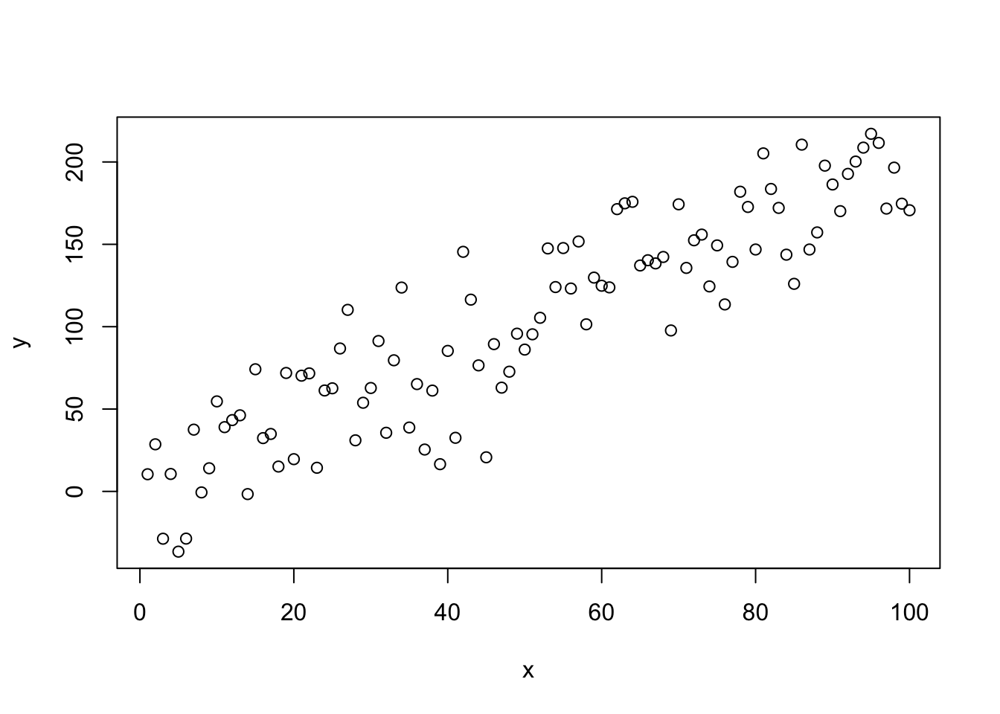
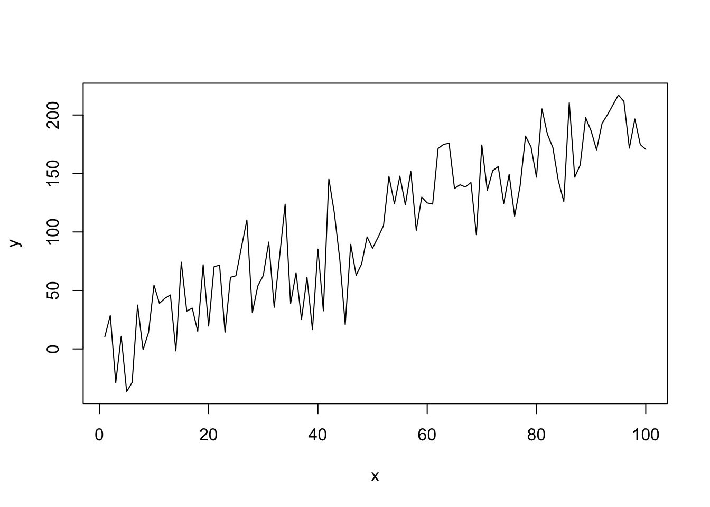
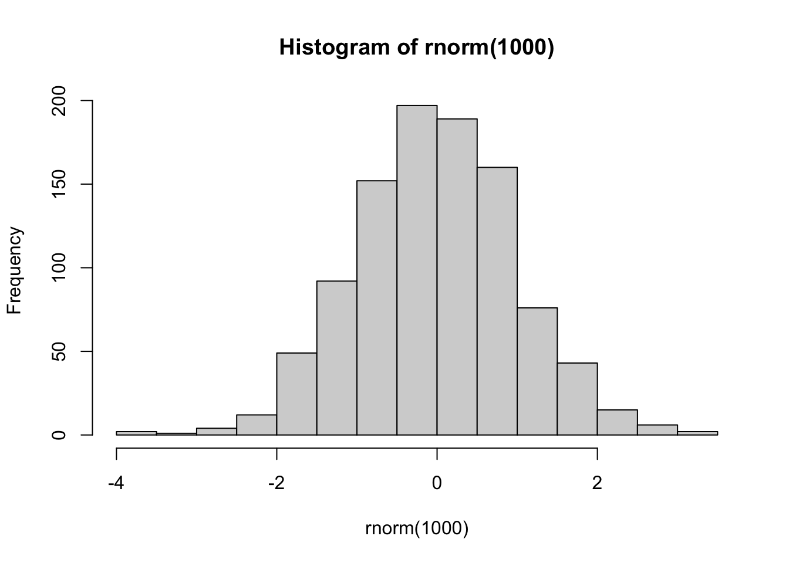
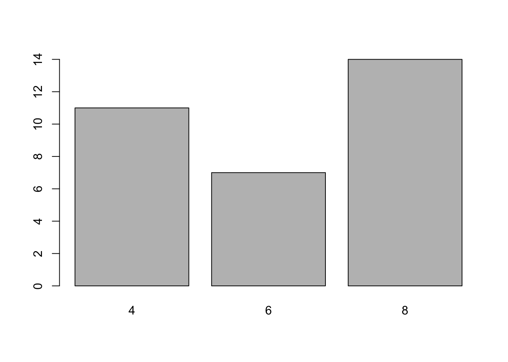

# R Básico {#r-base}


Introduziremos aqui os principais conceitos de programação em R. Indicamos a leitura deste capítulo a quem nunca teve contato com uma linguagem de programação ou a quem gostaria de entender um pouco melhor a estrutura de objetos, funções e classes do R. 

Os tópicos discutidos aqui são especialmente importantes para entendermos o que é um *data frame*, a nossa base de dados dentro do R, e quais operações estão sendo realizadas por trás das cortinas quando estivermos filtrando suas linhas ou modificando suas colunas. Também são importantes para começarmos a criar as nossas próprias funções, o que deixa nossos códigos muito mais organizados, eficientes e *compartilháveis*. 

## Pedindo Ajuda

Na linguagem `R` é possível fazer bastante coisa à base da tentativa e erro. Além disso, grande parte do conhecimento é escalável, isto é, aprender a utilizar uma função é meio caminho andado para aprender todas as outras funções que operam de forma semelhante^[Essa ideia é um dos princípios por trás do `tidyverse`.].

No entanto, a intuição não é infalível, e recorrentemente vamos precisar de ajuda para rodar alguma função ou descobrir como fazer alguma tarefa no R. Felizmente, a comunidade R é bem ativa e existem vários lugares para buscar respostas. Nesta seção, vamos apresentar algumas dessas maneiras.

<div class="figure" style="text-align: center">

<p class="caption">(\#fig:r-base-1)Arte por Allison Horst (@allison_horst). Veja nas Referências onde encontrá-la.</p>
</div>

No R, há quatro principais entidades para se pedir ajuda:

- Help/documentação do R
- Google
- Stack Overflow
- Coleguinha

A busca por ajuda é feita preferencialmente, mas não necessariamente, na ordem acima.

### Documentação do R

A documentação do R serve para você aprender a usar uma determinada função. Se você não sabe o que é uma função, não se preocupe. Discutiremos esse tópico nas Seções \@ref(objetosFuncoes) e \@ref(maisFuncoes).

Você pode acessar a documentação de uma função^[Bases de dados presentes em pacotes também têm documentação, e geralmente é possível encontrar o significado de cada variável nela. Por exemplo, `help(mtcars)`.] através de dois comandos: `?nome_da_funcao` ou `help(nome_da_funcao)`. Por exemplo, para acessar a documentação da função `mean`, fazemos:


```r
?mean
# ou
help(mean)
```

Algumas dicas:

1. Leia a seção *Usage* para ter noção de como usar a função.
2. Os parâmetros da função estão descritos em *Arguments*.
3. Os exemplos no final são particularmente úteis.
4. Caso essa função não atenda às suas necessidades, a seção *See Also* sugere funções relacionadas.

Alguns pacotes possuem tutoriais de uso mais completos. Esses textos são chamados de `vignettes` e podem ser acessados com a função `vignette(package = 'nomeDoPacote')`. Por exemplo, `vignette(package = 'dplyr')`.

### Google

Há uma comunidade gigantesca de R gerando diariamente uma infinidade de conteúdos e discussões. Não raramente, você irá encontrar discussões sobre o seu problema simplesmente o descrevendo no Google. Pesquisas em inglês aumentam consideravelmente a chance de encontrar uma resposta.

Quando você recebe um erro na tentativa de rodar algum código no R e não sabe o que está errado, uma boa estratégia é pesquisar a mensagem de erro no Google. Essa deve ser sua primeira tentativa para resolver o problema. Repare na imagem abaixo o 'r' adicionado na busca. Isso ajuda bastante a encontrar uma solução. 


```r
log("5")
## Error in log("5"): non-numeric argument to mathematical function
```


### Stack Overflow

O [Stack Overflow](http://stackoverflow.com/) e o [Stack Overflow em Português](http://pt.stackoverflow.com/) são sites de Pergunta e Resposta amplamente utilizados por todas as linguagens de programação, e o R é uma delas. Nos EUA, chegam até a usar a reputação das pessoas dentro da plataforma como diferencial no currículo!

Provavelmente o Google lhe indicará uma dessas quando você estiver procurando ajuda. E quando todas as fontes possíveis de ajuda falharem, o Stack Overflow lhe dará o espaço para **criar sua própria pergunta**.

**Um ponto importante**: como fazer uma *boa pergunta* no Stack Overflow?

No site, existe um tutorial com uma lista de boas práticas, [que se encontra aqui](http://pt.stackoverflow.com/help/how-to-ask). Resumindo, as principais dicas são

- fazer perguntas concisas;
- fazer perguntas específicas;
- ter mente aberta; e
- ser gentil.

Porém, no caso do R, há outro requisito que vai aumentar muito sua chance de ter uma boa resposta: **exemplinho minimal e reprodutível**.

- Ser **minimal**: usar bancos de dados menores e utilizar pedaços de códigos apenas suficientes para apresentar o seu problema. Não precisa de banco de dados de um milhão de linhas e nem colocar o seu código inteiro para descrever a sua dúvida.

- Ser **reprodutível**: o seu código deve rodar fora da sua máquina. Se você não fornecer uma versão do seu problema que rode (ou que imite seu erro), as pessoas vão logo desistir de te ajudar. Por isso, nunca coloque bancos de dados que só você tem acesso. Use bancos de dados que já vem no R ou disponibilize um exemplo (possivelmente anonimizado) em `.csv` na web para baixar. E se precisar utilizar funções de algum pacote, especifique os pacotes que você usou.

<!-- ### R Markdown -->

<!-- O R Markdown é um tipo de documento especial que contém tanto textos em *markdown* quanto *chunks* de códigos em R, tudo escrito no mesmo lugar.  -->

<!-- O *markdown* nada mais é do que um documento de texto com alguns padrões básicos de formatação, como negrito, itálico, títulos, subtítulos, itens e referências cruzadas. Já os *chunks* são pedaços de códigos em R encapsulados por três crases (```). Os códigos são executados sempre que o documento é processado. -->

<!-- ```{r, echo=FALSE} -->
<!-- cat("```{r} -->
<!-- isto é um chunk.  -->
<!-- ```") -->
<!-- ``` -->

<!-- > Este site foi escrito em R Markdown. Toda vez que aparecer exemplos de código de R, havia um chunk no .Rmd original. -->

<!-- Para produção de relatórios, o R Markdown possui algumas vantagens, como: -->

<!-- 1. **Simplicidade e foco**. Permite ao usuário o foco na análise e não na formatação do documento. -->
<!-- 1. **Versátil**. Pode ser utilizado para gerar documentos em `LaTeX`, `Word`, `HTML` e apresentações em `beamer`, `pptx` e `HTML`. Pode ainda gerar sites, livros, dissertações de mestrado e até mesmo dashboards interativos. -->
<!-- 1. **Reprodutível**. O R Markdown nada mais é que um arquivo de texto. Além disso, ele tenta te obrigar a fazer o documento mais autocontido possível. Assim, um documento `.Rmd` é fácil de compartilhar e de ser utilizado pelo receptor. Lembre-se, o receptor pode ser o futuro você! Vale enfatizar que a reprodutibilidade é considerada como um dos princípios fundamentais da ciência. Então, só de usar R Markdown, você já está colaborando com o método científico. :) -->
<!-- 1. **Flexível**. É possível configurar e criar *templates* de análises para quaisquer tipos de aplicações e clientes. Os textos podem ser parametrizados por números que variam de versão para versão, mensalmente, por exemplo, tudo escrito somente em R.  -->

<!-- Criar um R Markdown novo no RStudio é fácil. Clique no botão de criar arquivo e selecione R Markdown. -->

<!-- ```{r echo=FALSE, fig.align='center'} -->
<!-- knitr::include_graphics(rep("assets/img/r-base/criar_rmarkdown.png")) -->
<!-- ``` -->


<!-- Para detalhes sobre como utilizar o R Markdown, leia   [esta seção do R4DS](http://r4ds.had.co.nz/r-markdown.html) e [o tutorial do RStudio](http://rmarkdown.rstudio.com/lesson-1.html). -->


## R como calculadora

O papel do **Console** no R é executar os nossos comandos. Ele avalia o código que passamos para ele e devolve a saída correspondente --- se tudo der certo --- ou uma mensagem de erro --- se o seu código tiver algum problema.

Vamos começar com um exemplo simples:


```r
1 + 1
## [1] 2
```

Nesse caso, o nosso comando foi o código `1 + 1` e a saída foi o valor `2`.

> **Quando compilamos?** Quem vem de linguagens como o C ou Java espera que seja necessário compilar o código em texto para o código das máquinas (geralmente um código binário). No R, isso não é necessário. O R é uma linguagem de programação dinâmica que interpreta o seu código enquanto você o executa.

Tente agora jogar no console a expressão: `2 * 2 - (4 + 4) / 2`. 

Pronto! Você já é capaz de pedir ao R para fazer qualquer uma das quatro operações aritméticas básicas. A seguir, apresentamos uma lista resumindo como fazer as principais operações no R.


```r
# adição
1 + 1
## [1] 2

# subtração
4 - 2
## [1] 2

# multiplicação
2 * 3
## [1] 6

# divisão
5 / 3
## [1] 1.666667

# potência
4 ^ 2
## [1] 16

# resto da divisão de 5 por 3
5 %% 3
## [1] 2

# parte inteira da divisão de 5 por 3
5 %/% 3  
## [1] 1
```

Repare que as operações e suas precedências são mantidas como na matemática, ou seja, divisão e multiplicação são calculadas antes da adição e subtração. E os parênteses nunca são demais!

Uma outra forma de executar uma expressão é escrever o código em um **script**, deixar o cursor em cima da linha e usar o atalho `Ctrl + Enter`. Assim, o comando é enviado para o **Console**, onde é diretamente executado. Essa operação é chamada de **avaliar**, **executar** ou **rodar** o código.

Se você digitar um comando incompleto, como `5 + `, e apertar `Enter`, o R mostrará um `+`, o que não tem nada a ver com a adição da matemática. Isso significa que o R está esperando você enviar **mais** algum código para completar o seu comando. Termine o seu comando ou aperte `Esc` para recomeçar.

```
> 5 -
+ 
+ 5
[1] 0
```

Se você digitar um comando que o R não reconhece, ele retornará uma mensagem de erro. 

NÃO ENTRE EM PÂNICO! 

Ele só está avisando que não conseguiu interpretar o comando. Você pode digitar outro comando normalmente em seguida.

```
> 5 % 2
Error: unexpected input in "5 % 2"
> 5 ^ 2
[1] 25
```
### Exercícios {-}

**1.** Qual a diferença entre o R e o RStudio?

**2.** Podemos usar o RStudio sem o R? E o R sem o RStudio?

**3.** Precisamos compilar nossos códigos de R?

**4.** Calcule o número de ouro no R. Dica: o número de ouro é dado pela expressão $\frac{1 + \sqrt{5}}{2}$.

**5.** Por que é preferível escrevermos sempre o nosso código no *script* e não no *Console*?


## Objetos e funções {#objetosFuncoes}

O R te permite salvar valores dentro de um **objeto**. Um objeto é simplesmente um nome que guarda um valor. Para criar um objeto, utilizamos o operador `<-`.

No exemplo abaixo, salvamos o valor `1` em `a`. Sempre que avaliarmos o objeto `a`, o R vai devolver o valor 1.


```r
# Salvando `1` em `a`
a <- 1

# Avaliando o objeto `a`
a
## [1] 1
```

Existem algumas regras para dar nomes aos objetos. A mais importante é: o nome deve começar com uma letra^[Ou com um ponto.]. O nome pode conter números, mas não pode começar com números. Você pode usar pontos `.` e underlines `_` para separar palavras.


```r
# Permitido

x <- 1
x1 <- 2
objeto <- 3
meu_objeto <- 4
meu.objeto <- 5

# Não permitido

1x <- 1
_objeto <- 2
meu-objeto <- 3

```


**Atenção!**

O R **diferencia letras maiúsculas e minúsculas**, isto é, `b` é considerado um objeto diferente de `B`. Rode o exemplo abaixo e observe que dois objetos diferentes são criados no **Environment**.


```r
b <- 2
B <- 3

b
## [1] 2
B
## [1] 3
```

O objeto mais importante para cientistas de dados é, claro, a base de dados. No R, uma base de dados é representada por objetos chamados de *data frames*. Na próxima seção, vamos entender o que são esses objetos.

Enquanto objetos são *nomes* que guardam *valores*, funções no R são *nomes* que guardam um **código de R**. A ideia é muito simples: sempre que você rodar uma função, o código que ela guarda será executado e um resultado nos será devolvido.

A sintaxe para usar uma função é a seguinte:


```r
nome_da_funcao(arg1, arg2, argn)
```

Entre parênteses, após o nome da função, temos o que chamamos de *argumentos*. Uma função pode ter qualquer número de argumentos e eles são sempre separados por vírgula.

Basicamente, uma função recebe seus argumentos, executa uma ação sobre ou a partir deles e devolve um resultado. Por exemplo


```r
sum(1, 2)
## [1] 3
```

A função `sum()` recebeu os argumentos `1` e `2`, somou os dois valores e devolveu o resultado dessa operação: o valor `3`.

Falaremos mais sobre funções na Seção \@ref(maisFuncoes).

### Exercícios {-}

**1.** Qual a diferença entre os códigos abaixo?


```r
# Código 1
33 / 11

# Código 2
divisao <- 33 / 11
```

**2.** Multiplique a sua idade por 12 e salve o resultado em um objeto chamado `idade_em_meses`. Em seguida, multiplique esse objeto por 30 e salve o resultado em um objeto chamado `idade_em_dias`.

**3.** Por que o nome `meu-objeto` não pode ser utilizado para criar um objeto? O que significa a mensagem de erro resultante?


```r
meu-objeto <- 1
## Error in meu - objeto <- 1: object 'meu' not found
```


## Data frames

Os *data frames* são de extrema importância no R, pois são os objetos que guardam os nossos dados. Eles são equivalentes a uma tabela do SQL ou uma planilha do Excel.

A principal característica de um *data frame* é possuir linhas e colunas^[Você  pode construir um *data frame* vazio, com 0 linha e 0 coluna. No entanto, a *estrutura* de linhas e colunas estará presente.]. Veja o exemplo abaixo:


```r
mtcars
##                      mpg cyl  disp  hp drat    wt  qsec vs am gear carb
## Mazda RX4           21.0   6 160.0 110 3.90 2.620 16.46  0  1    4    4
## Mazda RX4 Wag       21.0   6 160.0 110 3.90 2.875 17.02  0  1    4    4
## Datsun 710          22.8   4 108.0  93 3.85 2.320 18.61  1  1    4    1
## Hornet 4 Drive      21.4   6 258.0 110 3.08 3.215 19.44  1  0    3    1
## Hornet Sportabout   18.7   8 360.0 175 3.15 3.440 17.02  0  0    3    2
## Valiant             18.1   6 225.0 105 2.76 3.460 20.22  1  0    3    1
## Duster 360          14.3   8 360.0 245 3.21 3.570 15.84  0  0    3    4
## Merc 240D           24.4   4 146.7  62 3.69 3.190 20.00  1  0    4    2
## Merc 230            22.8   4 140.8  95 3.92 3.150 22.90  1  0    4    2
## Merc 280            19.2   6 167.6 123 3.92 3.440 18.30  1  0    4    4
## Merc 280C           17.8   6 167.6 123 3.92 3.440 18.90  1  0    4    4
## Merc 450SE          16.4   8 275.8 180 3.07 4.070 17.40  0  0    3    3
## Merc 450SL          17.3   8 275.8 180 3.07 3.730 17.60  0  0    3    3
## Merc 450SLC         15.2   8 275.8 180 3.07 3.780 18.00  0  0    3    3
## Cadillac Fleetwood  10.4   8 472.0 205 2.93 5.250 17.98  0  0    3    4
## Lincoln Continental 10.4   8 460.0 215 3.00 5.424 17.82  0  0    3    4
## Chrysler Imperial   14.7   8 440.0 230 3.23 5.345 17.42  0  0    3    4
## Fiat 128            32.4   4  78.7  66 4.08 2.200 19.47  1  1    4    1
## Honda Civic         30.4   4  75.7  52 4.93 1.615 18.52  1  1    4    2
## Toyota Corolla      33.9   4  71.1  65 4.22 1.835 19.90  1  1    4    1
## Toyota Corona       21.5   4 120.1  97 3.70 2.465 20.01  1  0    3    1
## Dodge Challenger    15.5   8 318.0 150 2.76 3.520 16.87  0  0    3    2
## AMC Javelin         15.2   8 304.0 150 3.15 3.435 17.30  0  0    3    2
## Camaro Z28          13.3   8 350.0 245 3.73 3.840 15.41  0  0    3    4
## Pontiac Firebird    19.2   8 400.0 175 3.08 3.845 17.05  0  0    3    2
## Fiat X1-9           27.3   4  79.0  66 4.08 1.935 18.90  1  1    4    1
## Porsche 914-2       26.0   4 120.3  91 4.43 2.140 16.70  0  1    5    2
## Lotus Europa        30.4   4  95.1 113 3.77 1.513 16.90  1  1    5    2
## Ford Pantera L      15.8   8 351.0 264 4.22 3.170 14.50  0  1    5    4
## Ferrari Dino        19.7   6 145.0 175 3.62 2.770 15.50  0  1    5    6
## Maserati Bora       15.0   8 301.0 335 3.54 3.570 14.60  0  1    5    8
## Volvo 142E          21.4   4 121.0 109 4.11 2.780 18.60  1  1    4    2
```

O `mtcars` é um *data frame* nativo do R que contém informações sobre diversos modelos de carros. Ele possui 32 linhas e 11 colunas^[A primeira "coluna" representa apenas o *nome* das linhas (modelo do carro), não é uma coluna da base. Repare que ela não possui um nome, como as outras. Essa estrutura de nome de linha é própria de *data frames* no R. Se exportássemos essa base para o Excel, por exemplo, essa coluna não apareceria.]. Se você quiser saber mais sobre o `mtcars`, veja a documentação dele rodando `?mtcars` no **Console**.

Nos próximos capítulos, os *data frames* serão o nosso principal objeto de estudo. Aprenderemos a selecionar, criar e modificar colunas, filtrar e ordenar linhas, juntar dois *data frames* e, a partir deles, construiremos gráficos e ajustaremos modelos.

Mas, da mesma forma que é muito mais fácil aprendermos a fritar um ovo após entendermos o que é o fogo, uma frigideira e um ovo, vamos estudar nas próximas seções quais são as estruturas que formam os *data frames* e como manipulá-las.

## Classes

A classe de um objeto é muito importante dentro do R. É a partir dela que as funções e operadores conseguem saber exatamente o que fazer com um objeto.

Por exemplo, podemos somar dois números, mas não conseguimos somar duas letras (texto):


```r
1 + 1
## [1] 2


"a" + "b"
## Error in "a" + "b": non-numeric argument to binary operator
```

O operador `+` verifica que `"a"` e `"b"` não são números (ou que a classe deles não é numérica) e devolve uma mensagem de erro informando isso.

Observe que para criar texto no R, colocamos os caracteres entre aspas. As aspas servem para diferenciar *nomes* (objetos, funções, pacotes) de *textos* (letras e palavras). Os textos são muito comuns em variáveis categóricas e são popularmente chamados de *strings* no contexto de programação.


```r
a <- 10

# O objeto `a`, sem aspas
a
## [1] 10

# A letra (texto) `a`, com aspas
"a"
## [1] "a"
```

Para saber a classe de um objeto, basta rodarmos `class(nome-do-objeto)`.


```r
x <- 1
class(x)
## [1] "numeric"

y <- "a"
class(y)
## [1] "character"

class(mtcars)
## [1] "data.frame"
```

As classes mais básicas dentro do R são:

- *numeric*
- *character*
- *logical*

> Geralmente serão utilizados como sinônimos: 
>
>  - número, valor real, *numeric*, *double*
>  - texto, string, *character*, caracteres
>  - lógico, *logical*, booleano, valor TRUE/FALSE

Veja alguns exemplos:


```r
# numeric
1
0.10
0.95
pi

# characters
"a"
"1"
"positivo"

# logical
TRUE
FALSE
```

Um objeto de qualquer uma dessas classes é chamado de **objeto atômico**. 

Esse nome se deve ao fato de essas classes não se misturarem, isto é, para um objeto ter a classe `numeric`, por exemplo, todos os seus valores precisam ser numéricos.

Mas como atribuir mais de um valor a um mesmo objeto? Para isso, precisamos criar **vetores**.

### Exercícios

**1.** Guarde em um objeto chamado `nome` uma *string* contendo o seu nome completo.

**2.** Guarde em um objeto chamado `cidade` o nome da cidade onde você mora. Em seguida, guarde em um objeto chamado `estado` o nome do estado onde você mora. Usando esses objetos, resolva os itens abaixo:

- **a.** Utilize a função `nchar()` para contar o número de caracteres em cada cada string.

- **b.** Interprete o resultado do seguinte código:


```r
paste(cidade, estado)
```

- **c.** Interprete o resultado do seguinte código:


```r
paste(cidade, estado, sep = " - ")
```

- **d.** Desafio. Como você reproduziria o mesmo resultado do item (c) sem utilizar o argumento `sep`?

- **e.** Qual a diferença entre as funções `paste()` e `paste0()`?

## Vetores

Vetores são estruturas muito importantes dentro R. Em especial, pensando em análise de dados, precisamos estudá-los pois cada coluna de um *data frame* será representada como um vetor.

Vetores no R são apenas **conjuntos indexados de valores**. Para criá-los, basta colocar os valores separados por vírgulas dentro de um `c()`.


```r
vetor1 <- c(1, 5, 3, -10)
vetor2 <- c("a", "b", "c")

vetor1
## [1]   1   5   3 -10
vetor2
## [1] "a" "b" "c"
```

Os objetos `vetor1` e `vetor2` são vetores.

Uma maneira fácil de criar um vetor com uma sequência de números é utilizar o operador `:`.


```r
# Vetor de 1 a 10
1:10
##  [1]  1  2  3  4  5  6  7  8  9 10

# Vetor de 10 a 1
10:1
##  [1] 10  9  8  7  6  5  4  3  2  1

# Vetor de -3 a 3
-3:3
## [1] -3 -2 -1  0  1  2  3
```

Quando dizemos que vetores são conjuntos *indexados*, isso quer dizer que cada valor dentro de um vetor tem uma **posição**. Essa posição é dada pela ordem em que os elementos foram colocados no momento em que o vetor foi criado. Isso nos permite acessar individualmente cada valor de um vetor. 

Para isso, colocamos o índice do valor que queremos acessar dentro de colchetes `[]`.


```r
vetor <- c("a", "b", "c", "d")

vetor[1]
## [1] "a"
vetor[2]
## [1] "b"
vetor[3]
## [1] "c"
vetor[4]
## [1] "d"
```

Você também pode colocar um conjunto de índices dentro dos colchetes, para pegar os valores contidos nessas posições:


```r
vetor[c(2, 3)]
## [1] "b" "c"
vetor[c(1, 2, 4)]
## [1] "a" "b" "d"
```

Essa operação é conhecida como *subsetting*, pois estamos pegando subconjuntos de valores de um vetor.

Se você tentar acessar uma posição do vetor que não existe, ele retornará `NA`, indicando que esse valor não existe. Discutiremos o que são `NA`'s na Seção \@ref(valoresEspeciais).


```r
vetor[5]
## [1] NA
```

Um vetor só pode guardar um tipo de objeto e ele terá sempre a mesma classe dos objetos que guarda. Para saber a classe de um vetor, rodamos `class(nome-do-vetor)`.


```r
vetor1 <- c(1, 5, 3, -10)
vetor2 <- c("a", "b", "c")

class(vetor1)
## [1] "numeric"
class(vetor2)
## [1] "character"
```

Se tentarmos misturar duas classes, o R vai apresentar o comportamento conhecido como **coerção**.


```r
vetor <- c(1, 2, "a")

vetor
## [1] "1" "2" "a"
class(vetor)
## [1] "character"
```

Veja que todos os elementos do vetor se transformaram em texto. Agora temos um vetor com o texto `"1"`, o texto `"2"` e o texto `"a"`. Como um vetor só pode ter uma classe de objeto dentro dele, classes mais fracas serão sempre reprimidas pelas classes mais fortes. Como regra de bolso: caracteres serão sempre a classe mais forte. Então, sempre que você misturar números e texto em um vetor, os números virarão texto.

Falaremos bastante de coerção nas próximas seções e capítulos, trazendo exemplos de quando ela ajuda e de quando ela atrapalha.

Você também pode fazer operações com vetores.


```r
vetor <- c(0, 5, 20, -3)
vetor + 1
## [1]  1  6 21 -2
```

Ao rodarmos `vetor1 + 1`, o R soma `1` em cada um dos elementos do vetor. O mesmo acontece com qualquer outra operação aritmética.


```r
vetor - 1
vetor / 2
vetor * 10
```

Você também pode fazer operações que envolvem mais de um vetor:


```r
vetor1 <- c(1, 2, 3)
vetor2 <- c(10, 20, 30)

vetor1  + vetor2
## [1] 11 22 33
```

Neste caso, o R irá alinhar os dois vetores e somar elemento a elemento. Esse tipo de comportamento é chamado de **vetorização**. Isso pode ficar um pouco confuso quando os dois vetores não possuem o mesmo tamanho. Tente adivinhar qual será a saída do código a seguir:


```r
vetor1 <- c(1, 2)
vetor2 <- c(10, 20, 30, 40)

vetor1 + vetor2
## [1] 11 22 31 42
```

Embora estejamos somando dois vetores de tamanho diferentes, o R não devolve um erro (o que parecia ser a resposta mais intuitiva). O R alinhou os dois vetores e, como eles não possuíam o mesmo tamanho, o primeiro foi repetido para ficar do mesmo tamanho do segundo. É como se o primeiro vetor fosse na verdade `c(1, 2, 1, 2)`. Esse comportamento é chamado de **reciclagem**. 

Embora contra-intuitiva, a reciclagem é muito útil no R graças a um caso particular muito importante. Quando somamos `vetor + 1` no nosso primeiro exemplo, o que o R está fazendo por trás é transformando o `1` em `c(1, 1, 1, 1)` e realizando a soma vetorizada `c(0, 5, 20, -3) + c(1, 1, 1, 1)`. Isso porque o número `1` nada mais é do que um vetor de tamanho 1, isto é, `1` é igual a `c(1)`.

Usaremos esse comportamento no R o tempo todo e é muito importante a reciclagem para termos certeza de que o R está fazendo exatamente aquilo que gostaríamos que ele fizesse.

Um outro caso interessante de reciclagem é quando o comprimento dos vetores não são múltiplos um do outro. 


```r
vetor1 <- c(1, 2, 3)
vetor2 <- c(10, 20, 30, 40, 50)

vetor1 + vetor2
## Warning in vetor1 + vetor2: longer object length is not a multiple of shorter
## object length
## [1] 11 22 33 41 52
```

Neste caso, duas coisas aconteceram:

1. O R realizou a conta, repetindo cada valor do primeiro vetor até que os dois tenham o mesmo tamanho. No fundo, a operação realizada foi `c(1, 2, 3, 1, 2) + c(10, 20, 30, 40, 50)`.

2. Como essa operação é ainda menos intuitiva e raramente desejada, o R devolveu um aviso dizendo que o comprimento do primeiro vetor maior não é um múltiplo do comprimento do vetor menor.

### Exercícios {-}

**1.** Guarde em um objeto a sequência de números de 0 a 5 e resolva os itens abaixo.

- **a.** Use subsetting para fazer o R devolver o primeiro número dessa sequência. Em seguida, faça o R devolver o último número da sequência.

- **b.** Multiplique todos os valores do vetor por -1. Guarde o resultado em
um novo objeto chamado `vetor_negativo`.

**2.** Crie um vetor com o nome de três `frutas`, guarde em um objeto chamado frutas e resolva os itens abaixo.

- **a.** Utilize a a função `length()` para verificar o tamanho do vetor.

- **b.** Inspecione a saída de `paste("eu gosto de", frutas)` e responda se o tamanho do vetor mudou.

**3.** O que é reciclagem? Escreva um código em R que exemplifique esse comportamento.

**4.** O que é coerção? Escreva um código em R que exemplifique esse comportamento.

**5.** Por que a coerção pode ser um problema na hora de importarmos bases de dados para o R?

**6.** Use a função `sum()` para somar os valores de 1 a 100.

**7.** Considere o vetor booleano a seguir:


```r
dolar_subiu <- c(TRUE, TRUE, FALSE, FALSE, TRUE, FALSE, TRUE)
```

Este vetor tem informação de uma semana (7 dias, começando no domingo) indicando se o dólar subiu (TRUE) ou não subiu (FALSE) no respectivo dia. Interprete o resultado dos códigos abaixo:

- **a.** `length(dolar_subiu)`

- **b.** `dolar_subiu[2]`

- **c.** `sum(dolar_subiu)`

- **d.** `mean(dolar_subiu)`

## Testes lógicos

Poder fazer qualquer tipo de operação lógica é um dos motivos pelos quais programar nos deixar mais eficientes. Dê bastante atenção a elas, pois usaremos comparações lógicas o tempo todo!

Uma operação lógica nada mais é do que um teste que retorna **verdadeiro** ou **falso**. No R (e em outras linguagens de programação), esses dois valores recebem uma classe especial: `logical`.

O **verdadeiro** no R vai ser representado pelo valor `TRUE` e o **falso** pelo valor `FALSE`. Esses nomes no R são **reservados**, isto é, você não pode chamar nenhum objeto de *TRUE* ou *FALSE*.


```r
TRUE <- 1
## Error in TRUE <- 1 : invalid (do_set) left-hand side to assignment
```

Checando a classe desses valores, vemos que são lógicos^[Também conhecidos como valores binários ou booleanos]. Eles são os únicos possíveis valores dessa classe.


```r
class(TRUE)
## [1] "logical"
class(FALSE)
## [1] "logical"
```

Agora que conhecemos o `TRUE` e `FALSE`, podemos explorar os teste lógicos. Começando pelo mais simples: vamos testar se um valor é igual ao outro. Para isso, usamos o operador `==`.


```r
# Testes com resultado verdadeiro
1 == 1
## [1] TRUE
"a" == "a"
## [1] TRUE

# Testes com resultado falso
1 == 2
## [1] FALSE
"a" == "b"
## [1] FALSE
```

Também podemos testar se dois valores são diferentes. Para isso, usamos o operador `!=`.


```r
# Testes com resultado falso
1 != 1
## [1] FALSE
"a" != "a"
## [1] FALSE

# Testes com resultado verdadeiro
1 != 2
## [1] TRUE
"a" != "b"
## [1] TRUE
```

Para comparar se um valor é maior que outro, temos à disposição 4 operadores:


```r
# Maior
3 > 3
## [1] FALSE
3 > 2
## [1] TRUE

# Maior ou igual
3 >= 4
## [1] FALSE
3 >= 3
## [1] TRUE

# Menor 
3 < 3
## [1] FALSE
3 < 4
## [1] TRUE

# Menor ou igual
3 <= 2
## [1] FALSE
3 <= 3
## [1] TRUE
```

Um outro operador muito útil é o `%in%`. Com ele, podemos verificar se um valor está dentro de um conjunto de valores (vetor).


```r
3 %in% c(1, 2, 3)
## [1] TRUE
"a" %in% c("b", "c")
## [1] FALSE
```

Nós começamos essa seção dizendo que usaremos testes lógicos o tempo todo. O motivo para isso é que eles fazem parte de uma operação muito comum na manipulação de bases de dados: os **filtros**.

No Excel, por exemplo, quando você filtra uma planilha, o que está sendo feito por trás é um teste lógico.

Falamos anteriormente que cada coluna das nossas bases de dados será representada dentro do R como um vetor. O comportamento que explica a importância dos testes lógicos na hora de filtrar uma base está ilustrado abaixo:


```r
minha_coluna <- c(1, 3, 0, 10, -1, 5, 20)

minha_coluna > 3
## [1] FALSE FALSE FALSE  TRUE FALSE  TRUE  TRUE

minha_coluna[minha_coluna > 3]
## [1] 10  5 20
```

Muitas coisas aconteceram aqui, vamos por partes.

Primeiro, na operação `minha_coluna > 3` o R fez um excelente uso do comportamento de reciclagem. No fundo, o que ele fez foi transformar (reciclar) o valor `3` no vetor `c(3, 3, 3, 3, 3, 3, 3)` e  testar se `c(1, 3, 0, 10, -1, 5, 20) > c(3, 3, 3, 3, 3, 3, 3)`. 

Como os operadores lógicos também são vetorizados (fazem operações elemento a elemento), os testes realizados foram `1 > 3`, `3 > 3`, `0 > 3`, `10 > 3`, `-1 > 3`, `5 > 3` e, finalmente, `20 > 3`. Cada um desses testes tem o seu próprio resultado. Por isso a saída de `minha_coluna > 3` é um vetor de verdadeiros e falsos, respectivos a cada um desses 7 testes.

A segunda operação traz a grande novidade aqui: podemos usar os valores `TRUE` e `FALSE` para selecionar elementos de um vetor!

A regra é muito simples: **retornar** as posições que receberem `TRUE`, **não retornar** as posições que receberem `FALSE`. Portanto, a segunda operação é equivalente a:


```r
minha_coluna[c(FALSE, FALSE, FALSE, TRUE, FALSE, TRUE, TRUE)]
## [1] 10  5 20
```

O vetor lógico filtra o vetor `minha_coluna`, retornando apenas os valores maiores que 3, já que foi esse o teste lógico que fizemos. 

Essa é a *mágica* que acontece por trás de filtros no R. Na prática, não precisaremos usar colchetes, não lembraremos da reciclagem e nem veremos a cara dos `TRUE` e `FALSE`. Mas conhecer esse processo é muito importante, principalmente para encontrar problemas de código ou de base.

Para finalizar, listamos na tabela abaixo os principais operadores lógicos.


|Operador   |Descrição                                 |
|:----------|:-----------------------------------------|
|x < y      |x menor que y?                            |
|x <= y     |x menor ou igual a y?                     |
|x > y      |x maior que y?                            |
|x >= y     |x maior ou igual a y?                     |
|x == y     |x igual a y?                              |
|x != y     |x diferente de y?                         |
|!x         |Negativa de x                             |
|x &#124; y |x ou y são verdadeiros?                   |
|x & y      |x e y são verdadeiros?                    |
|x %in% y   |x pertence a y?                           |
|xor(x, y)  |x ou y são verdadeiros (apenas um deles)? |

Por fim, veja algumas diferenças entre comparações lógicas no SQL e no R:

- **Igualdade**: no SQL é só um sinal de igual: `2 = 1`. No R são dois: `2 == 1`.
- **Diferença**: no SQL, usamos `<>`. No R usamos `!=`.
- **Negação**: em vez de usar a palavra `NOT` igual ao SQL, usamos `!` no R. Por exemplo, `id not in ('1', '2', '3')` fica `!(id %in% c(1, 2, 3))`.


### Exercícios {-}

**1** O código abaixo vai guardar no objeto `segredo` um número inteiro entre 0 e 10. Sem olhar qual número foi guardado no objeto, resolva os itens a seguir:


```r
segredo <- round(runif(1, min = 0, max = 10))
```

- **a.** Teste se o segredo é maior ou igual a 0.

- **b.** Teste se o segredo é menor ou igual a 10.

- **c.** Teste se o segredo é maior que 5.

- **d.** Teste se o segredo é par.

- **e.** Teste se `segredo * 5` é maior que a sua idade.

- **f.** Desafio. Escreva um teste para descobrir o valor do segredo.

**2.** Escreva um código em R que devolva apenas os valores maiores
ou iguais a 10 do vetor abaixo:


```r
vetor <- c(4, 8, 15, 16, 23, 42)
```

**3.** Use o vetor `numeros` abaixo para responder as questões seguintes.


```r
numeros <- -4:2
```

- **a.** Escreva um código que devolva apenas valores positivos do vetor `numeros`.

- **b.** Escreva um código que devolta apenas os valores pares do vetor `numeros`.

- **c.** Filtre o vetor para que retorne apenas aqueles valores que, quando elevados a 2, são menores do que 4.

## Valores especiais {#valoresEspeciais}

Vimos anteriormente que se você tentar acessar uma posição que não existe dentro de um vetor, ele retorna um valor estranho.


```r
vetor <- c(1, 2, 3)

vetor[4]
## [1] NA
```

Esse valor, o `NA`, é tratado de forma especial no R. Ele representa a *ausência de informação*, isto é, a informação existe, mas nós (e o R) não sabemos qual é.

O `NA` para o R nada mais é do que o valor faltante ou omisso da Estatística. O famoso *missing*. Geralmente, quando temos uma base com valores faltando, como a idade para alguns indivíduos da nossa amostra, não significa que a idade deles não existe. Significa apenas que não temos essa informação.

Esse conceito é muito importante para entender o resultado da expressão abaixo.


```r
5 == NA
## [1] NA
```

Em um primeiro momento, poderíamos esperar que o resultado fosse `FALSE`. Mas, sabendo o significado por trás do `NA` --- um valor desconhecido ---, a verdadeira pergunta que estamos fazendo é: 5 é igual a um valor que existe, mas que não sei qual é? É como se eu perguntasse se eu tenho 5 moedas na mão, mas lhe mostrasse a mão fechada. A resposta para isso é *não sei* ou, dentro do R, `NA`.

Um outro exemplo:


```r
idade_ana <- 30
idade_beto <- NA
idade_carla <- NA

idade_ana == idade_beto
## [1] NA

idade_beto == idade_carla
## [1] NA
```

Eu posso saber a idade da Ana, mas se eu não souber a idade do Beto, não sei se os dois tem a mesma idade. Por isso, `NA`. Da mesma forma, se não sei nem a idade do Beto nem da Carla, também não tenho como saber se os dois têm a mesma idade. Outra vez `NA`.

Mas e quando queremos saber se um valor é NA ou não? Para fazer esse teste, temos que rodar `is.na(valor-ou-objeto)`.


```r
is.na(NA)
## [1] TRUE

is.na(idade_ana)
## [1] FALSE

is.na(idade_beto)
## [1] TRUE
```

Repare que essa função também é vetorizada.


```r
is.na(c(idade_ana, idade_beto, idade_carla))
## [1] FALSE  TRUE  TRUE
```

Assim como o `NA`, existem outros valores especiais muito comuns no R.

O `NaN` (*not a number*) representa indefinições matemáticas.


```r
0/0
## [1] NaN

log(-1)
## Warning in log(-1): NaNs produced
## [1] NaN
```

O `Inf` (infinito) representa um número muito grande (que o computador não consegue representar) ou um limite matemático.


```r
# O computador não consegue representar um número tão grande.
# O número é então """arredondado""" para infinito.
10^310
## [1] Inf

# Limite matemático.
1 / 0
## [1] Inf

# O "menos infinito" também existe.
-1 / 0
## [1] -Inf
```

O `NULL` (nulo) representa a ausência de um objeto. Ele não tem significado prático para a análise dados. Está mais em sintonia com comportamentos de lógica de programação. Muitas vezes vamos definir um objeto como nulo para dizer ao R que não queremos dar um valor para ele. Muito utilizado em funções.

Da mesma forma que utilizados `is.na()` para testar se um objeto é `NA`, utilizamos `is.nan()`, `is.infinite()` ou `is.null()` para testar se um objeto é `NaN`, infinito ou nulo.


```r
nao_sou_um_numero <- NaN
objeto_infinito <- Inf
objeto_nulo <- NULL

is.nan(nao_sou_um_numero)
## [1] TRUE

is.infinite(objeto_infinito)
## [1] TRUE

is.null(objeto_nulo)
## [1] TRUE
```

### Exercícios {-}

**1.** Quais as diferenças entre `NaN`, `NULL`, `NA` e `Inf`? Digite expressões que retornem cada um desses valores.

**2.** Escreva um código que conte o número de `NAs` do vetor `b`.


```r
b <- c(1, 0, NA, NA, NA, NA, 7, NA, NA, NA, NA, NA, 2, NA, NA, 10, 1, 1, NA)
```


## Listas

Chegamos ao último tópico antes de voltarmos aos data frames: as listas.

Listas são objetos muito importantes dentro do R. Primeiro porque **todo data frame é uma lista**. Segundo porque elas são bem parecidas com vetores, mas com uma diferença essencial: você pode misturar diferentes classes de objetos dentro dela.

Para criar uma lista, rodamos `list(valor1, valor2, valor3)`.


```r
list(1, "a", TRUE)
## [[1]]
## [1] 1
## 
## [[2]]
## [1] "a"
## 
## [[3]]
## [1] TRUE
```

Veja que não houve coerção. Ainda temos um valor número, um texto e um valor lógico dentro da lista.

O *subsetting* de listas é um pouco diferente do que o de vetores. Isso porque **cada elemento de uma lista também é uma lista**. Veja o que acontece se tentarmos usar `[]` para pegar um elemento de uma lista.


```r
lista <- list(1, "a", TRUE)

lista[1]
## [[1]]
## [1] 1

class(lista[1])
## [1] "list"
```

O R nos retorna uma lista com apenas aquele elemento. Se quisermos o elemento de fato dentro de cada posição, precisamos usar dois colchetes:


```r
lista[[1]]
## [1] 1

class(lista[[1]])
## [1] "numeric"
```

Cada elemento de uma lista ser uma lista é importante pois isso nos permite colocar vetores de tamanhos diferentes em cada posição. Isso faz das listas uma estrutura bem flexível para guardar dados.


```r
lista <- list(1:3, "a", c(TRUE, TRUE, FALSE, FALSE))

lista
## [[1]]
## [1] 1 2 3
## 
## [[2]]
## [1] "a"
## 
## [[3]]
## [1]  TRUE  TRUE FALSE FALSE

lista[1]
## [[1]]
## [1] 1 2 3

lista[2]
## [[1]]
## [1] "a"

lista[3]
## [[1]]
## [1]  TRUE  TRUE FALSE FALSE
```

É muito comum darmos nomes para cada posição de uma lista.


```r
dados_cliente <- list(cliente = "Ana Silva", idade = 25, estado_civil = NA)

dados_cliente
## $cliente
## [1] "Ana Silva"
## 
## $idade
## [1] 25
## 
## $estado_civil
## [1] NA
```

Agora, dentro da lista, o valor `Ana Silva`, por exemplo, está sendo atribuído ao nome `cliente`. Esse nome só existirá dentro da lista. 

Um detalhe importante: os iguais utilizados nas atribuições dos nomes dentro da lista **não podem** ser substituídos por `<-`.

Quando as posições de uma lista tem nome, podemos acessar seus valores diretamente utilizando o operador `$`.


```r
dados_cliente$cliente
## [1] "Ana Silva"

dados_cliente$idade
## [1] 25

dados_cliente$estado_civil
## [1] NA
```

Repare que o R devolve o valor dentro de cada posição, e não uma lista. 


```r
dados_cliente[1]
## $cliente
## [1] "Ana Silva"

dados_cliente$cliente
## [1] "Ana Silva"

class(dados_cliente[1])
## [1] "list"

class(dados_cliente$cliente)
## [1] "character"
```

Isto implica que, nesse exemplo, `dados_cliente$cliente` é equivalente a `dados_cliente[[1]]`.

Conforme ficamos mais e mais proficientes na linguagem R, as listas passam a ficar cada vez mais frequentes. Voltaremos a falar delas diversas vezes nos próximos capítulos, em especial no Capítulo \@ref(funcionais).

## Mais sobre data frames

Chegou a hora de usarmos tudo o que aprendemos na seção anterior para exploramos ao máximo o nosso objeto favorito: o *data frame*.

Na seção anterior, nós dissemos que *data frames* são listas. Isso é importante pois todas as propriedades de uma lista valem para um *data frame*.

A melhor forma de entender essa equivalência é ver um *data frame* representado como uma lista.


```r
as.list(mtcars)
## $mpg
##  [1] 21.0 21.0 22.8 21.4 18.7 18.1 14.3 24.4 22.8 19.2 17.8 16.4 17.3 15.2 10.4
## [16] 10.4 14.7 32.4 30.4 33.9 21.5 15.5 15.2 13.3 19.2 27.3 26.0 30.4 15.8 19.7
## [31] 15.0 21.4
## 
## $cyl
##  [1] 6 6 4 6 8 6 8 4 4 6 6 8 8 8 8 8 8 4 4 4 4 8 8 8 8 4 4 4 8 6 8 4
## 
## $disp
##  [1] 160.0 160.0 108.0 258.0 360.0 225.0 360.0 146.7 140.8 167.6 167.6 275.8
## [13] 275.8 275.8 472.0 460.0 440.0  78.7  75.7  71.1 120.1 318.0 304.0 350.0
## [25] 400.0  79.0 120.3  95.1 351.0 145.0 301.0 121.0
## 
## $hp
##  [1] 110 110  93 110 175 105 245  62  95 123 123 180 180 180 205 215 230  66  52
## [20]  65  97 150 150 245 175  66  91 113 264 175 335 109
## 
## $drat
##  [1] 3.90 3.90 3.85 3.08 3.15 2.76 3.21 3.69 3.92 3.92 3.92 3.07 3.07 3.07 2.93
## [16] 3.00 3.23 4.08 4.93 4.22 3.70 2.76 3.15 3.73 3.08 4.08 4.43 3.77 4.22 3.62
## [31] 3.54 4.11
## 
## $wt
##  [1] 2.620 2.875 2.320 3.215 3.440 3.460 3.570 3.190 3.150 3.440 3.440 4.070
## [13] 3.730 3.780 5.250 5.424 5.345 2.200 1.615 1.835 2.465 3.520 3.435 3.840
## [25] 3.845 1.935 2.140 1.513 3.170 2.770 3.570 2.780
## 
## $qsec
##  [1] 16.46 17.02 18.61 19.44 17.02 20.22 15.84 20.00 22.90 18.30 18.90 17.40
## [13] 17.60 18.00 17.98 17.82 17.42 19.47 18.52 19.90 20.01 16.87 17.30 15.41
## [25] 17.05 18.90 16.70 16.90 14.50 15.50 14.60 18.60
## 
## $vs
##  [1] 0 0 1 1 0 1 0 1 1 1 1 0 0 0 0 0 0 1 1 1 1 0 0 0 0 1 0 1 0 0 0 1
## 
## $am
##  [1] 1 1 1 0 0 0 0 0 0 0 0 0 0 0 0 0 0 1 1 1 0 0 0 0 0 1 1 1 1 1 1 1
## 
## $gear
##  [1] 4 4 4 3 3 3 3 4 4 4 4 3 3 3 3 3 3 4 4 4 3 3 3 3 3 4 5 5 5 5 5 4
## 
## $carb
##  [1] 4 4 1 1 2 1 4 2 2 4 4 3 3 3 4 4 4 1 2 1 1 2 2 4 2 1 2 2 4 6 8 2
```

O código acima nos permite ver o *data frame* `mtcars` representado como uma lista. Veja que cada coluna da base se transforma em um elemento da lista. E o nome de cada coluna vira o nome de cada posição. Isso é interessante, pois podemos usar nos *data frames* as mesmas operações que aprendemos para listas. 

Por exemplo, podemos usar o operador `$` para acessar cada elemento da lista, isto é, cada coluna do *data frame*.


```r
mtcars$mpg
##  [1] 21.0 21.0 22.8 21.4 18.7 18.1 14.3 24.4 22.8 19.2 17.8 16.4 17.3 15.2 10.4
## [16] 10.4 14.7 32.4 30.4 33.9 21.5 15.5 15.2 13.3 19.2 27.3 26.0 30.4 15.8 19.7
## [31] 15.0 21.4
```

E assim como cada elemento de uma lista também é uma lista, cada elemento (coluna) de um *data frame* também é um *data frame*.


```r
mtcars[1]
##                      mpg
## Mazda RX4           21.0
## Mazda RX4 Wag       21.0
## Datsun 710          22.8
## Hornet 4 Drive      21.4
## Hornet Sportabout   18.7
## Valiant             18.1
## Duster 360          14.3
## Merc 240D           24.4
## Merc 230            22.8
## Merc 280            19.2
## Merc 280C           17.8
## Merc 450SE          16.4
## Merc 450SL          17.3
## Merc 450SLC         15.2
## Cadillac Fleetwood  10.4
## Lincoln Continental 10.4
## Chrysler Imperial   14.7
## Fiat 128            32.4
## Honda Civic         30.4
## Toyota Corolla      33.9
## Toyota Corona       21.5
## Dodge Challenger    15.5
## AMC Javelin         15.2
## Camaro Z28          13.3
## Pontiac Firebird    19.2
## Fiat X1-9           27.3
## Porsche 914-2       26.0
## Lotus Europa        30.4
## Ford Pantera L      15.8
## Ferrari Dino        19.7
## Maserati Bora       15.0
## Volvo 142E          21.4

class(mtcars[1])
## [1] "data.frame"
```

Mas se *data frames* são listas, por que existe a classe *data frame*? Na verdade, *data frames* são um tipo especial de listas, que têm as seguintes propriedades:

1. Todos os seus elementos (colunas) precisam ter o mesmo comprimento (número de linhas).

2. Todos os seus elementos (colunas) precisam ser nomeados.

3. *Data frames* têm 2 dimensões.

As propriedades (1) e (2) se devem ao formato das bases de dados. Elas são retangulares^[Também existem bases não retangulares, como dados de imagens por exemplos, mas não trataremos dessas estruturas neste livro.] --- observamos as mesmas variáveis (colunas) para todas as unidades amostrais (linhas)^[Mesmo quando uma variável não existe para uma unidade amostral, representamos esse valor como um *missing*] ---, e precisam ter algum nome especificando as colunas.

Da mesma forma que podemos ver um *data frame* como uma lista, também podemos fazer o inverso.


```r
dados_cliente <- list(
  cliente = c("Ana Silva", "Beto Pereira", "Carla Souza"),
  idade = c(25, 30, 23),
  estado_civil = c(NA, "Solteiro", "Casada")
)

dados_cliente 
## $cliente
## [1] "Ana Silva"    "Beto Pereira" "Carla Souza" 
## 
## $idade
## [1] 25 30 23
## 
## $estado_civil
## [1] NA         "Solteiro" "Casada"

as.data.frame(dados_cliente)
##        cliente idade estado_civil
## 1    Ana Silva    25         <NA>
## 2 Beto Pereira    30     Solteiro
## 3  Carla Souza    23       Casada
```

Quando tivermos valores faltantes na nossa base (células vazias no Excel), eles serão representados por `NA` nos *data frames*.

Observe que não conseguimos transformar uma lista em *data frame* se os elementos da lista não tiverem o mesmo comprimento.


```r
dados_cliente <- list(
  cliente = c("Ana Silva", "Beto Pereira", "Carla Souza"),
  idade = c(25, 30),
  estado_civil = c(NA, "Solteiro", "Casada")
)

as.data.frame(dados_cliente)
## Error in (function (..., row.names = NULL, check.rows = FALSE, check.names = TRUE, : arguments imply differing number of rows: 3, 2
```

Transformar uma lista não nomeada em *data frame* é possível, mas o R cria nomes nada agradáveis para as colunas.


```r
dados_cliente <- list(
  c("Ana Silva", "Beto Pereira", "Carla Souza"),
  c(25, 30, 23),
  c(NA, "Solteiro", "Casada")
)

as.data.frame(dados_cliente)
##   c..Ana.Silva....Beto.Pereira....Carla.Souza.. c.25..30..23.
## 1                                     Ana Silva            25
## 2                                  Beto Pereira            30
## 3                                   Carla Souza            23
##   c.NA...Solteiro....Casada..
## 1                        <NA>
## 2                    Solteiro
## 3                      Casada
```

A propriedade (3) é atribuída aos *data frames* para que possamos aproveitar melhor dessa estrutura retangular dentro do R. Na prática, essas duas dimensões representam nada mais que as linhas e as colunas da base. Essa é a maior diferença entre uma lista e um *data frame*.


```r
class(mtcars)
## [1] "data.frame"

dim(mtcars)
## [1] 32 11
```

O resultado do código `dim(mtcars)` nos dá as seguintes informações:

- O *data frame* mtcars tem duas dimensões (como todo *data frame*).

- A primeira dimensão tem comprimento 32 e a segunda dimensão tem comprimento 11. Em outras palavras: a base `mtcars` tem 32 linhas e 11 colunas.

Veja a seguir que listas não têm dimensão.


```r
mtcars_como_lista <- as.list(mtcars)

class(mtcars_como_lista)
## [1] "list"

dim(mtcars_como_lista)
## NULL
```

Ter duas dimensões significa que devemos usar dois índices para acessar os valores de um *data frame* (fazer *subsetting*). Para isso, ainda usamos o colchete, mas agora com dois argumentos: `[linha, coluna]`.


```r
mtcars[2, 3]
## [1] 160
```

O código acima está nos devolvendo o valor presente na segunda linha da terceira coluna da base `mtcars`.

Também podemos pegar todas as linhas de uma coluna ou todas as colunas de uma linha deixando um dos argumentos vazio:


```r
# Todas as linhas da coluna 1
mtcars[,1]
##  [1] 21.0 21.0 22.8 21.4 18.7 18.1 14.3 24.4 22.8 19.2 17.8 16.4 17.3 15.2 10.4
## [16] 10.4 14.7 32.4 30.4 33.9 21.5 15.5 15.2 13.3 19.2 27.3 26.0 30.4 15.8 19.7
## [31] 15.0 21.4

# Todas as colunas da linha 1
mtcars[1,]
##           mpg cyl disp  hp drat   wt  qsec vs am gear carb
## Mazda RX4  21   6  160 110  3.9 2.62 16.46  0  1    4    4
```

Por fim, lembrando que dentro de cada coluna temos um vetor, podemos usar os testes lógicos para filtrar as linhas do nosso *data frame* conforme alguma regra.


```r
mtcars$cyl == 4
##  [1] FALSE FALSE  TRUE FALSE FALSE FALSE FALSE  TRUE  TRUE FALSE FALSE FALSE
## [13] FALSE FALSE FALSE FALSE FALSE  TRUE  TRUE  TRUE  TRUE FALSE FALSE FALSE
## [25] FALSE  TRUE  TRUE  TRUE FALSE FALSE FALSE  TRUE

mtcars[mtcars$cyl == 4, ]
##                 mpg cyl  disp  hp drat    wt  qsec vs am gear carb
## Datsun 710     22.8   4 108.0  93 3.85 2.320 18.61  1  1    4    1
## Merc 240D      24.4   4 146.7  62 3.69 3.190 20.00  1  0    4    2
## Merc 230       22.8   4 140.8  95 3.92 3.150 22.90  1  0    4    2
## Fiat 128       32.4   4  78.7  66 4.08 2.200 19.47  1  1    4    1
## Honda Civic    30.4   4  75.7  52 4.93 1.615 18.52  1  1    4    2
## Toyota Corolla 33.9   4  71.1  65 4.22 1.835 19.90  1  1    4    1
## Toyota Corona  21.5   4 120.1  97 3.70 2.465 20.01  1  0    3    1
## Fiat X1-9      27.3   4  79.0  66 4.08 1.935 18.90  1  1    4    1
## Porsche 914-2  26.0   4 120.3  91 4.43 2.140 16.70  0  1    5    2
## Lotus Europa   30.4   4  95.1 113 3.77 1.513 16.90  1  1    5    2
## Volvo 142E     21.4   4 121.0 109 4.11 2.780 18.60  1  1    4    2
```

O código `mtcars$cyl == 4` nos diz em quais linhas estão os carros com 4 cilindros. Quando usamos o vetor de `TRUE` e `FALSE` resultante dentro do *subsetting* das linhas em `mtcars[mtcars$cyl == 4, ]`, o R nos devolve todos as colunas dos carros com 4 cilindros. A regra é simples: linha com `TRUE` é retornada, linha com `FALSE` não.

Encerramos aqui a nossa primeira conversa sobre `data frames` para falar de outra estrutura muito importante dentro do R: as funções.

### Exercícios {-}

**1.** Quais códigos abaixo retornam **um vetor** com a coluna `mpg` do data frame `mtcars`?

- **a.** `mtcars$mpg`

- **b.** `mtcars[ , 3]`

- **c.** `mtcars("mpg")`

- **d.** `mtcars[ , "mpg"]`

- **e.** `mtcars.mpg`

- **f.** `mtcars[ , 1]`

- **g.** `mtcars[1, 1]`

- **h.** `mpg$mtcars`

**2.** Para que serve a função `str()`. Dê um exemplo do seu uso.

**3.** Para que serve a função `names()`. Dê um exemplo do seu uso.

**4.** Use o data frame `airquality` para responder às questões abaixo:

- **a.** Quantas colunas `airquality` tem?

- **b.** Quantas linhas `airquality` tem?

- **c.** O que a função `head()` retorna?

- **d.** Quais são os nomes das colunas?

- **e.** Qual é a classe da coluna `Ozone`?

**5.** Desafio. Calculando desvio-padrão no R. Use o data frame `airquality` para responder às questões abaixo:

- **a.** Tire a média da coluna Ozone e guarde em um objeto.

- **b.** Guarde em um objeto o vetor correspondente à coluna Ozone subtraída da sua própria média (calculada em no item a).

- **c.** Eleve o vetor calculado em (b) ao quadrado. Salve o resultado em um novo objeto.

- **d.** Tire a média do vetor calculado em (c) e salve o resultado em um objeto chamado `variancia`. Em seguida, calcule a raiz quadrada desse valor e salve em um objeto chamado `desvio_padrao`.

- **e.** Compare o valor de `desvio_padrao` com `sd(airquality$Ozone, na.rm=TRUE)` e pesquise por que os valores não são iguais. Dica: veja a documentação da função `sd()`.

**6.** Use o *data frame* `airquality` para responder às questões abaixo.

- **a.** Conte quantos `NAs` tem na coluna `Solar.R`.

- **b.** Filtre a tabela `airquality `com apenas linhas em que `Solar.R` é `NA`.

- **c.** Filtre a tabela `airquality` com apenas linhas em que `Solar.R` **não** é `NA`.

- **d.** Filtre a tabela `airquality` com apenas linhas em que `Solar.R` **não** é `NA` e `Month` é igual a 5.

## Mais sobre funções {#maisFuncoes}

Funções são tão comuns (provavelmente você já usou funções no Excel), que mesmo sem termos abordado o tema com detalhes, nós conseguimos utilizar várias funções nas seções anteriores:

- a função `c()` foi utilizada para criar vetores;
- a função `class()` foi utilizada para descobrir a classe de um objeto;
- a família de funções `is.na()`, `is.nan()`, `is.infinite()` e `is.null` foram utilizadas para testar se um valor é `NA`, `NaN`, infinito ou `NULL`, respectivamente.

Diferentemente dos objetos, as funções podem receber **argumentos**. Argumentos são os valores que colocamos dentro dos parênteses e que as funções precisam para funcionar (calcular algum resultado). Por exemplo, a função `c()` precisa saber quais são os valores que formarão o vetor que ela irá criar.


```r
c(1, 3, 5)
## [1] 1 3 5
```

Nesse caso, os valores `1`, `3` e `5` são os argumentos da função `c()`. **Os argumentos de uma função são sempre separados por vírgulas**.

Funções no R têm personalidade. Cada uma pode funcionar de um jeito diferente das demais, mesmo quando fazem tarefas parecidas. Por exemplo, vejamos a função `sum()`.


```r
sum(1, 3)
## [1] 4
```

Como podemos ver, essa função retorna a soma de seus argumentos. Também podemos passar um vetor como argumento, e ela retornará a soma dos elementos do vetor.


```r
sum(c(1, 3))
## [1] 4
```

Já a função `mean()`, que calcula a média de um conjunto de valores, exige que você passe valores na forma de um vetor:


```r
# Só vai considerar o primeiro número na média
mean(1, 3)
## [1] 1

# Considera todos os valores dentro do vetor na média
mean(c(1, 3))
## [1] 2
```

Como cada coluna de um *data frame* é um vetor, podemos calcular a média de uma coluna fazendo:


```r
# Podemos passar esse vetor para a função mean()
mean(mtcars$mpg)
## [1] 20.09062
```

Também podemos usar argumentos para modificar o comportamento de uma função. O que acontece se algum elemento do vetor for `NA`?


```r
mean(c(1, 3, NA))
## [1] NA
```

Como a função não sabe o valor do terceiro elemento do vetor, ela não sabe qual é a média desses 3 elementos e, então, devolve `NA`. Como é muito comum termos `NA` nas nossas bases de dados, é muito comum tentarmos calcular a média de uma coluna que tem `NA` e recebermos `NA` como resposta.

Na grande maioria dos casos, queremos saber a média de uma coluna apesar dos `NA`s. Isto é, queremos retirar os `NA`s e então calcular a média com os valores que conhecemos. Para isso, podemos utilizar o argumento `na.rm = TRUE` da função `mean()`.


```r
mean(c(1, 3, NA), na.rm = TRUE)
## [1] 2
```

Esse argumento diz à função para remover os `NA`s antes de calcular a média. Assim, a média calculada é: `(1 + 3)/2`.

Claro que cada função tem os seus próprios argumentos e nem toda função terá o argumento `na.rm=`. Para saber quais são e como usar os argumentos de uma função, basta acessar a sua documentação:


```r
help(mean)
```

Os argumentos das funções também têm nomes, que podemos ou não usar na hora de usar uma função. Veja por exemplo a função `seq()`. 


```r
seq(from = 4, to = 10, by = 2)
## [1]  4  6  8 10
```

Entre outros argumentos, ela possui os argumentos `from=`, `to=` e `by=`. O que ela faz é criar uma sequência (vetor) de `by` em `by` que começa em `from` e termina em `to`. No exemplo, criamos uma função de 2 em 2 que começa em 4 e termina em 10.

Também poderíamos usar a mesma função sem colocar o nome dos argumentos:


```r
seq(4, 10, 2)
## [1]  4  6  8 10
```

Para utilizar a função sem escrever o nome dos argumentos, você precisa colocar os valores na ordem em que os argumentos aparecem. E se você olhar a documentação da função `seq()`, fazendo `help(seq)`, verá que a ordem dos argumentos é justamente `from=`, `to=` e `by=`.

Escrevendo o nome dos argumentos, não há problema em alterar a ordem dos argumentos:


```r
seq(by = 2, to = 10, from = 4)
## [1]  4  6  8 10
```

Mas se especificar os argumentos, a ordem importa. Veja que o resultado será diferente.


```r
seq(2, 10, 4)
## [1]  2  6 10
```

A seguir, apresentamos algumas funções nativas do R úteis para trabalhar com *data frames* :

- `head()` - Mostra as primeiras 6 linhas.
- `tail()` - Mostra as últimas 6 linhas.
- `dim()` - Número de linhas e de colunas.
- `names()` - Os nomes das colunas (variáveis).
- `str()` - Estrutura do *data frame*. Mostra, entre outras coisas, as classes de cada coluna.
- `cbind()` - Acopla duas tabelas lado a lado.
- `rbind()` - Empilha duas tabelas.

Além de usar funções já prontas, você pode criar a sua própria função. A sintaxe é a seguinte:


```r
nome_da_funcao <- function(argumento_1, argumento_2) {
  
  # Código que a função irá executar
  
}
```

Repare que `function` é um nome reservado no R, isto é, você não pode criar um objeto com esse nome.

Um exemplo: vamos criar uma função que soma dois números.


```r
minha_soma <- function(x, y) {
  soma <- x + y
  
  soma  # resultado retornado
}
```

Essa função tem os seguintes componentes:

- `minha_soma`: nome da função
- `x` e `y`: argumentos da função
- `soma <- x + y`: operação que a função executa
- `soma`: valor retornado pela função

Após rodarmos o código de criar a função, podemos utilizá-la como qualquer outra função do R.


```r
minha_soma(2, 2)
## [1] 4
```

O objeto `soma` só existe *dentro da função*, isto é, além de ele não ser colocado no seu *environment*, ele só existirá na memória (RAM) enquanto o R estiver executando a função. Depois disso, ele será apagado. O mesmo vale para os argumentos `x` e `y`.

O valor retornado pela função representa o resultado que receberemos ao utilizá-la. Por padrão, **a função retornará sempre a última linha de código que existir dentro dela**. No nosso exemplo, a função retorna o valor contido no objeto `soma`, pois é isso que fazemos na última linha de código da função.

Repare que se atribuirmos o resultado a um objeto, ele não será mostrado no console:


```r
resultado <- minha_soma(3, 3)

# Para ver o resultado, rodamos o objeto `resultado`
resultado
## [1] 6
```

Agora, o que acontece se a última linha da função não devolver um objeto? Veja:


```r
minha_nova_soma <- function(x, y) {
  soma <- x + y
}
```

A função `minha_nova_soma()` apenas cria o objeto `soma`, sem retorná-lo como na função `minha_soma()`. Se utilizarmos essa nova função, nenhum valor é devolvido no console:


```r
minha_nova_soma(1, 1)
```

No entanto, a última linha da função agora é a atribuição `soma <- x + y` e esse será o "resultado retornado". Assim, podemos visualizar o resultado da função fazendo:


```r
resultado <- minha_nova_soma(1, 1)

resultado
## [1] 2
```


É como se, por trás das cortinas, o R estivesse fazendo `resultado <- soma <- x + y`, mas apenas o objeto `resultado` continua existindo, já que os objetos `soma`, `x`e `y` são descartados após a função ser executada.

Claro que, na prática, é sempre bom criarmos funções que retornem na tela os seus resultados, para evitar esse passo a mais se quisermos apenas ver o resultado no console. Assim, a função `minha_soma()` costuma ser preferível com relação à função `minha_nova_soma()`. 

### Exercícios {-}

**1.** Qual dos códigos abaixo devolverá um erro se for avaliado?

- **a.** `3 * 5 + 10`

- **b.** `function <- 10`

- **c.** `mean(1, 10)`

- **d.** `(soma <- sum(1, 1))`

**2.** Crie uma função que receba um número e retorne o quadrado deste número.

**3.** Crie uma função que receba 2 números e devolva a raiz quadrada da soma desses números.

**4.** Crie uma função que receba dois valores (numéricos) e devolva o maior deles. 

**5.** Use a função `runif()` para criar uma função que retorne um número aleatório inteiro entre 0 e 10 (0 e 10 inclusive). Caso você não conheça a função `runif()`, rode `help(runif)` para ler a sua documentação.

**6.** Rode `help(sample)` para descobrir o que a função `sample()` faz. Em seguida

- **a.** use-a para escrever uma função que devolva uma linha aleatória de um *data frame*;

- **b.** generalize a função para retornar um número qualquer de linhas, que poderá ser escolhido por quem for usá-la.

## Controle de Fluxo

Como toda boa linguagem de programação, o R possui estruturas de `if`, `else`, `for` e `while`. Esses **controles de fluxo** são muito importantes na hora de programar, pois nos permitem manipular de modo eficiente as ações do computador.

A seguir, explicaremos para que servem e como utilizar cada uma dessas estruturas.

### Condicionamento: if e else

As estruturas `if` e `else` servem para executarmos um código apenas se uma condição (teste lógico) for satisfeita.

No código abaixo, a função `Sys.time()`, que retorna a data/hora no momento da execução, só será avaliada se o objeto `x` for igual a 1.


```r
# Não vai executar a função Sys.time()
x <- 2

if (x == 1) {         
  Sys.time()
}

# Vai executar a função Sys.time()
x <- 1

if (x == 1) {         
  Sys.time()
}
## [1] "2022-07-12 09:23:00 -03"
```

O R só vai executar o que está na expressão dentro das chaves `{}` se a expressão que estiver dentro dos parênteses `()` retornar `TRUE`. Veja outro exemplo:


```r
# Vai fazer  a soma
x <- c(1, 3, 10, 15)

if (class(x) == "numeric") {
  sum(x)
}
## [1] 29

# Não vai fazer a soma
x <- c("a", "b", "c")

if (class(x) == "numeric") {
  sum(x)
}
```

Nesse exemplo, a soma só é executada se a classe do objeto `x` for numérica, isto é, se `x` for um vetor de números. Essa verificação poderia ser colocada dentro de uma função para evitarmos que ela retorne um erro.


```r
minha_soma <- function(x, y) {
  if (class(x) == "numeric" & class(y) == "numeric") {
     x + y
  }
}

# Retorna a soma
minha_soma(1, 2)
## [1] 3

# Não retorna nada
minha_soma("a", "b")
```

Nesses casos, é muito comum o uso das funções `return()` e `stop()` para, respectivamente, retornar um resultado antecipadamente ou parar a execução da função e devolver uma mensagem de erro personalizada.

Um exemplo usando `return()`.


```r
# Devolvendo um resultado antecipadamente
minha_soma_NA <- function(x, y) {
  if (class(x) == "numeric" & class(y) == "numeric") {
     soma <- x + y
     return(soma)
  }
  
  NA
}

# Retorna a soma
minha_soma_NA(1, 2)
## [1] 3

# Retorna NA
minha_soma_NA("a", "b")
## [1] NA

# Retorna NA
minha_soma_NA(1, "b")
## [1] NA
```

Na função `minha_soma_NA()`, a soma só é calculada e retornada se `x` e `y` forem numéricos. Caso pelo menos um dos dois não seja, o código dentro do `if` não é executado e o valor retornado é o `NA`.

Agora, usando `stop()`.


```r
# Agora, devolvendo um erro
minha_soma_erro <- function(x, y) {
  if (class(x) != "numeric" | class(y) != "numeric") {
    stop("A classe dos objetos x e y deve ser numérica.")
  }
  
  x + y
}

# Retorna a soma
minha_soma_erro(1, 2)
## [1] 3

# Retorna erro
minha_soma_erro("a", "b")
## Error in minha_soma_erro("a", "b"): A classe dos objetos x e y deve ser numérica.

# Retorna erro
minha_soma_erro(1, "b")
## Error in minha_soma_erro(1, "b"): A classe dos objetos x e y deve ser numérica.
```

Na função `minha_soma_erro()`, testamos no `if` se a classe de `x` **ou** a classe de `y` é diferente de `numeric`, isto é, se pelo menos um dos dois não é um número. Se esse teste retornar `TRUE`, a função para a sua execução e devolve a seguinte mensagem de erro: "A classe dos objetos x e y deve ser numérica.". Se o teste retorna `FALSE`, a soma é realizada e seu resultado nos é retornado.

O `else` funciona como uma extensão do `if`, dando uma alternativa caso o teste executado seja falso.


```r
# Vai fazer  a soma
x <- c(1, 3, 10, 15)

if (class(x) == "numeric") {
  sum(x)
} else {
  NA
}
## [1] 29

# Vai retornar NA
x <- c(1, 3, 10, "15")

if (class(x) == "numeric") {
  sum(x)
} else {
  NA
}
## [1] NA
```

Também podemos usar o `else` para encadear vários `if`s. Teste o código abaixo com valores positivos e negativos para `x`.


```r
x <- 0

if(x < 0) {
  
  "negativo"
  
} else if(x == 0) {
  
  "neutro"
  
} else if(x > 0) {
  
  "positivo"
}
## [1] "neutro"
```

Repare que o `if` no último `else` poderia ser omitido.


```r
x <- 0

if(x < 0) {
  
  "negativo"
  
} else if(x == 0) {
  
  "neutro"
  
} else {
  
  "positivo"
}
## [1] "neutro"
```


### Iteradores: for e while

O `for` pode ser utilizado para fazer os famosos *loopings* de programação, isto é, repetir uma mesma tarefa para um conjunto de valores diferentes. Cada repetição é chamada de iteração e o objeto que muda de valor em cada **iteração** é chamado de **iterador**.


```r
numero_de_colunas <- ncol(mtcars)

for (coluna in 1:numero_de_colunas) {
  media <- mean(mtcars[,coluna])
  
  print(media)
}
## [1] 20.09062
## [1] 6.1875
## [1] 230.7219
## [1] 146.6875
## [1] 3.596563
## [1] 3.21725
## [1] 17.84875
## [1] 0.4375
## [1] 0.40625
## [1] 3.6875
## [1] 2.8125
```

O código acima vai calcular a média de cada coluna do *data frame* `mtcars`. Alguns pontos importantes:

- No exemplo, temos 11 iterações e o objeto `coluna` é o iterador.

- Como `numero_de_colunas` é igual a 11, a expressão `1:numero_de_colunas` cria uma sequência de números de 1 a 11.

- A expressão `coluna in 1:numero_de_colunas` indica que o valor de `coluna` será 1 na primeira iteração, 2 na segunda iteração, 3 na terceira e assim por diante.

- O código dentro do `for` não é retornado para o usuário ao fim de cada iteração. Por isso, para ver os resultados no Console, usamos a função `print()`.

Também podemos salvar as médias em um vetor.


```r
numero_de_colunas <- ncol(mtcars)

# Antes, criamos um vetor vazio.
medias <- c()

for (coluna in 1:numero_de_colunas) {
  medias[coluna] <- mean(mtcars[,coluna])
}

medias
##  [1]  20.090625   6.187500 230.721875 146.687500   3.596563   3.217250
##  [7]  17.848750   0.437500   0.406250   3.687500   2.812500
```

Assim como  o `for`, o `while` também é um iterador.

O código a seguir irá imprimir na tela o valor de `i` enquanto este objeto for menor que 3. No momento em que a condição dentro das chaves `{}` não for mais respeitada, o processo será interrompido.


```r
i <- 1

while (i < 3){
  print(i)
  i <-  i + 1
}
## [1] 1
## [1] 2
```

É importante que o valor de `i` seja atualizado em cada interação, caso contrário a função entrará em um loop infinito. Por isso fazemos `i <- i + 1` após o `print`.

### Exercícios {-}

**1.** Por que o código abaixo retorna erro? Arrume o código para retornar o valor `TRUE`.


```r
x <- 4
if(x = 4) {
  TRUE
}
```

**2.** Usando `if` e `else`, escreva um código que retorne a string `"número"` caso o valor seja da classe `numeric` ou `integer`; a string `"palavra"` caso o valor seja da classe `character`; e `NA` caso contrário.

**3.** Usando apenas `for` e a função `length()`, construa uma função que calcule a média de um vetor número qualquer. Construa uma condição para a função retornar `NULL` caso o vetor não seja numérico.

**4.** Utilize o vetor `a` para resolver as questões a seguir:


```r
a <- c(10, 3, 5, -1, 3, -4, 8, 9, -10)
```

- **a.** Utilize o `for` para imprimir as médias acumuladas do vetor `a`, isto é, primeiro vamos imprimir 10, depois a média entre 10 e 3, depois a média entre 10, 3 e 5 e assim por diante.

- **b.** Adapte o laço que você fez no item anterior para ignorar os valores negativos, isto é, em caso de valor negativo, o laço não deve calcular a média e não imprimir nada.

## Outros tópicos

Nesta seção, apresentamos alguns tópicos extras. Alguns deles serão retomanos em capítulos posteriores.

### Matrizes

As matrizes no R podem ser tratadas como vetores com duas dimensões. Por serem vetores, elas só podem conter elementos de uma mesma classe. Por possuírem duas dimensões, as operações de *subsetting* devem ser realizadas utilizando a sintaxe `matriz[linha, coluna]`.

Para criar uma matriz, utilizamos a função `matrix()`. Precisamos definir quais elementos formarão a matriz e qual será o número de linhas e colunas.


```r
# Uma matriz de 2 linhas e 3 colunas
m <- matrix(1:9, nrow = 3, ncol = 3)

m
##      [,1] [,2] [,3]
## [1,]    1    4    7
## [2,]    2    5    8
## [3,]    3    6    9

dim(m)
## [1] 3 3
```

Repare que os números de 1 a 9 foram dispostos na matriz coluna por coluna (*column-wise*), ou seja, preenchendo de cima para baixo e depois da esquerda para a direita. Esse comportamento pode ser alterado se utilizarmos o argumento `byrow=`.


```r
matrix(1:9, nrow = 3, ncol = 3, byrow = TRUE)
##      [,1] [,2] [,3]
## [1,]    1    2    3
## [2,]    4    5    6
## [3,]    7    8    9
```

*Subsetting* de matrizes é muito parecido com o de *data frames*.


```r
# Seleciona a terceira linha
m[3, ]
## [1] 3 6 9

# Seleciona a segunda coluna
m[ , 2]   
## [1] 4 5 6

# Seleciona o primeiro elemento da segunda coluna
m[1, 2]
## [1] 4
```

A seguir, apresentamos algumas operações úteis para trabalhar com matrizes.


```r
# Matriz transposta
t(m)     
##      [,1] [,2] [,3]
## [1,]    1    2    3
## [2,]    4    5    6
## [3,]    7    8    9

# Matriz identidade 3 por 3
n <- diag(3)
n
##      [,1] [,2] [,3]
## [1,]    1    0    0
## [2,]    0    1    0
## [3,]    0    0    1

# Multiplicação por escalar
n * 2
##      [,1] [,2] [,3]
## [1,]    2    0    0
## [2,]    0    2    0
## [3,]    0    0    2

# Multiplicação matricial
m %*% n
##      [,1] [,2] [,3]
## [1,]    1    4    7
## [2,]    2    5    8
## [3,]    3    6    9

# Matriz inversa de m
n2 <- n * 2
solve(n2)  
##      [,1] [,2] [,3]
## [1,]  0.5  0.0  0.0
## [2,]  0.0  0.5  0.0
## [3,]  0.0  0.0  0.5
```

### Fatores {#fatores}

Fatores são uma classe de objetos no R criada para representar as variáveis categóricas numericamente. Essa classe possui um atributo especial: os `levels`. *Levels* são nada mais do que as categorias possíveis de uma variável categórica.

Como exemplo, imagine que o objeto `sexo` guarde uma coluna que indica o sexo de uma pessoa: `F` para feminino e `M` para masculino. Normalmente, essa coluna seria importada para o R como texto. Podemos transformá-la em fator utilizando a função `as.factor()`.


```r
# Variável sexo como texto
sexo <- c("F", "M", "M", "M", "F", "F", "M")
sexo
## [1] "F" "M" "M" "M" "F" "F" "M"

# Variável sexo, como fator
as.factor(sexo)
## [1] F M M M F F M
## Levels: F M
```

Repare que a saída do objeto `sexo` quando o transformamos em fator tem uma informação a mais. Na última linha, visualizamos os `levels` desse fator, isto é, um conjunto das categorias possíveis do fator `sexo` (no caso, F e M).

Por padrão, **os levels são ordenados por ordem alfabética**. Veremos mais adiante que isso pode fazer diferença na construção de gráficos e na aplicação de modelos.

A diferença entre fatores e texto dentro do R é como eles são representados internamente. Enquanto objetos da classe `character` realmente são representados como texto, fatores são representados como números inteiros.


```r
# Em geral, não é possível transformar textos em números
as.numeric(sexo)
## Warning: NAs introduced by coercion
## [1] NA NA NA NA NA NA NA

# Mas podemos transforrma fatores em inteiros
fator <- as.factor(sexo)
as.numeric(fator)
## [1] 1 2 2 2 1 1 2
```

Internamente, cada level de um fator é representado como um inteiro. No exemplo anterior, o level `F` está sendo representado como `1` e o level `M` como `2`. Se um fator tiver 10 levels, teremos os inteiros de `1` a `10` representando esse fator.


```r
# letters é um objeto nativo do R
letras <- letters[1:10]

fator <- as.factor(letras)
fator
##  [1] a b c d e f g h i j
## Levels: a b c d e f g h i j

as.numeric(fator)
##  [1]  1  2  3  4  5  6  7  8  9 10
```

O texto que vemos quando avaliamos um fator (`F` e `M` em vez de `1` e `2`, por exemplo)  é apenas uma "etiqueta" que o R coloca em cima dos inteiros. As diferentes etiquetas de um fator são justamente os `levels`.

Como fatores são sempre representados internamente por inteiros sequencias começando do 1 (1, 2, 3, ...) e esses inteiros são sempre atribuídos conforme a ordem alfabética dos `levels`, um erro muito comum é tentar transformar levels numéricos em números:


```r
# Texto
vetor <- c("10", "55", "55", "12", "10", "-5", "-90")
vetor
## [1] "10"  "55"  "55"  "12"  "10"  "-5"  "-90"

# Fator
fator <- as.factor(vetor)
fator
## [1] 10  55  55  12  10  -5  -90
## Levels: -5 -90 10 12 55

# Número
as.numeric(fator)
## [1] 3 5 5 4 3 1 2
```

Quando transformamos o objeto `vetor` em um fator, o R não enxerga os "números" dentro dele. Para o R, é tudo texto. Então, como nos outros exemplos, cada "número" será representado por um inteiro, atribuído pela ordem alfabética.

Uma forma de evitar esse problema é transformar o fator em texto antes de transformá-lo em número.


```r
# Voltando para texto
texto <- as.character(fator)
texto
## [1] "10"  "55"  "55"  "12"  "10"  "-5"  "-90"

# Agora sim os números originais
as.numeric(texto)
## [1]  10  55  55  12  10  -5 -90
```


### Gráficos (R base)

O R já vem com funções básicas que fazem gráficos estatísticos de todas as naturezas. 

- Vantagens: são rápidas e simples.
- Desvantagens: os gráficos são simplórios e geralmente é difícil gerar gráficos mais elaborados.

Nesta seção, mostraremos como construir alguns tipos de gráficos usando as funções base do R, mas o nosso foco em visualização de dados está nas funções do pacote `ggplot2`, apresentadas no Capítulo \@ref(graficos).

#### Gráfico de dispersão e linhas {-}

Para construir um gráfico de dispersão, utilizamos a função `plot()`. Seus principais parâmetros são:

- `x`, `y`: vetores para representarem os eixos x e y.
- `type`: tipo de gráfico. Pode ser pontos, linhas, escada, entre outros.

Para mais detalhes sobre os argumentos, ver `help(plot)`.


```r
N <- 100
x <- 1:N
y <- 5 + 2 * x + rnorm(N, sd = 30)

plot(x, y)
```



No código acima, a função `rnorm()` gera uma amostra aleatória da distribuição Normal com média 0 e desvio-padrão 30.

O parâmetro `type = "l"` indica que queremos que os pontos sejam interligados por linhas.


```r
plot(x, y, type = "l")
```



#### Histograma {-}

Para construir histogramas, utilizamos a função `hist()`. Os principais parâmetros são:

- `x`: o vetor numérico para o qual o histograma será construído.
- `breaks`:  número (aproximado) de retângulos.


```r
hist(rnorm(1000))
```




```r
hist(rnorm(1000), breaks = 6)
```


#### Boxplot {-}

Para construir boxplots, utilizamos a função `boxplot()`. Os principais parâmetros são:

- `x`: o vetor numérico para o qual o boxplot será construído.


```r
boxplot(mtcars$mpg, col = "lightgray")
```


Observe que o argumento `col=` muda a cor da caixa do boxplot.

Para mapear duas variáveis ao gráfico, passamos um *data frame* para o argumento `data=` e utilizamos a seguinte sintaxe `var_numerica ~ var_categorica`.


```r
boxplot(mpg ~ cyl, data = mtcars, col = "purple")
```


#### Gráfico de barras {-}

Para construir gráficos de barras, precisamos combinar as funções `table()` e `barplot()`.

No gráfico abaixo, primeiro criamos uma tabela de frequências com a função `table()` e, em seguida, construímos o gráfico com a função `barplot()`.


```r
tabela <- table(mtcars$cyl)
tabela
## 
##  4  6  8 
## 11  7 14

barplot(tabela)
```




