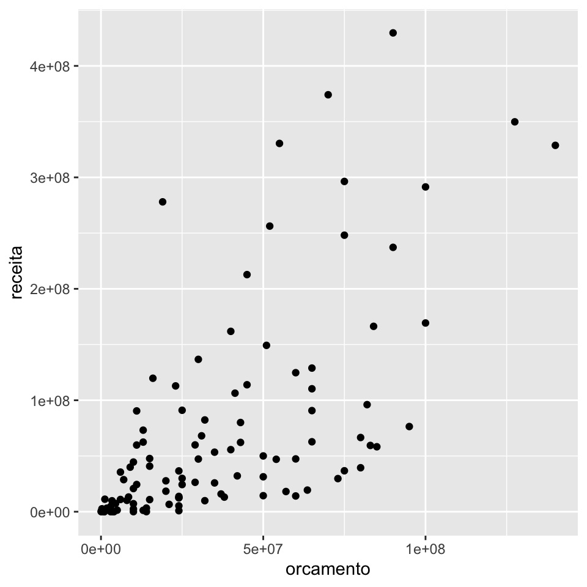

## O pacote tidyr {#tidyr}

Dentro do `tidyverse`, uma base *tidy* é uma base fácil de se trabalhar, isto é, fácil de se fazer manipulação de dados, fácil de se criar visualizações, fácil de se ajustar modelos e por aí vai.

Na prática, uma base *tidy* é aquela que se encaixa bem no *framework* do `tidyverse`, pois os pacotes como o `dplyr` e o `ggplot2` foram desenvolvidos para funcionar bem com bases *tidy*. E assim como esses pacotes motivaram o uso de bases *tidy*, o conceito *tidy* motiva o surgimento de novos *frameworks*, como o `tidymodels` para modelagem.

As duas propriedades mais importantes de uma base *tidy* são:

- cada coluna é uma variável;

- cada linha é uma observação.

Essa definição proporciona uma maneira consistente de se referir a variáveis (nomes de colunas) e observações (índices das linhas).

O pacote `{tidyr}` possui funções que nos ajudam a transformar uma base bagunçada em uma base *tidy*. Ou então, nos ajudam a bagunçar um pouquinho a nossa base quando isso nos ajudar a produzir o resultados que queremos.

Vamos ver aqui algumas de suas principais funções:

- `separate()` e `unite()`: para separar variáveis concatenadas em uma única coluna ou uni-las.

- `pivot_wider()` e `pivot_longer()`: para pivotar a base.

- `nest()` e `unnest()`: para criar *list columns*.

Como motivação para utilizar esssas funções, vamos utilizar a nossa boa e velha base `imdb`. Essa base pode ser baixada [clicando aqui](https://github.com/curso-r/livro-material/raw/master/assets/data/imdb.rds).


```r
library(dplyr)
library(tidyr)
library(ggplot2)

imdb <- readr::read_rds("imdb.rds")
```

### `separate()` e `unite()`

A função `separate()` separa duas ou mais variáveis que estão concatenadas em uma mesma coluna. A sintaxe da função está apresentada abaixo.


```r
dados %>% 
  separate( 
    col = coluna_velha, 
    into = c("colunas", "novas"),
    sep = "separador"
  )
```

Como exemplo, vamos transformar a coluna `generos` da base IMDB em três colunas, cada uma com um dos gêneros do filme. Lembrando que os valores da coluna `generos` estão no seguinte formato:


```r
imdb %>% pull(generos) %>% head()
```

```
## [1] "Comedy, Drama, Romance" "Comedy, Crime, Mystery" "Comedy"                
## [4] "Comedy, Musical"        "Comedy, Drama, Music"   "Drama"
```

Veja que agora, temos 3 colunas de gênero. Filmes com menos de 3 gêneros recebem `NA` na coluna `genero2` e/ou `genero3`. Os gêneros sobressalentes são descartados, assim como a coluna `generos` original.


```r
imdb %>% 
  separate( 
    col = generos,
    into = c("genero1", "genero2", "genero3"), 
    sep = ","
  )
```

```
## Warning: Expected 3 pieces. Missing pieces filled with `NA` in 5093 rows [3, 4,
## 6, 8, 9, 10, 18, 20, 22, 23, 24, 26, 28, 37, 38, 40, 41, 44, 45, 47, ...].
```

```
## # A tibble: 11,340 × 22
##    id_filme  titulo    ano data_lancamento genero1 genero2 genero3 duracao pais 
##    <chr>     <chr>   <dbl> <chr>           <chr>   <chr>   <chr>     <dbl> <chr>
##  1 tt0092699 Broadc…  1987 1988-04-01      Comedy  " Dram… " Roma…     133 USA  
##  2 tt0037931 Murder…  1945 1945-06-23      Comedy  " Crim… " Myst…      91 USA  
##  3 tt0183505 Me, My…  2000 2000-09-08      Comedy   <NA>    <NA>       116 USA  
##  4 tt0033945 Never …  1941 1947-05-02      Comedy  " Musi…  <NA>        71 USA  
##  5 tt0372122 Adam &…  2005 2007-05-17      Comedy  " Dram… " Musi…      99 USA  
##  6 tt3703836 Henry …  2015 2016-01-08      Drama    <NA>    <NA>        87 USA  
##  7 tt0093640 No Way…  1987 1987-12-11      Action  " Crim… " Dram…     114 USA  
##  8 tt0494652 Welcom…  2008 2008-02-08      Comedy  " Roma…  <NA>       104 USA  
##  9 tt0094006 Some K…  1987 1988-01-13      Drama   " Roma…  <NA>        95 USA  
## 10 tt1142798 The Fa…  2008 2008-09-12      Drama    <NA>    <NA>       111 USA  
## # … with 11,330 more rows, and 13 more variables: idioma <chr>,
## #   orcamento <dbl>, receita <dbl>, receita_eua <dbl>, nota_imdb <dbl>,
## #   num_avaliacoes <dbl>, direcao <chr>, roteiro <chr>, producao <chr>,
## #   elenco <chr>, descricao <chr>, num_criticas_publico <dbl>,
## #   num_criticas_critica <dbl>
```

Também podemos usar a função `separate()` para separar os nomes que fazem parte da coluna `elenco`:


```r
imdb_atuacao <- imdb %>% 
  separate( 
    col = elenco,
    into = c("atuacao1", "atuacao2", "atuacao3"), 
    sep = ","
  )
```

```
## Warning: Expected 3 pieces. Additional pieces discarded in 11300 rows [1, 2, 3,
## 4, 5, 6, 7, 8, 9, 10, 11, 12, 13, 14, 15, 16, 17, 18, 19, 20, ...].
```

```
## Warning: Expected 3 pieces. Missing pieces filled with `NA` in 15 rows [226,
## 1178, 1767, 3536, 3900, 4188, 4706, 5557, 5591, 6030, 7475, 7579, 8190, 8376,
## 9649].
```

```r
imdb_atuacao
```

```
## # A tibble: 11,340 × 22
##    id_filme  titulo   ano data_lancamento generos duracao pais  idioma orcamento
##    <chr>     <chr>  <dbl> <chr>           <chr>     <dbl> <chr> <chr>      <dbl>
##  1 tt0092699 Broad…  1987 1988-04-01      Comedy…     133 USA   Engli…  20000000
##  2 tt0037931 Murde…  1945 1945-06-23      Comedy…      91 USA   Engli…        NA
##  3 tt0183505 Me, M…  2000 2000-09-08      Comedy      116 USA   Engli…  51000000
##  4 tt0033945 Never…  1941 1947-05-02      Comedy…      71 USA   Engli…        NA
##  5 tt0372122 Adam …  2005 2007-05-17      Comedy…      99 USA   Engli…        NA
##  6 tt3703836 Henry…  2015 2016-01-08      Drama        87 USA   Engli…        NA
##  7 tt0093640 No Wa…  1987 1987-12-11      Action…     114 USA   Engli…  15000000
##  8 tt0494652 Welco…  2008 2008-02-08      Comedy…     104 USA   Engli…  35000000
##  9 tt0094006 Some …  1987 1988-01-13      Drama,…      95 USA   Engli…        NA
## 10 tt1142798 The F…  2008 2008-09-12      Drama       111 USA   Engli…        NA
## # … with 11,330 more rows, and 13 more variables: receita <dbl>,
## #   receita_eua <dbl>, nota_imdb <dbl>, num_avaliacoes <dbl>, direcao <chr>,
## #   roteiro <chr>, producao <chr>, atuacao1 <chr>, atuacao2 <chr>,
## #   atuacao3 <chr>, descricao <chr>, num_criticas_publico <dbl>,
## #   num_criticas_critica <dbl>
```

A função `unite()` realiza a operação inversa da função `separate()`. Ela concatena os valores de várias variáveis em uma única coluna. A sintaxe é a seguinte:


```r
dados %>% 
  unite(
    col = coluna_nova, 
    colunas_para_juntar, 
    sep = "separador" 
  )
```

Usando a base `imdb_atuacao` gerada no exemplo anterior, vamos agora transformar as colunas `atuacao1`, `atuacao2` e `atuacao3` em uma única coluna `atuacao_principal`. Lembrando que essas colunas estão no formato abaixo.


```r
imdb_atuacao %>% select(starts_with("atuacao")) %>% head(3)
```

```
## # A tibble: 3 × 3
##   atuacao1       atuacao2           atuacao3           
##   <chr>          <chr>              <chr>              
## 1 William Hurt   " Albert Brooks"   " Holly Hunter"    
## 2 Fred MacMurray " Helen Walker"    " Marjorie Main"   
## 3 Jim Carrey     " Renée Zellweger" " Anthony Anderson"
```

Veja que agora a coluna `atuacao_principal` possui os 3 atores concatenados. Se a ordem das colunas `atuacao1`, `atuacao2` e `atuacao3` nos trazia a informação de protagonismo, essa informação passa a ficar implícita nesse novo formato. As 3 colunas originais são removidas da base resultante.


```r
imdb_atuacao %>% 
  unite(
    col = "atuacao_principal",
    starts_with("atuacao"), 
    sep = " - "
  ) %>% 
  select(atuacao_principal)
```

```
## # A tibble: 11,340 × 1
##    atuacao_principal                                    
##    <chr>                                                
##  1 William Hurt -  Albert Brooks -  Holly Hunter        
##  2 Fred MacMurray -  Helen Walker -  Marjorie Main      
##  3 Jim Carrey -  Renée Zellweger -  Anthony Anderson    
##  4 W.C. Fields -  Gloria Jean -  Leon Errol             
##  5 Malcolm Gets -  Cary Curran -  Craig Chester         
##  6 Cole Doman -  Joe Keery -  Elizabeth Laidlaw         
##  7 Kevin Costner -  Gene Hackman -  Sean Young          
##  8 Martin Lawrence -  James Earl Jones -  Margaret Avery
##  9 Eric Stoltz -  Mary Stuart Masterson -  Lea Thompson 
## 10 Alfre Woodard -  Sanaa Lathan -  Rockmond Dunbar     
## # … with 11,330 more rows
```

### Pivotagem

O conceito de pivotagem no *tidyverse* se refere a mudança da estrutura da base, geralmente para alcançar o formato *tidy*. 

Geralmente realizamos pivotagem quando nossas linhas não são unidades observacionais ou nossas colunas não são variáveis. Ela é similiar à pivotagem do Excel, mas um pouco mais complexa.

O ato de pivotar resulta em transformar uma base de dados *long* em *wide* e vice-versa. 

Uma base no formato *long* possui mais linhas e pode ter menos colunas, enquanto no formato *wide* poussi menos linhas e pode ter mais colunas

Esses formatos são sempre relativos às colunas que estão sendo pivotadas, sendo que uma base *tidy* pode estar tanto no formato *long* quanto *wide*.

Antigamente, utilizávamos as funções `gather()` e `spread()` para fazer as operações de pivotagem. 

Agora, no lugar de `gather()`, utilizamos a função `pivot_longer()`. Abaixo, usando a base `imdb_atuacao` gerada anteriormente, transformamos as colunas `atuacao1`, `atuacao2` e `atuacao3` em duas colunas: `ator_atriz` e `protagonismo`.


```r
imdb_atuacao %>% 
  pivot_longer(
    cols = starts_with("atuacao"), 
    names_to = "protagonismo",
    values_to = "ator_atriz"
  ) %>% 
  select(titulo, ator_atriz, protagonismo) %>% 
  head(6)
```

```
## # A tibble: 6 × 3
##   titulo          ator_atriz       protagonismo
##   <chr>           <chr>            <chr>       
## 1 Broadcast News  "William Hurt"   atuacao1    
## 2 Broadcast News  " Albert Brooks" atuacao2    
## 3 Broadcast News  " Holly Hunter"  atuacao3    
## 4 Murder, He Says "Fred MacMurray" atuacao1    
## 5 Murder, He Says " Helen Walker"  atuacao2    
## 6 Murder, He Says " Marjorie Main" atuacao3
```

Se considerarmos que na análise da base IMDB cada observação deve ser um filme, então essa nova base já não mais *tidy*, pois agora cada filme aparece em três linhas diferentes, uma vez para cada um de seus atores.

Nesse sentido, embora possa parecer que a variável `protagonismo` estava implícita na base original, ela não é uma variável de fato. Todos filmes têm um `ator_1`, um `ator_2` e um `ator_3`. Não existe nenhuma informação sobre o filme que podemos tirar da coluna `protagonismo`, pois ela qualifica apenas os atores, não o filme em si.

A função `pivot_wider()` faz a operação inversa da `pivot_longer()`. Se aplicarmos as duas funções em sequência, voltamos para a base original.


```r
imdb_atuacao %>% 
  pivot_longer(
    cols = starts_with("atuacao"), 
    names_to = "ator_protagonismo",
    values_to = "ator_nome"
  ) %>% 
  pivot_wider(
    names_from = "ator_protagonismo",
    values_from = "ator_nome"
  ) %>% 
  head(4)
```

```
## # A tibble: 4 × 22
##   id_filme  titulo    ano data_lancamento generos duracao pais  idioma orcamento
##   <chr>     <chr>   <dbl> <chr>           <chr>     <dbl> <chr> <chr>      <dbl>
## 1 tt0092699 Broadc…  1987 1988-04-01      Comedy…     133 USA   Engli…  20000000
## 2 tt0037931 Murder…  1945 1945-06-23      Comedy…      91 USA   Engli…        NA
## 3 tt0183505 Me, My…  2000 2000-09-08      Comedy      116 USA   Engli…  51000000
## 4 tt0033945 Never …  1941 1947-05-02      Comedy…      71 USA   Engli…        NA
## # … with 13 more variables: receita <dbl>, receita_eua <dbl>, nota_imdb <dbl>,
## #   num_avaliacoes <dbl>, direcao <chr>, roteiro <chr>, producao <chr>,
## #   descricao <chr>, num_criticas_publico <dbl>, num_criticas_critica <dbl>,
## #   atuacao1 <chr>, atuacao2 <chr>, atuacao3 <chr>
```

A base `imdb` não possui nenhuma variável que faça sentido aplicarmos diretamente a função `pivot_wider()`. Vamos então considerar a seguinte tabela derivada da base `imdb`:


```r
tab_romance_terror <- imdb %>%
  filter(ano >= 2010) %>%
  mutate(
    genero = case_when(
      stringr::str_detect(generos, "Romance") ~ "Romance",
      stringr::str_detect(generos, "Horror") ~ "Horror",
      TRUE ~ NA_character_
    )
  ) %>%
  filter(!is.na(genero)) %>%
  group_by(ano, genero) %>%
  summarise(receita_media = mean(receita, na.rm = TRUE))
```

```
## `summarise()` has grouped output by 'ano'. You can override using the `.groups`
## argument.
```

Essa tabela possui a receita média dos filmes de romance e terror nos anos de 2010 a 2016.

Para apresentar essa tabela em uma reunião, por exemplo, pode ficar ser mais agradável ter os anos nas colunas e não nas linhas. Para isso, basta utilizarmos a função `pivot_wider()`.


```r
# Tabela original
tab_romance_terror
```

```
## # A tibble: 22 × 3
## # Groups:   ano [11]
##      ano genero  receita_media
##    <dbl> <chr>           <dbl>
##  1  2010 Horror      35186671.
##  2  2010 Romance     56885184.
##  3  2011 Horror      20176100.
##  4  2011 Romance     51856138.
##  5  2012 Horror      19722687.
##  6  2012 Romance     33651867.
##  7  2013 Horror      26271101.
##  8  2013 Romance     22546610.
##  9  2014 Horror      20623813.
## 10  2014 Romance     28482653.
## # … with 12 more rows
```


```r
# Tabela com os anos nas colunas
tab_romance_terror %>% 
  pivot_wider(
    names_from = ano,
    values_from = receita_media
  )
```

```
## # A tibble: 2 × 12
##   genero   `2010` `2011` `2012` `2013` `2014` `2015` `2016` `2017` `2018` `2019`
##   <chr>     <dbl>  <dbl>  <dbl>  <dbl>  <dbl>  <dbl>  <dbl>  <dbl>  <dbl>  <dbl>
## 1 Horror   3.52e7 2.02e7 1.97e7 2.63e7 2.06e7 1.22e7 1.53e7 2.24e7 3.40e7 1.88e7
## 2 Romance  5.69e7 5.19e7 3.37e7 2.25e7 2.85e7 3.53e7 1.97e7 8.96e6 6.88e7 4.14e7
## # … with 1 more variable: `2020` <dbl>
```

Esse é um caso que *bagunçar* um pouquinho a tabela nos trouxe um resultado desejado.

### *List columns*

Um terceiro conceito de dados *tidy* é que cada célula da tabela possui um valor. No entanto, quando estamos programando, muitas vezes vale apena abandonar essa definição e guardarmos objetos mais complexos nas células de uma tabela.

Utilizando as chamadas *list columns* podemos guardar virtualmente qualquer objeto em nossas *tibbles*, como gráficos, resultados de modelos ou até mesmo outras tabelas.

Uma forma de trabalhar com *list columns* consiste em utilizarmos as funções

- `nest()`: para criar uma *list column*;

- `unnest()`: para desfazer uma *list column*.

A forma mais simples de utilizarmos uma *list column* é *aninhar* a nossa base com relação a uma variável.


```r
imdb_nest <- imdb %>%
  group_by(ano) %>%
  nest() %>% 
  arrange(ano)

head(imdb_nest, 8)
```

```
## # A tibble: 8 × 2
## # Groups:   ano [8]
##     ano data             
##   <dbl> <list>           
## 1  1914 <tibble [3 × 19]>
## 2  1915 <tibble [3 × 19]>
## 3  1916 <tibble [2 × 19]>
## 4  1917 <tibble [1 × 19]>
## 5  1918 <tibble [3 × 19]>
## 6  1919 <tibble [6 × 19]>
## 7  1920 <tibble [7 × 19]>
## 8  1921 <tibble [7 × 19]>
```

A base `imdb_nest` possui duas colunas `ano` e `data` e uma linha para cada ano. Na coluna `data`, temos o restante da base `imdb`, recortada para cada um dos anos.

Abaixo, acessmos os dados do único filme de 1916 (primeira linha da base `imdb_nest`).


```r
imdb_nest$data[[1]]
```

```
## # A tibble: 3 × 19
##   id_filme titulo data_lancamento generos duracao pais  idioma orcamento receita
##   <chr>    <chr>  <chr>           <chr>     <dbl> <chr> <chr>      <dbl>   <dbl>
## 1 tt00047… Tilli… 1914-12-21      Comedy       82 USA   None,…     50000      NA
## 2 tt00041… Judit… 1914-03-08      Drama        61 USA   Engli…     40000      NA
## 3 tt00036… The A… 1914-08-24      Crime,…      78 USA   Engli…        NA      NA
## # … with 10 more variables: receita_eua <dbl>, nota_imdb <dbl>,
## #   num_avaliacoes <dbl>, direcao <chr>, roteiro <chr>, producao <chr>,
## #   elenco <chr>, descricao <chr>, num_criticas_publico <dbl>,
## #   num_criticas_critica <dbl>
```

Imagine que queiramos fazer, para cada ano, um gráfico de dispersão da receita contra o orçamento dos filmes lançados no ano.

Com a base no formato de *list columns*, basta criarmos uma função para gerar o gráfico e utilizarmos a função `purrr::map()`.

Abaixo, construímos a função `fazer_grafico_dispersao()`, que será aplicada a cada uma das bases contidas na coluna `data` da base `imdb_nest`. Os gráficos, respectivamos a cada ano, são salvos na coluna `grafico`.


```r
fazer_grafico_dispersao <- function(tab) {
  tab %>%
    ggplot(aes(x = orcamento, y = receita)) +
    geom_point()
}

imdb_graficos <- imdb_nest %>% 
  mutate(
    grafico = purrr::map(data, fazer_grafico_dispersao)
  )

head(imdb_graficos, 6)
```

```
## # A tibble: 6 × 3
## # Groups:   ano [6]
##     ano data              grafico
##   <dbl> <list>            <list> 
## 1  1914 <tibble [3 × 19]> <gg>   
## 2  1915 <tibble [3 × 19]> <gg>   
## 3  1916 <tibble [2 × 19]> <gg>   
## 4  1917 <tibble [1 × 19]> <gg>   
## 5  1918 <tibble [3 × 19]> <gg>   
## 6  1919 <tibble [6 × 19]> <gg>
```

Para acessar cada um dos gráficos, basta rodar o código abaixo.


```r
# Pegando o gráfico referente ao ano de 2000
imdb_graficos$grafico[[74]]
```

```
## Warning: Removed 76 rows containing missing values (geom_point).
```


Ou, escolhendo diretamente pelo ano


```r
imdb_graficos %>% 
  filter(ano == 2000) %>% 
  pull(grafico)
```

```
## [[1]]
```

```
## Warning: Removed 43 rows containing missing values (geom_point).
```



A função `unnest()` remove a estrutura de *list column*. Fazendo a operação abaixo, voltamos para a base `imdb` original.


```r
imdb_nest %>%
  unnest(cols = "data")
```

```
## # A tibble: 11,340 × 20
## # Groups:   ano [108]
##      ano id_filme  titulo data_lancamento generos duracao pais  idioma orcamento
##    <dbl> <chr>     <chr>  <chr>           <chr>     <dbl> <chr> <chr>      <dbl>
##  1  1914 tt0004707 Tilli… 1914-12-21      Comedy       82 USA   None,…     50000
##  2  1914 tt0004181 Judit… 1914-03-08      Drama        61 USA   Engli…     40000
##  3  1914 tt0003643 The A… 1914-08-24      Crime,…      78 USA   Engli…        NA
##  4  1915 tt0005960 The R… 1915-09-13      Biogra…      72 USA   Engli…        NA
##  5  1915 tt0005078 The C… 1915-12-13      Drama,…      59 USA   Engli…     17311
##  6  1915 tt0004972 The B… 1915-03-21      Drama,…     195 USA   None      100000
##  7  1916 tt0006864 Intol… 1918-02-24      Drama,…     163 USA   Engli…    385907
##  8  1916 tt0006333 20,00… 1916-12-24      Action…     105 USA   Engli…    200000
##  9  1917 tt0008443 The P… 1917-03-05      Comedy…      65 USA   Engli…        NA
## 10  1918 tt0009611 Shoul… 1918-10-27      Comedy…      45 USA   None,…        NA
## # … with 11,330 more rows, and 11 more variables: receita <dbl>,
## #   receita_eua <dbl>, nota_imdb <dbl>, num_avaliacoes <dbl>, direcao <chr>,
## #   roteiro <chr>, producao <chr>, elenco <chr>, descricao <chr>,
## #   num_criticas_publico <dbl>, num_criticas_critica <dbl>
```

### Exercícios

**1.** Crie 5 novas colunas de idiomas na base imdb, cada uma com um dos idiomas contidos na coluna `idioma`. Para os filmes com menos de 5 idiomas, substitua os valores `NA` pela string "Inexistente".

**2.** Substitua os "????" no código abaixo para criar uma tabela do lucro médio dos filmes ao longo dos anos de 2000 a 2020, com cada ano sendo uma coluna da base.


```r
imdb %>%
  mutate(lucro = receita - orcamento) %>%
  filter(ano %in% "????") %>%
  group_by("????") %>%
  summarise(lucro_medio = "????") %>%
  pivot_wider(names_from = "????", values_from = "????")
```

Para os exercícios 3, 4 e 5, vamos utilize a base `pokemon`, disponível no pacote `basesCursoR`.


```r
install.packages("remotes")
remotes::install_github("curso-r/basesCursoR")
pokemon <- basesCursoR::pegar_base("pokemon")
```

**3.** Utilize a função `unite()` para juntar as duas colunas de tipo em uma única coluna na base pokemon.

**4.** Utilize a função `unite()` para juntar as três colunas de cor em uma única coluna na base pokemon. Faça isso sem remover as 3 colunas originais.

**5.** Utilizando a base `pokemon`, resolva os itens abaixo:

**a.** Utilize a função `pivot_longer()` para criar uma única coluna de tipo na base pokemon.

**b.** Utilize a base criada no item (a) e escreva um código para descobrir qual o tipo mais frequente na base, independentemente se ele é primário (tipo_1) ou secundário (tipo_2).

**6.** DESAFIO! Escreva uma função que receba uma base qualquer e o nome de uma coluna numérica dessa base e retorne uma figura com um gráfico de dispersão da coluna escolhida contra cada uma das outras variáveis numéricas da base.


