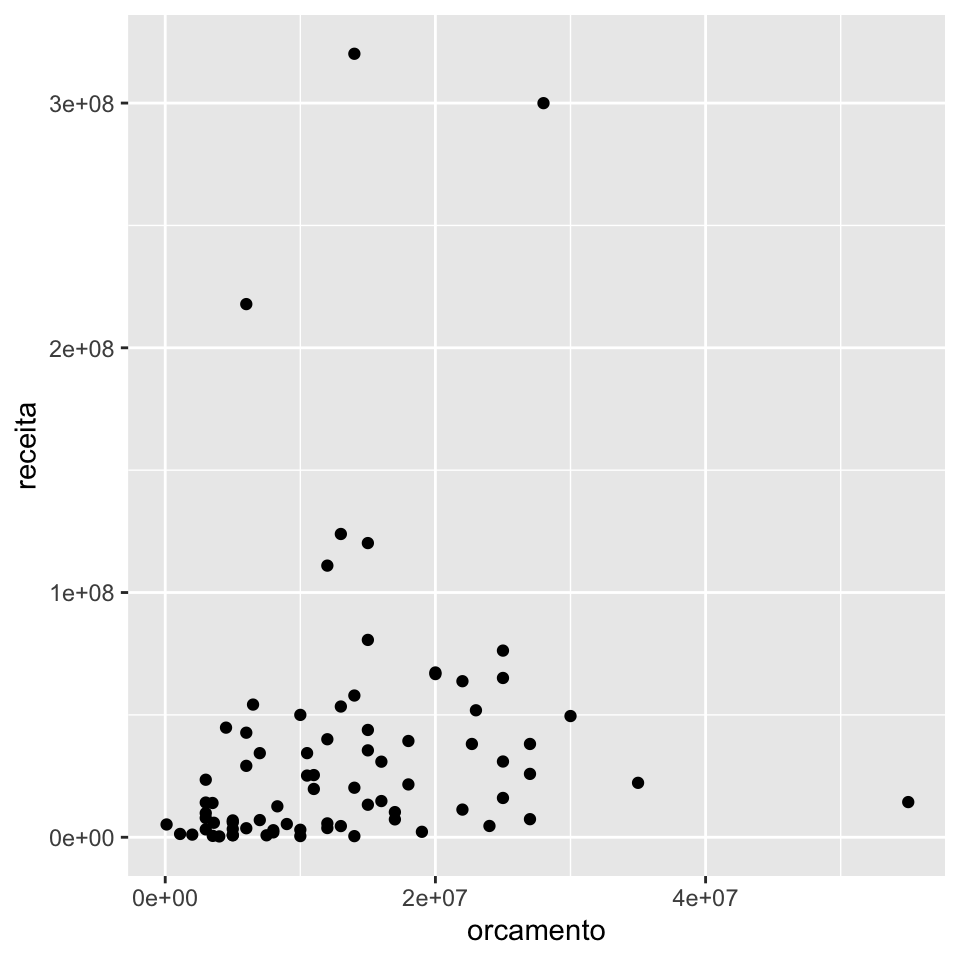

## O pacote tidyr {#tidyr}

Dentro do `tidyverse`, uma base *tidy* é uma base fácil de se trabalhar, isto é, fácil de se fazer manipulação de dados, fácil de se criar visualizações, fácil de se ajustar modelos e por aí vai.

Na prática, uma base *tidy* é aquela que se encaixa bem no *framework* do `tidyverse`, pois os pacotes como o `dplyr` e o `ggplot2` foram desenvolvidos para funcionar bem com bases *tidy*. E assim como esses pacotes motivaram o uso de bases *tidy*, o conceito *tidy* motiva o surgimento de novos *frameworks*, como o `tidymodels` para modelagem.

As duas propriedades mais importantes de uma base *tidy* são:

- cada coluna é uma variável;

- cada linha é uma observação.

Essa definição proporciona uma maneira consistente de se referir a variáveis (nomes de colunas) e observações (índices das linhas).

O pacote `{tidyr}` possui funções que nos ajudam a deixar uma base bagunçada em uma base *tidy*. Ou então, nos ajudam a bagunçar um pouquinho a nossa base quando isso nos ajudar a produzir o resultados que queremos.

Vamos ver aqui algumas de suas principais funções:

- `separate()` e `unite()`: para separar variáveis concatenadas em uma única coluna ou uni-las.

- `pivot_wider()` e `pivot_longer()`: para pirvotar a base.

- `nest()` e `unnest()`: para criar *list columns*.

Como motivação para utilizar esssas funções, vamos utilizar a nossa boa e velha base `imdb`. Essa base pode ser baixada [clicando aqui](https://github.com/curso-r/livro-material/raw/master/assets/data/imdb.rds).


```r
library(dplyr)
library(tidyr)
library(ggplot2)

imdb <- readr::read_rds("imdb.rds")
```

### `separate()` e `unite()`

A função `separate()` separa duas ou mais variáveis que estão concatenadas em uma mesma coluna. A sintaxe da função está apresentada abaixo.


```r
dados %>% 
  separate( 
    col = coluna_velha, 
    into = c("colunas", "novas"),
    sep = "separador"
  )
```

Como exemplo, vamos transformar a coluna `generos` da base IMDB em três colunas, cada uma com um dos gêneros do filme. Lembrando que os valores da coluna `generos` estão no seguinte formato:


```r
imdb %>% pull(generos) %>% head()
```

```
## [1] "Action|Adventure|Fantasy|Sci-Fi"                          
## [2] "Action|Adventure|Fantasy"                                 
## [3] "Action|Thriller"                                          
## [4] "Action|Adventure|Sci-Fi"                                  
## [5] "Action|Adventure|Romance"                                 
## [6] "Adventure|Animation|Comedy|Family|Fantasy|Musical|Romance"
```

Veja que agora, temos 3 colunas de gênero. Filmes com menos de 3 gêneros recebem `NA` na coluna `genero2` e/ou `genero3`. Os gêneros sobressalentes são descartados, assim como a coluna `generos` original.


```r
imdb %>% 
  separate( 
    col = generos,
    into = c("genero1", "genero2", "genero3"), 
    sep = "\\|"
  )
```

```
## Warning: Expected 3 pieces. Additional pieces discarded in 1052 rows [1, 6, 12,
## 13, 16, 18, 23, 24, 25, 28, 32, 34, 36, 39, 40, 43, 47, 48, 49, 50, ...].
```

```
## Warning: Expected 3 pieces. Missing pieces filled with `NA` in 1537 rows [3, 19,
## 21, 42, 84, 88, 92, 102, 106, 111, 113, 129, 138, 147, 178, 183, 186, 219, 222,
## 233, ...].
```

```
## # A tibble: 3,807 x 17
##    titulo   ano diretor duracao cor   genero1 genero2 genero3 pais 
##    <chr>  <int> <chr>     <int> <chr> <chr>   <chr>   <chr>   <chr>
##  1 Avata…  2009 James …     178 Color Action  Advent… Fantasy USA  
##  2 Pirat…  2007 Gore V…     169 Color Action  Advent… Fantasy USA  
##  3 The D…  2012 Christ…     164 Color Action  Thrill… <NA>    USA  
##  4 John …  2012 Andrew…     132 Color Action  Advent… Sci-Fi  USA  
##  5 Spide…  2007 Sam Ra…     156 Color Action  Advent… Romance USA  
##  6 Tangl…  2010 Nathan…     100 Color Advent… Animat… Comedy  USA  
##  7 Aveng…  2015 Joss W…     141 Color Action  Advent… Sci-Fi  USA  
##  8 Batma…  2016 Zack S…     183 Color Action  Advent… Sci-Fi  USA  
##  9 Super…  2006 Bryan …     169 Color Action  Advent… Sci-Fi  USA  
## 10 Pirat…  2006 Gore V…     151 Color Action  Advent… Fantasy USA  
## # … with 3,797 more rows, and 8 more variables: classificacao <chr>,
## #   orcamento <int>, receita <int>, nota_imdb <dbl>, likes_facebook <int>,
## #   ator_1 <chr>, ator_2 <chr>, ator_3 <chr>
```

A função `unite()` realiza a operação inversa da função `separate()`. Ela concatena os valores de várias variáveis em uma única coluna. A sintaxe é a seguinte:


```r
dados %>% 
  unite(
    col = coluna_nova, 
    colunas_para_juntar, 
    sep = "separador" 
  )
```

Como exemplo, vamos agora transformar as colunas `ator1`, `ator2` e `ator3` em uma única coluna `atores`. Lembrando que essas colunas estão no formato abaixo.


```r
imdb %>% select(starts_with("ator")) %>% head(3)
```

```
## # A tibble: 3 x 3
##   ator_1      ator_2           ator_3              
##   <chr>       <chr>            <chr>               
## 1 CCH Pounder Joel David Moore Wes Studi           
## 2 Johnny Depp Orlando Bloom    Jack Davenport      
## 3 Tom Hardy   Christian Bale   Joseph Gordon-Levitt
```

Veja que agora a coluna `atores` possui os 3 atores concatenados. Se a ordem das colunas `ator1`, `ator2` e `ator3` nos trazia a informação de protagonismo, essa informação passa a ficar implícita nesse novo formato. As 3 colunas originais são removidas da base resultante.


```r
imdb %>% 
  unite(
    col = "elenco",
    starts_with("ator"), 
    sep = " - "
  ) %>% 
  select(elenco)
```

```
## # A tibble: 3,807 x 1
##    elenco                                                  
##    <chr>                                                   
##  1 CCH Pounder - Joel David Moore - Wes Studi              
##  2 Johnny Depp - Orlando Bloom - Jack Davenport            
##  3 Tom Hardy - Christian Bale - Joseph Gordon-Levitt       
##  4 Daryl Sabara - Samantha Morton - Polly Walker           
##  5 J.K. Simmons - James Franco - Kirsten Dunst             
##  6 Brad Garrett - Donna Murphy - M.C. Gainey               
##  7 Chris Hemsworth - Robert Downey Jr. - Scarlett Johansson
##  8 Henry Cavill - Lauren Cohan - Alan D. Purwin            
##  9 Kevin Spacey - Marlon Brando - Frank Langella           
## 10 Johnny Depp - Orlando Bloom - Jack Davenport            
## # … with 3,797 more rows
```

### Pivotagem

O conceito de pivotagem no *tidyverse* se refere a mudança da estrutura da base, geralmente para alcançar o formato *tidy*. 

Geralmente realizamos pivotagem quando nossas linhas não são unidades observacionais ou nossas colunas não são variáveis. Ela é similiar à pivotagem do Excel, mas um pouco mais complexa.

O ato de pivotar resulta em transformar uma base de dados *long* em *wide* e vice-versa. 

Uma base no formato *long* possui mais linhas e pode ter menos colunas, enquanto no formato *wide* poussi menos linhas e pode ter mais colunas

Esses formatos são sempre relativos às colunas que estão sendo pivotadas, sendo que uma base *tidy* pode estar tanto no formato *long* quanto *wide*.

Antigamente, utilizávamos as funções `gather()` e `spread()` para fazer as operações de pivotagem. 

Agora, no lugar de `gather()`, utilizamos a função `pivot_longer()`. Abaixo, transformamos as colunas `ator1`, `ator2` e `ator3` em duas colunas: `ator_atriz` e `protagonismo`.


```r
imdb %>% 
  pivot_longer(
    cols = starts_with("ator"), 
    names_to = "protagonismo",
    values_to = "ator_atriz"
  ) %>% 
  select(titulo, ator_atriz, protagonismo) %>% 
  head(6)
```

```
## # A tibble: 6 x 3
##   titulo                                    ator_atriz       protagonismo
##   <chr>                                     <chr>            <chr>       
## 1 Avatar                                    CCH Pounder      ator_1      
## 2 Avatar                                    Joel David Moore ator_2      
## 3 Avatar                                    Wes Studi        ator_3      
## 4 Pirates of the Caribbean: At World's End  Johnny Depp      ator_1      
## 5 Pirates of the Caribbean: At World's End  Orlando Bloom    ator_2      
## 6 Pirates of the Caribbean: At World's End  Jack Davenport   ator_3
```

Se considerarmos que na análise da base IMDB cada observação deve ser um filme, então essa nova base já não mais *tidy*, pois agora cada filme aparece em três linhas diferentes, uma vez para cada um de seus atores.

Nesse sentido, embora possa parecer que a variável `protagonismo` estava implícita na base original, ela não é uma variável de fato. Todos filmes têm um `ator_1`, um `ator_2` e um `ator_3`. Não existe nenhuma informação sobre o filme que podemos tirar da coluna `protagonismo`, pois ela qualifica apenas os atores, não o filme em si.

A função `pivot_wider()` faz a operação inversa da `pivot_longer()`. Sem aplicarmos as duas funções em sequência, voltamos para a base original.


```r
imdb %>% 
  pivot_longer(
    cols = starts_with("ator"), 
    names_to = "ator_protagonismo",
    values_to = "ator_nome"
  ) %>% 
  pivot_wider(
    names_from = "ator_protagonismo",
    values_from = "ator_nome"
  ) %>% 
  head(4)
```

```
## Warning: Values are not uniquely identified; output will contain list-cols.
## * Use `values_fn = list` to suppress this warning.
## * Use `values_fn = length` to identify where the duplicates arise
## * Use `values_fn = {summary_fun}` to summarise duplicates
```

```
## # A tibble: 4 x 15
##   titulo   ano diretor duracao cor   generos pais  classificacao orcamento
##   <chr>  <int> <chr>     <int> <chr> <chr>   <chr> <chr>             <int>
## 1 Avata…  2009 James …     178 Color Action… USA   A partir de … 237000000
## 2 Pirat…  2007 Gore V…     169 Color Action… USA   A partir de … 300000000
## 3 The D…  2012 Christ…     164 Color Action… USA   A partir de … 250000000
## 4 John …  2012 Andrew…     132 Color Action… USA   A partir de … 263700000
## # … with 6 more variables: receita <int>, nota_imdb <dbl>,
## #   likes_facebook <int>, ator_1 <list>, ator_2 <list>, ator_3 <list>
```

A base `imdb` não possui nenhuma variável que faça sentido aplicarmos diretamente a função `pivot_wider()`. Vamos então considerar a seguinte tabela derivada da base `imdb`:


```r
tab_romance_terror <- imdb %>%
  filter(ano >= 2010) %>%
  mutate(
    genero = case_when(
      stringr::str_detect(generos, "Romance") ~ "Romance",
      stringr::str_detect(generos, "Horror") ~ "Horror",
      TRUE ~ NA_character_
    )
  ) %>%
  filter(!is.na(genero)) %>%
  group_by(ano, genero) %>%
  summarise(receita_media = mean(receita, na.rm = TRUE))
```

```
## `summarise()` regrouping output by 'ano' (override with `.groups` argument)
```

Essa tabela possui a receita média dos filmes de romance e terror nos anos de 2010 a 2016.

Para apresentar essa tabela em uma reunião, por exemplo, pode ficar ser mais agradável ter os anos nas colunas e não nas linhas. Para isso, basta utilizarmos a função `pivot_wider()`.


```r
# Tabela original
tab_romance_terror
```

```
## # A tibble: 14 x 3
## # Groups:   ano [7]
##      ano genero  receita_media
##    <int> <chr>           <dbl>
##  1  2010 Horror      30242147.
##  2  2010 Romance     48834552 
##  3  2011 Horror      33186210.
##  4  2011 Romance     40780528.
##  5  2012 Horror      36090815.
##  6  2012 Romance     53134506.
##  7  2013 Horror      56829163 
##  8  2013 Romance     25590508 
##  9  2014 Horror      37324785.
## 10  2014 Romance     51353872.
## 11  2015 Horror      27965711.
## 12  2015 Romance     60166036.
## 13  2016 Horror      57896396.
## 14  2016 Romance    105439985.
```


```r
# Tabela com os anos nas colunas
tab_romance_terror %>% 
  pivot_wider(
    names_from = ano,
    values_from = receita_media
  )
```

```
## # A tibble: 2 x 8
##   genero     `2010`    `2011`    `2012`   `2013`    `2014`    `2015`     `2016`
##   <chr>       <dbl>     <dbl>     <dbl>    <dbl>     <dbl>     <dbl>      <dbl>
## 1 Horror  30242147. 33186210. 36090815. 56829163 37324785. 27965711.  57896396.
## 2 Romance 48834552  40780528. 53134506. 25590508 51353872. 60166036. 105439985.
```

Esse é um caso que *bagunçar* um pouquinho a tabela nos trouxe um resultado desejado.

### *List columns*

Um terceiro conceito de dados *tidy* é que cada célula da tabela possui um valor. No entanto, quando estamos programando, muitas vezes vale apena abandonar essa definição e guardarmos objetos mais complexos nas células de uma tabela.

Utilizando as chamadas *list columns* podemos guardar virtualmente qualquer objeto em nossas *tibbles*, como gráficos, resultados de modelos ou até mesmo outras tabelas.

Uma forma de trabalhar com *list columns* consiste em utilizarmos as funções

- `nest()`: para criar uma *list column*;

- `unnest()`: para desfazer uma *list column*.

A forma mais simples de utilizarmos uma *list column* é *aninhar* a nossa base com relação a uma variável.


```r
imdb_nest <- imdb %>%
  group_by(ano) %>%
  nest() %>% 
  arrange(ano)

head(imdb_nest, 8)
```

```
## # A tibble: 8 x 2
## # Groups:   ano [8]
##     ano data             
##   <int> <list>           
## 1  1916 <tibble [1 × 14]>
## 2  1920 <tibble [1 × 14]>
## 3  1925 <tibble [1 × 14]>
## 4  1929 <tibble [1 × 14]>
## 5  1930 <tibble [1 × 14]>
## 6  1932 <tibble [1 × 14]>
## 7  1933 <tibble [2 × 14]>
## 8  1934 <tibble [1 × 14]>
```

A base `imdb_nest` possui duas colunas `ano` e `data` e uma linha para cada ano. Na coluna `data`, temos o restante da base `imdb`, recortada para cada um dos anos.

Abaixo, acessmos os dados do único filme de 1916 (primeira linha da base `imdb_nest`).


```r
imdb_nest$data[[1]]
```

```
## # A tibble: 1 x 14
##   titulo diretor duracao cor   generos pais  classificacao orcamento receita
##   <chr>  <chr>     <int> <chr> <chr>   <chr> <chr>             <int>   <int>
## 1 Intol… D.W. G…     123 Blac… Drama|… USA   Outros           385907      NA
## # … with 5 more variables: nota_imdb <dbl>, likes_facebook <int>, ator_1 <chr>,
## #   ator_2 <chr>, ator_3 <chr>
```

Imagine que queiramos fazer, para cada ano, um gráfico de dispersão da receita contra o orçamento dos filmes lançados no ano.

Com a base no formato de *list columns*, basta criarmos uma função para gerar o gráfico e utilizarmos a função `purrr::map()`.

Abaixo, construímos a função `fazer_grafico_dispersao()`, que será aplicada a cada uma das bases contidas na coluna `data` da base `imdb_nest`. Os gráficos, respectivamos a cada ano, são salvos na coluna `grafico`.


```r
fazer_grafico_dispersao <- function(tab) {
  tab %>%
    ggplot(aes(x = orcamento, y = receita)) +
    geom_point()
}

imdb_graficos <- imdb_nest %>% 
  mutate(
    grafico = purrr::map(data, fazer_grafico_dispersao)
  )

head(imdb_graficos, 6)
```

```
## # A tibble: 6 x 3
## # Groups:   ano [6]
##     ano data              grafico
##   <int> <list>            <list> 
## 1  1916 <tibble [1 × 14]> <gg>   
## 2  1920 <tibble [1 × 14]> <gg>   
## 3  1925 <tibble [1 × 14]> <gg>   
## 4  1929 <tibble [1 × 14]> <gg>   
## 5  1930 <tibble [1 × 14]> <gg>   
## 6  1932 <tibble [1 × 14]> <gg>
```

Para acessar cada um dos gráficos, basta rodar o código abaixo.


```r
# Pegando o gráfico referente ao ano de 2000
imdb_graficos$grafico[[74]]
```

```
## Warning: Removed 5 rows containing missing values (geom_point).
```


Ou, escolhendo diretamente pelo ano


```r
imdb_graficos %>% 
  filter(ano == 2000) %>% 
  pull(grafico)
```

```
## [[1]]
```

```
## Warning: Removed 5 rows containing missing values (geom_point).
```



A função `unnest()` remove a estrutura de *list column*. Fazendo a operação abaixo, voltamos para a base `imdb` original.


```r
imdb_nest %>%
  unnest(cols = "data")
```

```
## # A tibble: 3,807 x 15
## # Groups:   ano [91]
##      ano titulo diretor duracao cor   generos pais  classificacao orcamento
##    <int> <chr>  <chr>     <int> <chr> <chr>   <chr> <chr>             <int>
##  1  1916 Intol… D.W. G…     123 Blac… Drama|… USA   Outros           385907
##  2  1920 Over … Harry …     110 Blac… Crime|… USA   Outros           100000
##  3  1925 The B… King V…     151 Blac… Drama|… USA   Outros           245000
##  4  1929 The B… Harry …     100 Blac… Musica… USA   Outros           379000
##  5  1930 Hell'… Howard…      96 Blac… Drama|… USA   Outros          3950000
##  6  1932 A Far… Frank …      79 Blac… Drama|… USA   Outros           800000
##  7  1933 42nd … Lloyd …      89 Blac… Comedy… USA   Outros           439000
##  8  1933 She D… Lowell…      66 Blac… Comedy… USA   Outros           200000
##  9  1934 It Ha… Frank …      65 Blac… Comedy… USA   Outros           325000
## 10  1935 Top H… Mark S…      81 Blac… Comedy… USA   Outros           609000
## # … with 3,797 more rows, and 6 more variables: receita <int>, nota_imdb <dbl>,
## #   likes_facebook <int>, ator_1 <chr>, ator_2 <chr>, ator_3 <chr>
```

### Exercícios

**1.** Crie 5 novas colunas de gêneros na base imdb, cada uma com um dos gêneros contidos na coluna generos. Para os filmes com menos de 5 gêneros, substitua os valores `NA` pela string "inexistente".

**2.** Substitua os "????" no código abaixo para criar uma tabela do lucro médio dos filmes ao longo dos anos de 2000 a 2016, com cada ano sendo uma coluna da base.


```r
imdb %>%
  mutate(lucro = receita - orcamento) %>%
  filter(ano %in% "????") %>%
  group_by("????") %>%
  summarise(lucro_medio = "????") %>%
  pivot_wider(names_from = "????", values_from = "????")
```

Para os exercícios 3, 4 e 5, vamos utilize a base `pokemon`, disponível no pacote `basesCursoR`.


```r
install.packages("remotes")
remotes::install_github("curso-r/basesCursoR")
```

**3.** Utilize a função `unite()` para juntar as duas colunas de tipo em uma única coluna na base pokemon.

**4.** Utilize a função `unite()` para juntar as três colunas de cor em uma única coluna na base pokemon. Faça isso sem remover as 3 colunas originais.

**5.** Utilizando a base `pokemon`, resolva os itens abaixo:

**a.** Utilize a função `pivot_longer()` para criar uma única coluna de tipo na base pokemon.

**b.** Utilize a base criada no item (a) e escreva um código para descobrir qual o tipo mais frequente na base, independentemente se ele é primário (tipo_1) ou secundário (tipo_2).

**6.** Escreva uma função que receba uma base qualquer e o nome de uma coluna numérica dessa base e retorne uma figura com um gráfico de dispersão da coluna escolhida contra cada uma das outras variáveis numéricas da base.


