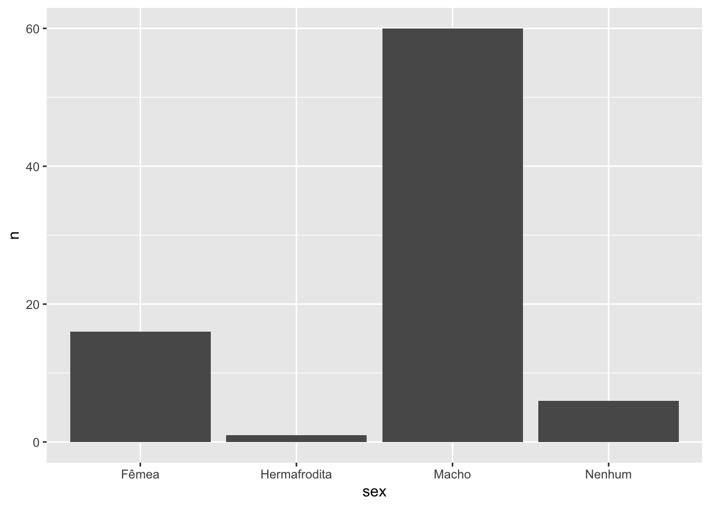
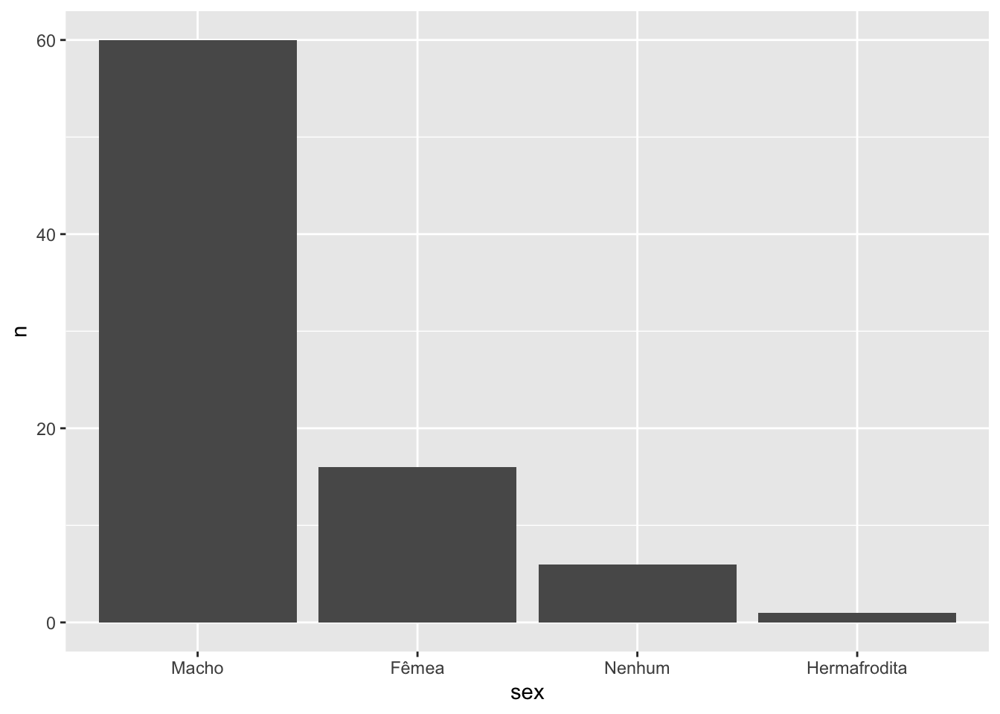
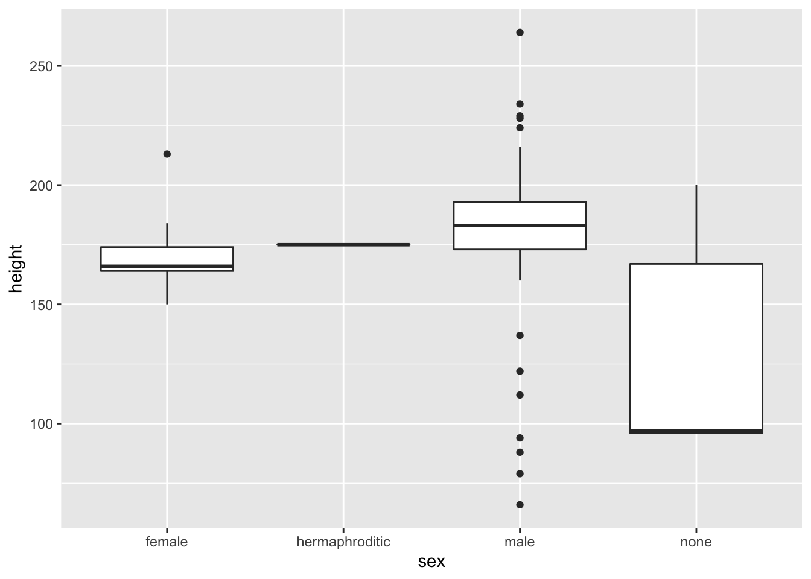
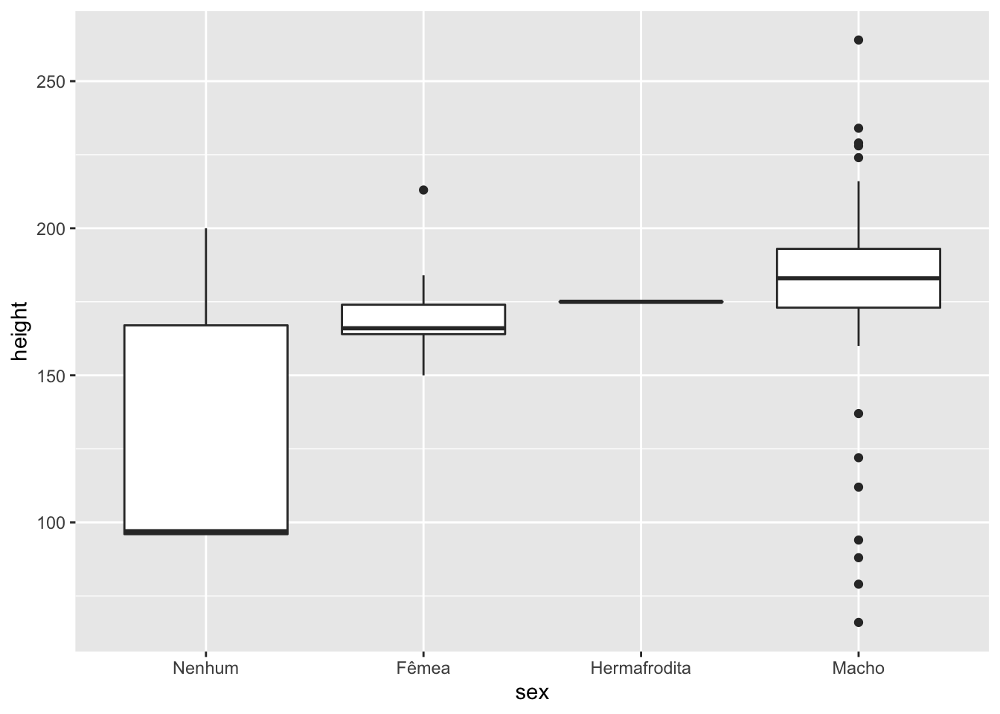
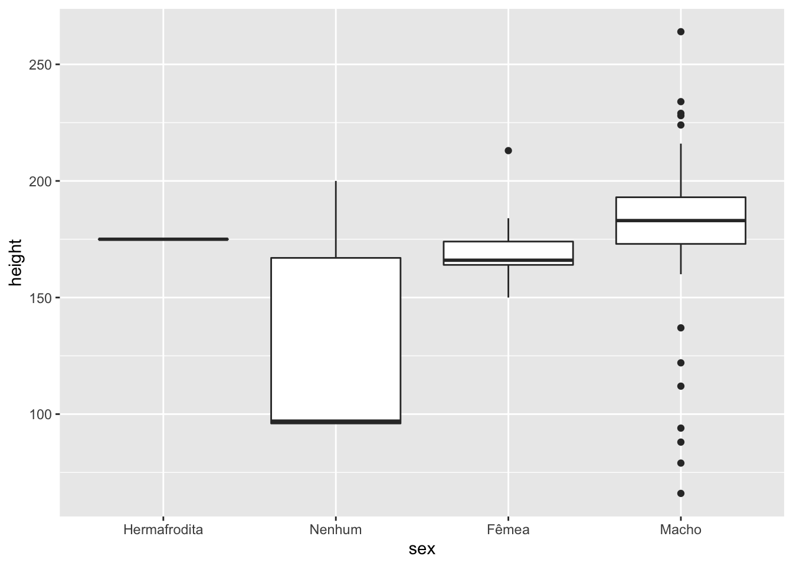
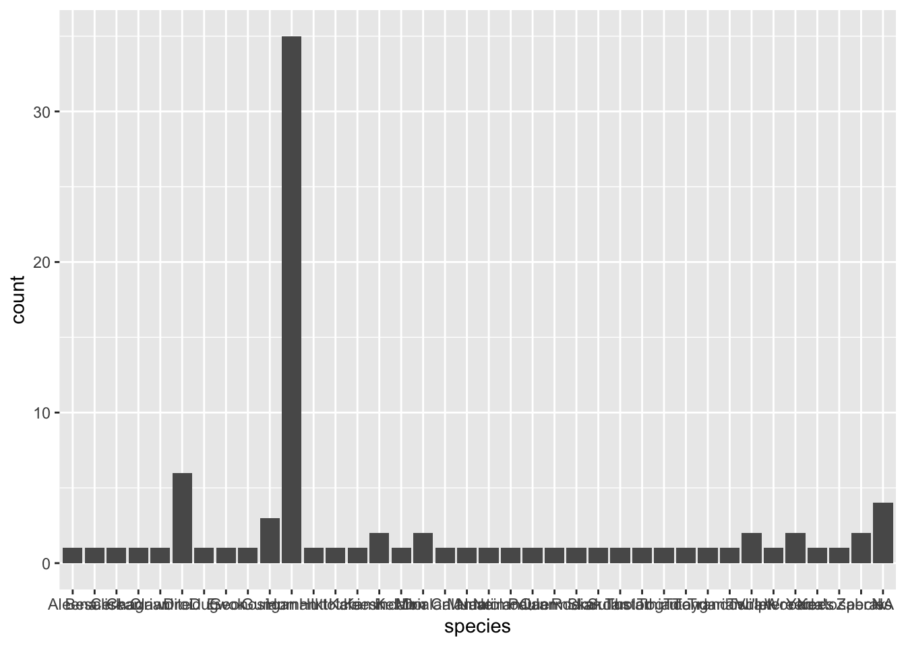
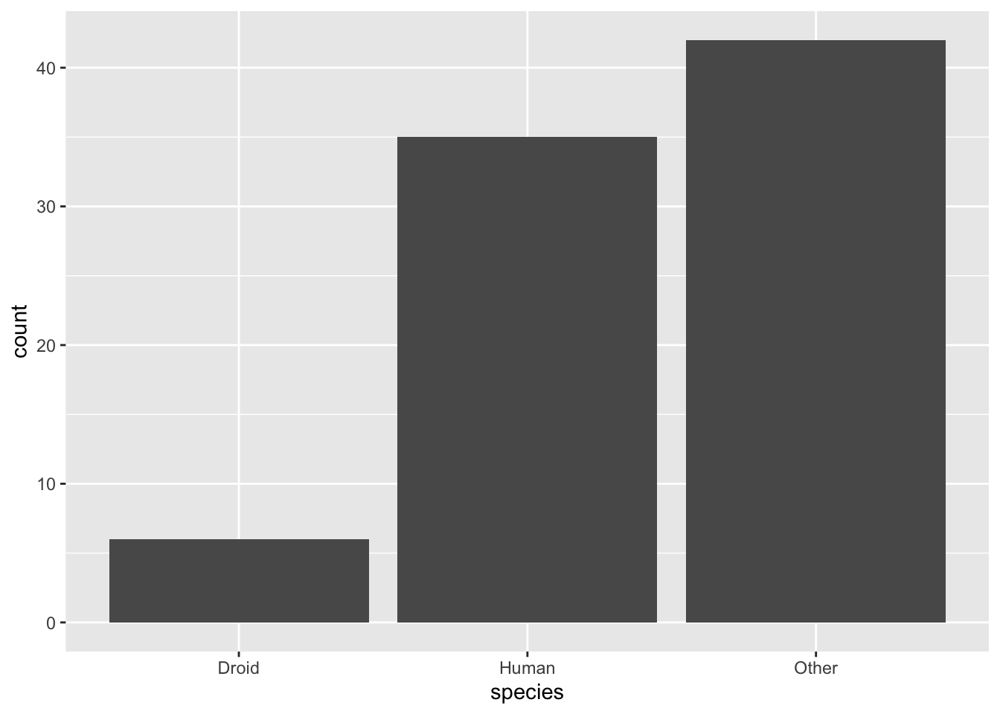
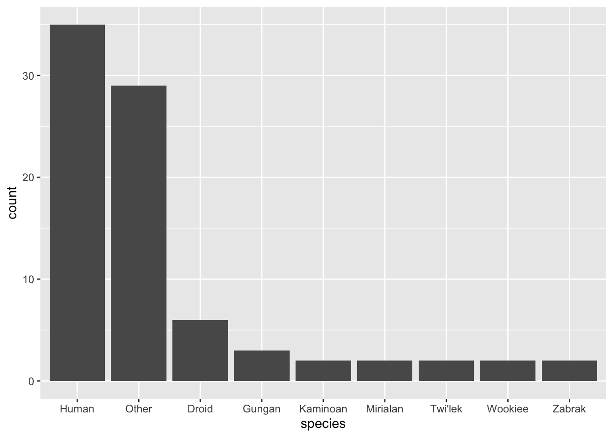
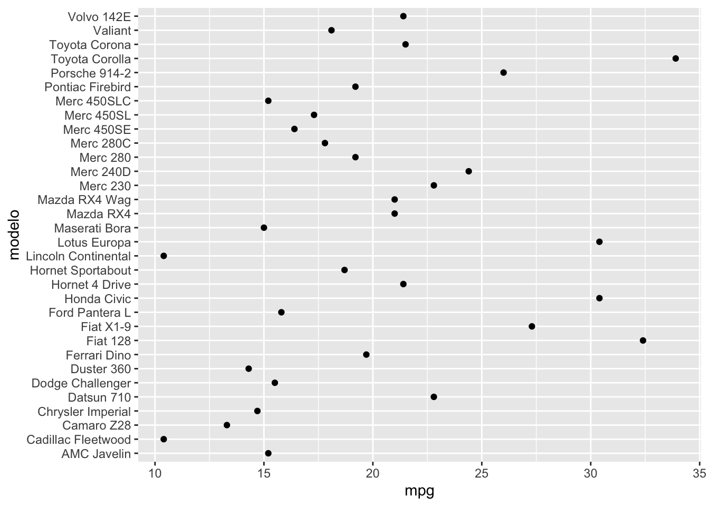

## O pacote forcats {#forcats}


Se você utiliza R antes do surgimento do `tidyverse`, provavelmente já escreveu a expressão `stringsAsFactors = F` quando importava dados usando as funções `read.csv` ou `read.table`. É muito frustrante quando uma coluna de `strings` é lida como um fator, pois fatores não podem ser manipulados do mesmo jeito que manipulamos vetores de `strings`.

Felizmente, depois de aprender a usar o `readr` você não terá mais esse problema, pois as funções do pacote não lê colunas de caracteres como fatores por padrão. Mas isso não significa que fatores são inúteis. Eles representam uma forma muito prática de lidar com variáveis categorizadas, tanto para fins de modelagem quanto para fins de visualização. 

Grande parte da frustração associada ao uso de fatores no R existe por conta da falta de algumas ferramentas úteis no pacote `base`. Para resolver esse o problema, Hadley Wickham ajudou a comunidade R (de novo) desenvolvendo o pacote `forcats`(**for** **cat**egorial variable**s**), que implementa algumas dessas ferramentas.

As principais funções do `forcats` servem para alterar a **ordem** e modificar os **níveis** de um fator. Para exemplificar a utilidade dessas funções, nesta seção vamos utilizá-las em situações corriqueiras.

Se você não tem o pacote `{forcats}`, instalado rode o código abaixo antes de utilizá-lo:


```r
install.packages("forcats")
```

Nos exemplos a seguir, utilizarmos os seguintes pacotes:


```r
library(forcats)
library(ggplot2)
library(dplyr)
```

### O que são fatores?

Como vimos na Seção \@ref(fatores), fatores são uma classe de objetos no R criada para representar as variáveis categóricas numericamente.

Eles são necessários pois muitas vezes precisamos representar variáveis categóricas como números. Quando estamos fazendo um gráfico, por exemplo, só podemos mapear variáveis numéricas em seus eixos, pois o plano cartesiano é formado por duas retas de números reais.

O que fazemos então quando plotamos uma variável categórica? Nós a transformamos em fatores.

Mas como a manipulação de fatores é diferente da manipulação de números e strings (graças aos famosos *levels*), tarefas que parecem simples, como ordenar as barras de um gráfico de barras, acabam se tornando grandes desafios quando não sabemos lidar com essa classe de valores.

Nos exemplos a seguir, vamos utilizar a base `starwars` (do pacote `{dplyr}`) para aprendermos a fazer as principais operações com fatores utilizando o pacote `{forcats}`.

### Modificando níveis de um fator

Vamos trabalhar primeiro com a coluna `sex`, que diz qual é o sexo de cada personagem. As possibilidades são:


```r
starwars %>% 
  pull(sex) %>% 
  unique()
## [1] "male"           "none"           "female"         "hermaphroditic"
## [5] NA
```

Veja que se transformarmos a coluna em fator, esses serão os *levels* da variável, não importa se o sub-conjunto que estivermos observando possua ou não todas as categorias.


```r
starwars %>% 
  mutate(sex = as.factor(sex)) %>% 
  pull(sex) %>% 
  head()
## [1] male   none   none   male   female male  
## Levels: female hermaphroditic male none
```

Vamos criar um objeto com os 16 primeiros valores da coluna `sex` já transformados em fator.


```r
fator_sex <- starwars %>% 
  pull(sex) %>% 
  as.factor() %>% 
  head(16)
fator_sex
##  [1] male           none           none           male           female        
##  [6] male           female         none           male           male          
## [11] male           male           male           male           male          
## [16] hermaphroditic
## Levels: female hermaphroditic male none
```

Para mudar os níveis de um fator, podemos utilizar a função `lvls_revalue()`. Veja que, ao mudarmos os níveis de um fator, o *label* de cada valor também muda. Os novos valores precisam ser passados conforme a ordem dos níveis antigos.


```r
lvls_revalue(
  fator_sex, 
  new_levels = c("Fêmea", "Hermafrodita", "Macho", "Nenhum")
)
##  [1] Macho        Nenhum       Nenhum       Macho        Fêmea       
##  [6] Macho        Fêmea        Nenhum       Macho        Macho       
## [11] Macho        Macho        Macho        Macho        Macho       
## [16] Hermafrodita
## Levels: Fêmea Hermafrodita Macho Nenhum
```

Essa função é uma boa alternativa para mudar o nome das categorias de uma variável antes de construir um gráfico.


```r
starwars %>% 
  filter(!is.na(sex)) %>% 
  count(sex) %>% 
  mutate(
    sex = lvls_revalue(sex, c("Fêmea", "Hermafrodita", "Macho", "Nenhum"))
  ) %>% 
  ggplot() +
  geom_col(aes(x = sex, y = n)) 
```



Como as colunas no gráfico respeitam a ordem dos níveis do fator, não importa a ordem que as linhas aparecem na tabela, o gráfico sempre será gerado com as colunas na mesma ordem. Assim, se quiséssemos alterar a ordem das barras do gráfico anterior, precisamos mudar a ordem dos níveis do fator `sex`.

### Mudando a ordem dos níveis de um fator

Para mudar a ordem dos níveis de um fator, podemos utilizar a função `lvls_reorder()`. Basta passarmos qual a nova ordem dos fatores, com relação à ordem anterior. No exemplo abaixo definimos que, na nova ordem,

- a primeira posição terá o nível que estava na terceira posição na ordem antiga;

- a segunda posição terá o nível que estava na primeira posição na ordem antiga;


- a terceira posição terá o nível que estava na quarta posição na ordem antiga;


- a quarta posição terá o nível que estava na segunda posição na ordem antiga.


```r
lvls_reorder(fator_sex, c(3, 1, 4, 2))
##  [1] male           none           none           male           female        
##  [6] male           female         none           male           male          
## [11] male           male           male           male           male          
## [16] hermaphroditic
## Levels: male female none hermaphroditic
```

Assim, poderíamos usar essa nova ordem para ordenar as colunas do nosso gráfico.


```r
starwars %>% 
  filter(!is.na(sex)) %>% 
  count(sex) %>% 
  mutate(
    sex = lvls_revalue(sex, c("Fêmea", "Hermafrodita", "Macho", "Nenhum")),
    sex = lvls_reorder(sex, c(3, 1, 4, 2))
  ) %>% 
  ggplot() +
  geom_col(aes(x = sex, y = n)) 
```


Repare que precisamos passar a nova ordem na mão, o que pode deixar de funcionar se a nossa base mudar (recebemos mais linhas ou fizermos um filtro anteriormente).

Anterior ao `mutate()` temos a seguinte tabela:


```r
starwars %>% 
  filter(!is.na(sex)) %>% 
  count(sex) 
## # A tibble: 4 x 2
##   sex                n
##   <chr>          <int>
## 1 female            16
## 2 hermaphroditic     1
## 3 male              60
## 4 none               6
```

O que queremos é que os níveis da coluna `sex` sejam ordenados segundo os valores da coluna `n`, isto é, quem tiver o maior valor de `n` deve ser o primeiro nível, o segundo maior valor de `n` seja o segundo nível e assim por diante.

Podemos melhorar esse código utilizando a função `fct_reorder()`. Com ela, em vez de definirmos na mão a ordem dos níveis do fator, podemos ordená-lo segundo valores de uma segunda variável.


```r
starwars %>% 
  filter(!is.na(sex)) %>% 
  count(sex) %>% 
  mutate(
    sex = lvls_revalue(sex, c("Fêmea", "Hermafrodita", "Macho", "Nenhum")),
    sex = fct_reorder(sex, n)
  ) %>% 
  ggplot() +
  geom_col(aes(x = sex, y = n)) 
```


É quase o que queríamos! O problema é que os níveis estão sendo ordenados de forma crescente e gostaríamos de ordenar na ordem decrescente. Para isso, basta utilizarmos o parâmetro `.desc`.


```r
starwars %>% 
  filter(!is.na(sex)) %>% 
  count(sex) %>% 
  mutate(
    sex = lvls_revalue(sex, c("Fêmea", "Hermafrodita", "Macho", "Nenhum")),
    sex = fct_reorder(sex, n, .desc = TRUE)
  ) %>% 
  ggplot() +
  geom_col(aes(x = sex, y = n)) 
```




Agora sim! Com esse código, as colunas estarão sendo ordenadas pela frequência, independentemente dos valores de `n` e `sex` que chegarem no `mutate()`.

Se olharmos a documentação da função `fct_reorder()` vamos descobrir que esse exemplo é apenas um caso particular de como podemos utilizá-la. No contexto geral, ela ordena os níveis de um fator segundo **uma função** dos valores de uma segunda variável.

Se em vez de construirmos um gráfico de barras da frequência da variável `sex`, construíssemos boxplots da altura para cada sexo diferente, teríamos o gráfico a seguir.


```r
starwars %>% 
  filter(!is.na(sex)) %>% 
  ggplot() +
  geom_boxplot(aes(x = sex, y = height))
## Warning: Removed 5 rows containing non-finite values (stat_boxplot).
```


Se quiséssemos ordenar cada boxplot (pela mediana, por exemplo), continuamos podendo usar a função `fct_reorder()`. Veja que ela possui o argumento `.fun`, que indica qual função será utilizada na variável secundária para determinar a ordem dos níveis.

No exemplo abaixo, utilizamos `.fun = median`, o que significa que, para cada nível da variável `sex`, vamos calcular a mediana da variável `height` e ordenaremos os níveis de `sex` conforme a ordem dessas medianas. Assim, o primeiro nível será o sexo com menor altura mediana, o segundo nível será o sexo com a segunda menor algura media e assim por diante. Se quiséssemos ordenar de forma decrescente, bastaria utilizar o argumento `.desc = TRUE`.


```r
starwars %>% 
  filter(!is.na(sex)) %>% 
  mutate(
    sex = lvls_revalue(sex, c("Fêmea", "Hermafrodita", "Macho", "Nenhum")),
    sex = fct_reorder(sex, height, .fun = median, na.rm = TRUE)
  ) %>% 
ggplot() +
  geom_boxplot(aes(x = sex, y = height))
## Warning: Removed 5 rows containing non-finite values (stat_boxplot).
```


Também poderíamos ordenar pelo máximo, utilizando `.fun = max`. Neste argumento, podemos usar qualquer função sumarizadora: `min()`, `mean()`, `median()`, `max()`, `sd()`, `var()` etc.


```r
starwars %>% 
  filter(!is.na(sex)) %>% 
  mutate(
    sex = lvls_revalue(sex, c("Fêmea", "Hermafrodita", "Macho", "Nenhum")),
    sex = fct_reorder(sex, height, .fun = max, na.rm = TRUE)
  ) %>% 
ggplot() +
  geom_boxplot(aes(x = sex, y = height))
## Warning: Removed 5 rows containing non-finite values (stat_boxplot).
```



### Colapsando níveis de um fator

Imagine que quermos fazer um gráfico de barras com a frequência de personagens por espécie.


```r
starwars %>% 
  ggplot(aes(x = species)) +
  geom_bar()
```



O gráfico resultante é horrível, pois temos muitas espécies diferentes. Uma solução seria agrupar as espécies menos frequentes, criando uma nova categoria (*outras*, por exemplo).

Para isso, podemos usar a função `fct_lump()`. Vamos fazer isso primeiro com o vetor de espécies.


```r
fator_especies <- as.factor(starwars$species)
fator_especies
##  [1] Human          Droid          Droid          Human          Human         
##  [6] Human          Human          Droid          Human          Human         
## [11] Human          Human          Wookiee        Human          Rodian        
## [16] Hutt           Human          Human          Yoda's species Human         
## [21] Human          Droid          Trandoshan     Human          Human         
## [26] Mon Calamari   Human          Human          Ewok           Sullustan     
## [31] Human          Neimodian      Human          Gungan         Gungan        
## [36] Gungan         <NA>           Toydarian      Dug            <NA>          
## [41] Human          Zabrak         Twi'lek        Twi'lek        Vulptereen    
## [46] Xexto          Toong          Human          Cerean         Nautolan      
## [51] Zabrak         Tholothian     Iktotchi       Quermian       Kel Dor       
## [56] Chagrian       Human          Human          Human          Geonosian     
## [61] Mirialan       Mirialan       Human          Human          Human         
## [66] Human          Clawdite       Besalisk       Kaminoan       Kaminoan      
## [71] Human          Aleena         Droid          Skakoan        Muun          
## [76] Togruta        Kaleesh        Wookiee        Human          <NA>          
## [81] Pau'an         Human          Human          Human          Droid         
## [86] <NA>           Human         
## 37 Levels: Aleena Besalisk Cerean Chagrian Clawdite Droid Dug ... Zabrak
```

Temos 37 espécies diferentes na base. Podemos deixar apenas as 3 mais frequentes da seguinte forma:


```r
fct_lump(fator_especies, n = 3)
##  [1] Human  Droid  Droid  Human  Human  Human  Human  Droid  Human  Human 
## [11] Human  Human  Other  Human  Other  Other  Human  Human  Other  Human 
## [21] Human  Droid  Other  Human  Human  Other  Human  Human  Other  Other 
## [31] Human  Other  Human  Gungan Gungan Gungan <NA>   Other  Other  <NA>  
## [41] Human  Other  Other  Other  Other  Other  Other  Human  Other  Other 
## [51] Other  Other  Other  Other  Other  Other  Human  Human  Human  Other 
## [61] Other  Other  Human  Human  Human  Human  Other  Other  Other  Other 
## [71] Human  Other  Droid  Other  Other  Other  Other  Other  Human  <NA>  
## [81] Other  Human  Human  Human  Droid  <NA>   Human 
## Levels: Droid Gungan Human Other
```

O fator resultante possui 4 níveis: `Droid`, `Gungan`, `Human` e `Other`. Os 3 primeiros níveis são os mais frequentes, enquanto o nível `Other` foi atribuído a todos os outros 34 níveis que existiam anteiormente.

Poderíamos definir o nome do nível `Others` usando o argumento `other_level`.


```r
fct_lump(fator_especies, n = 3, other_level = "Outras espécies")
##  [1] Human           Droid           Droid           Human          
##  [5] Human           Human           Human           Droid          
##  [9] Human           Human           Human           Human          
## [13] Outras espécies Human           Outras espécies Outras espécies
## [17] Human           Human           Outras espécies Human          
## [21] Human           Droid           Outras espécies Human          
## [25] Human           Outras espécies Human           Human          
## [29] Outras espécies Outras espécies Human           Outras espécies
## [33] Human           Gungan          Gungan          Gungan         
## [37] <NA>            Outras espécies Outras espécies <NA>           
## [41] Human           Outras espécies Outras espécies Outras espécies
## [45] Outras espécies Outras espécies Outras espécies Human          
## [49] Outras espécies Outras espécies Outras espécies Outras espécies
## [53] Outras espécies Outras espécies Outras espécies Outras espécies
## [57] Human           Human           Human           Outras espécies
## [61] Outras espécies Outras espécies Human           Human          
## [65] Human           Human           Outras espécies Outras espécies
## [69] Outras espécies Outras espécies Human           Outras espécies
## [73] Droid           Outras espécies Outras espécies Outras espécies
## [77] Outras espécies Outras espécies Human           <NA>           
## [81] Outras espécies Human           Human           Human          
## [85] Droid           <NA>            Human          
## Levels: Droid Gungan Human Outras espécies
```


Também podemos transformar em `Outras` os níveis cuja frequência relativa é menor que um determinado limite, por exemplo, 2%. No exemplo abaixo, apenas espécies que representam mais de 2% dos personagem na base são mantidas. As demais foram transformadas em `Outras`.


```r
fct_lump(fator_especies, p = 0.02, other_level = "Outras")
##  [1] Human    Droid    Droid    Human    Human    Human    Human    Droid   
##  [9] Human    Human    Human    Human    Wookiee  Human    Outras   Outras  
## [17] Human    Human    Outras   Human    Human    Droid    Outras   Human   
## [25] Human    Outras   Human    Human    Outras   Outras   Human    Outras  
## [33] Human    Gungan   Gungan   Gungan   <NA>     Outras   Outras   <NA>    
## [41] Human    Zabrak   Twi'lek  Twi'lek  Outras   Outras   Outras   Human   
## [49] Outras   Outras   Zabrak   Outras   Outras   Outras   Outras   Outras  
## [57] Human    Human    Human    Outras   Mirialan Mirialan Human    Human   
## [65] Human    Human    Outras   Outras   Kaminoan Kaminoan Human    Outras  
## [73] Droid    Outras   Outras   Outras   Outras   Wookiee  Human    <NA>    
## [81] Outras   Human    Human    Human    Droid    <NA>     Human   
## 9 Levels: Droid Gungan Human Kaminoan Mirialan Twi'lek Wookiee ... Outras
```

Com isso, já conseguimos fazer um gráfico de barras mais agradável.


```r
starwars %>% 
  filter(!is.na(species)) %>% 
  mutate(species = fct_lump(species, n = 2)) %>% 
  ggplot(aes(x = species)) +
  geom_bar()
```



```r


starwars %>% 
  filter(!is.na(species)) %>% 
  mutate(
    species = fct_lump(species, p = 0.02),
    species = fct_infreq(species) # Ordena pela frequência de cada nível
  ) %>% 
  ggplot(aes(x = species)) +
  geom_bar()
```



Também é possível colapsar níveis criando manualmente os grupos. Para isso, utilizamos a função `fct_collapse()`. No exemplo a seguir, reclassificamos os níveis da variável `eye_color`. Os níveis não listados são reclassificados como  `"outros"`.


```r
fator_cor_olhos <- as.factor(starwars$eye_color)

fct_collapse(
  fator_cor_olhos,
  preto = "black",
  castanho = c("brown", "hazel"),
  azul_verde = c("blue", "green"),
  exotico = c("pink", "red", "white"),
  colorido = c("red, blue", "green, yellow"),
  other_level = "outros"
)
## Warning: Unknown levels in `f`: green
##  [1] azul_verde outros     exotico    outros     castanho   azul_verde
##  [7] azul_verde exotico    castanho   outros     azul_verde azul_verde
## [13] azul_verde castanho   preto      outros     castanho   azul_verde
## [19] castanho   outros     castanho   exotico    exotico    castanho  
## [25] azul_verde outros     azul_verde castanho   castanho   preto     
## [31] azul_verde exotico    azul_verde outros     outros     outros    
## [37] azul_verde outros     outros     castanho   castanho   outros    
## [43] exotico    castanho   outros     preto      outros     castanho  
## [49] outros     preto      castanho   azul_verde outros     outros    
## [55] preto      azul_verde castanho   castanho   azul_verde outros    
## [61] azul_verde azul_verde castanho   castanho   castanho   castanho  
## [67] outros     outros     preto      preto      azul_verde outros    
## [73] colorido   outros     outros     preto      colorido   azul_verde
## [79] castanho   exotico    preto      outros     castanho   castanho  
## [85] preto      outros     castanho  
## Levels: preto azul_verde castanho colorido exotico outros
```

### Outras funções úteis

A seguir, listamos outras funções úteis do pacote `{forcats}`, apresentando exemplos simples de como usá-las.


```r
fator <- factor(c("a", "b", "a", "c", "c", "a"))
fator
## [1] a b a c c a
## Levels: a b c
```

#### `fct_c()` {-}

Junta dois fatores (e seus níveis).


```r
fator2 <- factor(c("d", "e"))
fct_c(fator, fator2)
## [1] a b a c c a d e
## Levels: a b c d e
```


#### `fct_count()` {-}

Devolve a frequência dos níveis de um vetor.


```r
fct_count(fator)
## # A tibble: 3 x 2
##   f         n
##   <fct> <int>
## 1 a         3
## 2 b         1
## 3 c         2
```

#### `fct_expand()` {-}

Acrescenta níveis a um fator


```r
fct_expand(fator, c("d", "e"))
## [1] a b a c c a
## Levels: a b c d e
```

#### `fct_rev()` {-}

Inverte os níveis de um fator.


```r
fct_rev(fator)
## [1] a b a c c a
## Levels: c b a
```

### Exercícios

A base `casas` nos exercícios abaixo está no pacote `dados`:


```r
remotes::install_github("cienciadedatos/dados")
```

**1.** Qual a diferença nos fatores criados com os códigos abaixo?


```r
fator1 <- as.factor(c("c", "a", "z", "B"))
fator2 <- forcats::as_factor(c("c", "a", "z", "B"))
```

**2.** Ordene os níveis do fator `frutas` conforme a sua preferência, isto é, as que você mais gosta primeiro e as que você menos gosta por último.


```r
frutas <- as.factor(c("maçã", "banana", "mamão", "laranja", "melancia"))
```

**3.** Com base no vetor `series`, resolva os itens a seguir.


```r
series <- as.factor(c("Game of Thrones", "How I Met your Mother", "Friends", "Lost", "The Office", "Breaking Bad"))
```

- **a.** Ordene os níveis do vetor `series` conforme a sua preferência, isto é, as que você mais gosta primeiro e as que você menos gosta por último. 

- **b.** Junte ao vetor `series` o vetor `novas_series` a seguir, reordenando os níveis para manter a sua ordem de preferência.


```r
novas_series <- as.factor(c("The Boys", "Stranger Things", "Queen's Gambit"))
```

- **c.** Renomeie o níveis do vetor criado no item (b) para os nomes em Português das séries. Mantenha o mesmo nome caso não haja tradução.

**4.** Ordene as categorias do eixo y do gráfico abaixo para que os pontos no eixo x fique em ordem crescente.


```r
library(dplyr)
library(ggplot2)
mtcars %>% 
  tibble::rownames_to_column("modelo") %>% 
  ggplot(aes(x = mpg, y = modelo)) +
  geom_point()
```



**5.** Utilize a base `dados::casas` para fazer um gráfico de barras mostrando as vizinhanças (coluna `vizinhanca`) com casas mais caras (segundo a coluna `venda_valor`). O gráfico deve conter as 9 vizinhanças mais frequentes e as demais devem ser agrupadas em uma categoria chamada `Outras vizinhanças`.


