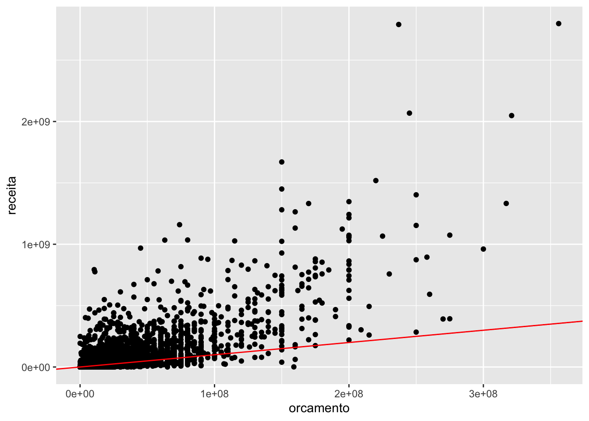
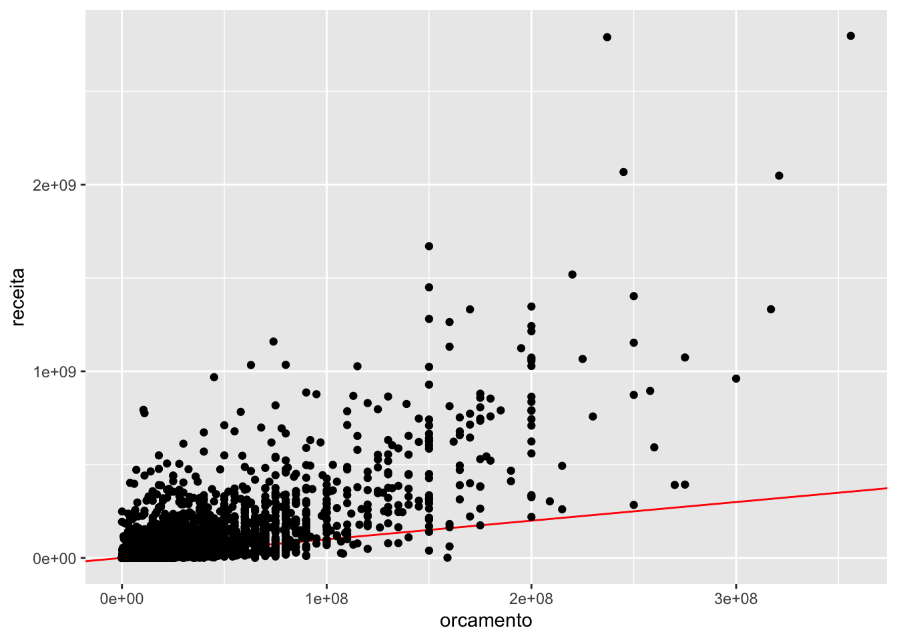
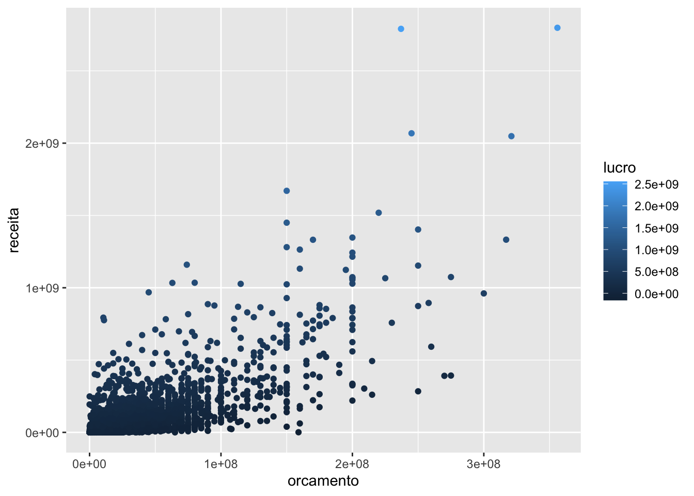
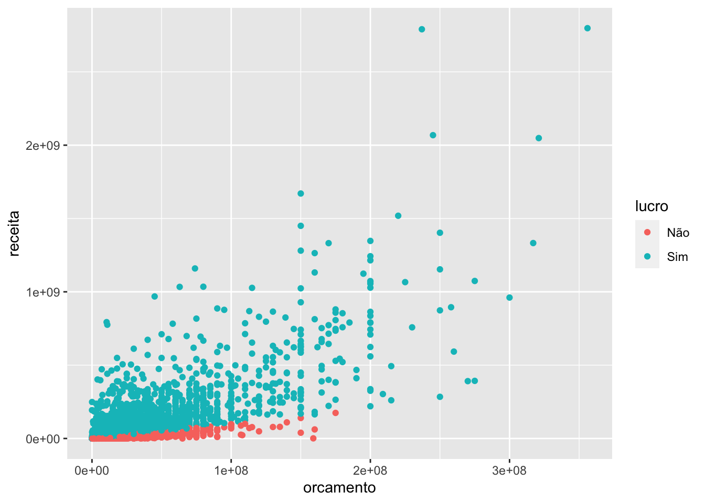
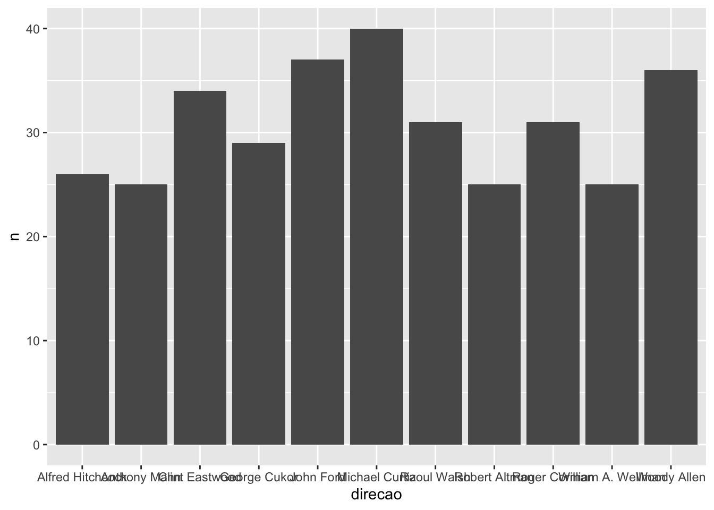
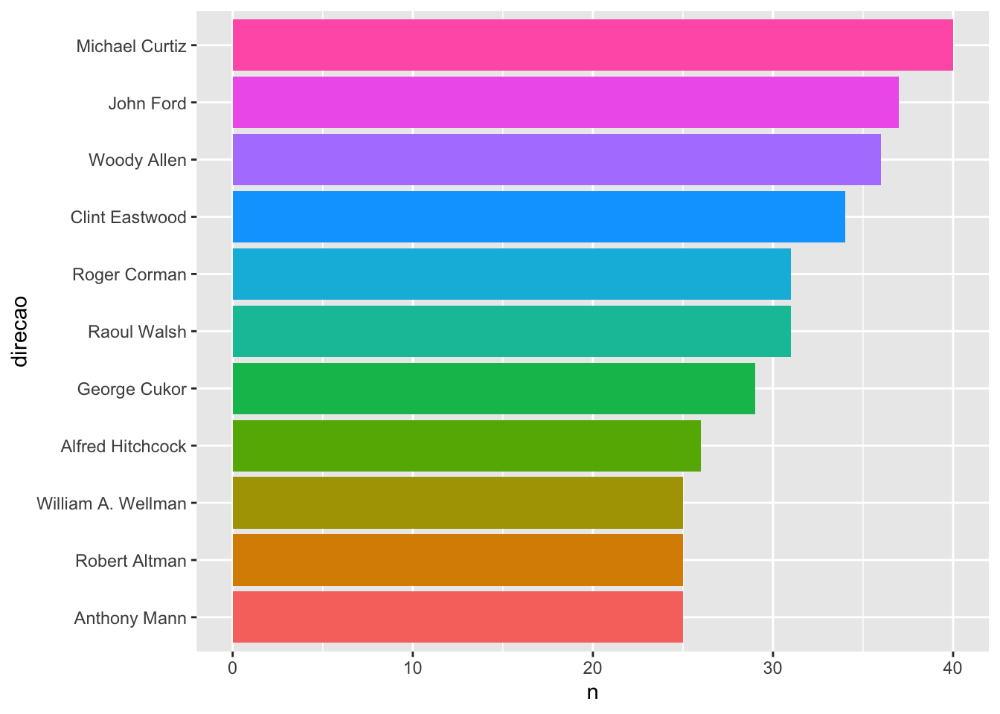
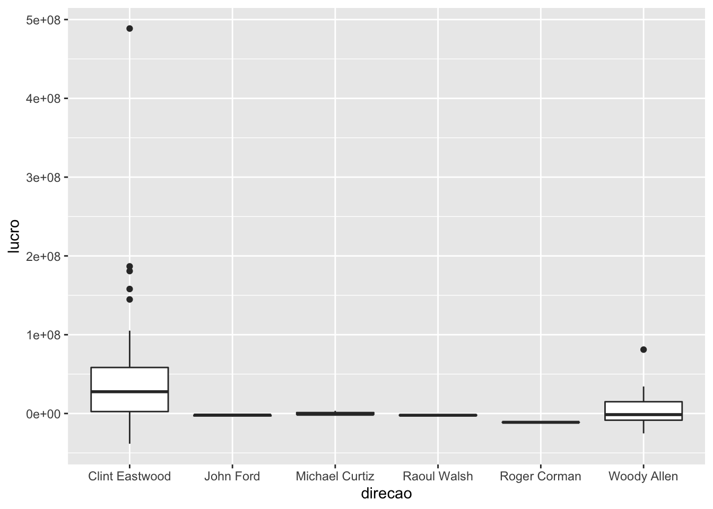
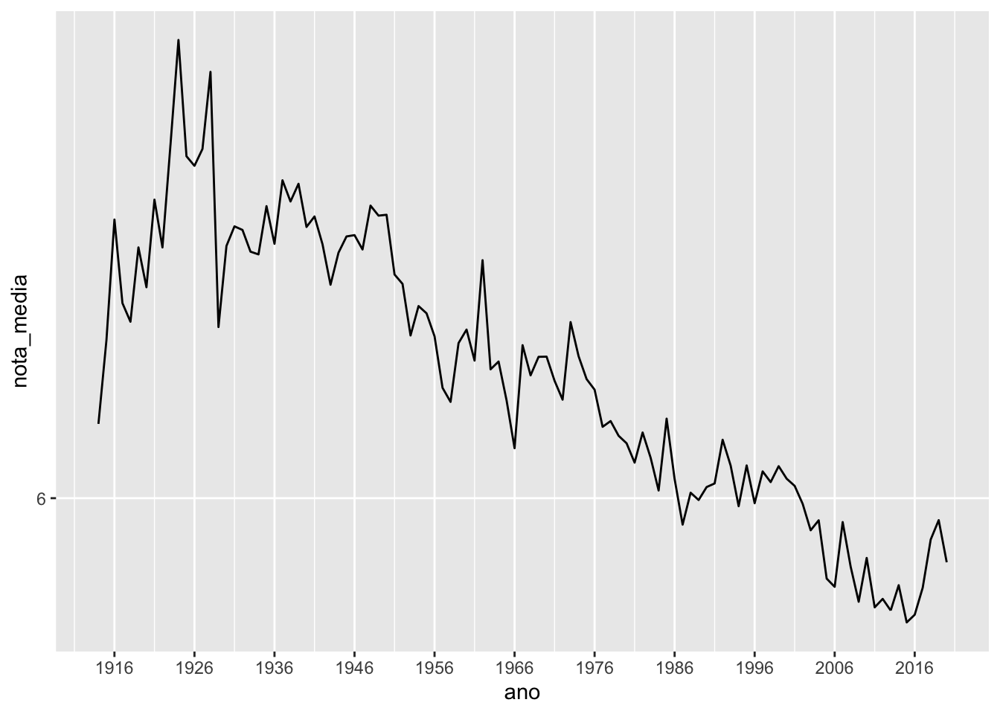
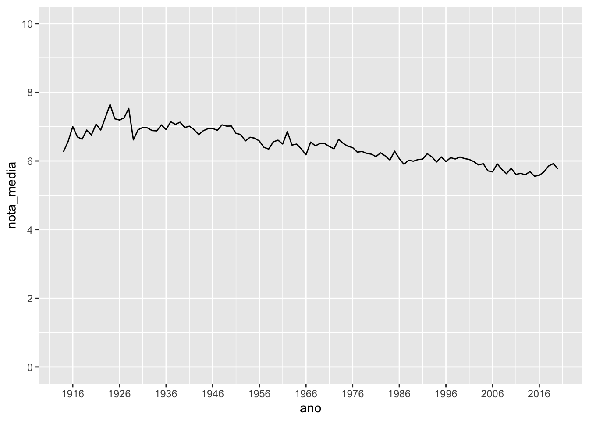

# Gráficos {#graficos}

Agora que já temos em mãos as ferramentas para importar, arrumar e transformar os nossos dados, é hora de começarmos a extrair informações deles. Seguindo o nosso bom e velho ciclo da ciência de dados, o próximo passo é a construção de *visualizações*.

A visualização dos dados é uma etapa importantíssima da análise estatística, pois é a partir dela que criamos a intuição necessária para escolher o teste ou modelo mais adequado para o nosso problema.

Visualizações podem ser uma simples medida resumo (frequência, média, variância, mínimo, máximo, ...), um conjunto dessas medidas organizadas em uma tabela ou a representação (de uma parte) dos dados em um gráfico. Nesse tópico, focaremos na construção de gráficos, uma tarefa que, apesar de nem sempre ser conceitualmente ou tecnicamente trivial, é muito facilitada pelas ferramentas disponíveis no R.

Mas, antes de mais nada, o que é um gráfico estatístico?

## O pacote ggplot2

A construção de gráficos no R foi revolucionada com a criação do pacote `ggplot2`, fruto da tese de doutorado de [Hadley Wickham](https://github.com/hadley). Essa revolução teve base na filosofia adotada por Hadley ao definir o que deveria ser um gráfico estatístico.

Mas será que podemos definir formalmente o que é um gráfico estatístico? Graças ao estatístico norte-americano Leland Wilkinson, a resposta é sim.

Em 2005, Leland publicou o livro [*The Grammar of graphics*](http://www.springer.com/statistics/computational+statistics/book/978-0-387-24544-7), uma fonte de princípios fundamentais para a construção de gráficos estatísticos. No livro, ele defende que um gráfico é o mapeamento dos dados a partir de atributos estéticos (posição, cor, forma, tamanho) de objetos geométricos (pontos, linhas, barras, caixas).

A partir dessa definição, Hadley escreveu [A Layered Grammar of Graphics](http://vita.had.co.nz/papers/layered-grammar.html), sugerindo que os principais aspectos de um gráfico (dados, sistema de coordenadas, rótulos e anotações) podiam ser divididos em camadas, construídas uma a uma na elaboração do gráfico. Essa é a essência do `ggplot2`.

Além de uma filosofia bem fundamentada, o `ggplot2` ainda traz outras vantagens em relação aos gráficos do r base:

- gráficos naturalmente mais bonitos;
- muito mais fácil deixar o gráfico do jeito que você quer;
- a estrutura padronizada das funções deixa o aprendizado muito mais intuitivo; e
- é possível criar uma imensa gama de gráficos com poucas linhas de código.

Para discutir os principais aspectos da construção de gráficos com o `ggplot2`, vamos continuar utilizando a base de filmes do IMDB apresentada na [seção de manipulação](https://www.curso-r.com/material/manipulacao/). Você pode baixá-la [clicando aqui](https://github.com/curso-r/site-v2/raw/master/content/material/importacao/data/imdb.rds).

Na próxima seção, vamos conhecer as principais funções do `ggplot2` e começar a construir nossos primeiros gráficos. Não se esqueça de instalar e carregar o pacote antes de rodar os exemplos.


```r
install.packages("ggplot2")
library(ggplot2)
```


### As camadas de um gráfico

No `ggplot2`, os gráficos são construídos camada por camada, sendo a primeira delas dada pela função `ggplot()` (repare que não tem o "2"). Essa função recebe um data frame e cria a camada base do gráfico. Se rodarmos apenas a função `ggplot()`, obteremos um painel em branco.


```r
imdb <- readr::read_rds("assets/data/imdb.rds")
ggplot(data = imdb)
```


Apesar de termos passados os dados para a função, precisamos especificar como as observações serão mapeadas nos aspectos visuais do gráfico e quais formas geométricas serão utilizadas para isso. Cada camada do gráfico representará um tipo de mapeamento ou personalização. 

O código abaixo constrói um gráfico de dispersão entre as variáveis orçamento e receita.


```r
ggplot(imdb) +
  geom_point(aes(x = orcamento, y = receita))
```

```
## Warning: Removed 733 rows containing missing values (geom_point).
```


Observe que:

- como vimos, a primeira camada é dada pela função `ggplot()` e recebe um data frame;
- a segunda camada é dada pela função `geom_point()`, especificando a forma **geom**étrica utilizada no mapeamento das observações;
- as camadas são unidas com um `+`;
- o mapeamento na função `geom_point()` recebe a função `aes()`, responsável por descrever como as variáveis serão mapeadas nos aspectos visuais da forma geométrica escolhida, no caso, pontos.

A combinação da função `ggplot()` e de uma ou mais funções `geom_()` definirá o tipo de gráfico gerado.

**Atenção!** As camadas dos gráficos são empilhadas utilizando-se o sinal `+`. Como a estrutura é muito parecida com uma pipe line, é comum trocarmos o `+` por um `%>%` no meio do código, resultando em erro.

Podemos acrescentar uma terceira camada ao gráfico, gerando a reta `y = x` para visualizarmos os filmes não se pagaram.


```r
ggplot(imdb) +
  geom_point(mapping = aes(x = orcamento, y = receita)) +
  geom_abline(intercept = 0, slope = 1, color = "red")
```

```
## Warning: Removed 733 rows containing missing values (geom_point).
```


Assim, os pontos abaixo da reta representam os filmes com orçamento maior que a receita, isto é, aqueles que deram prejuízo.

Em vez de utilizarmos a reta `y = x`, podemos pintar os pontos que deram lucro e prejuízo de cores diferentes.


```r
library(dplyr)
```

```
## 
## Attaching package: 'dplyr'
```

```
## The following objects are masked from 'package:stats':
## 
##     filter, lag
```

```
## The following objects are masked from 'package:base':
## 
##     intersect, setdiff, setequal, union
```

```r
imdb %>%
   mutate(
    lucro = receita - orcamento,
    lucro = ifelse(lucro <= 0, "Não", "Sim")
  ) %>% 
  filter(!is.na(lucro)) %>% 
  ggplot() + 
  geom_point(mapping = aes(x = orcamento, y = receita, color = lucro))
```



Aqui temos dois pontos importantes:

1. Unimos uma primeira parte de manipulação, utilizando as funções `filter()` e `mutate()`, com o código do gráfico. Essa etapa inicial de transformação da base é muito comum na construção de gráficos.

2. A cor dos pontos foi alterada por meio do atributo `color=`, dentro da função `aes()`.

Também podemos adicionar uma camada especificando os textos que representam cada atributo. Para isso, usamos a função `labs()`.


```r
imdb %>%
  mutate(
    lucro = receita - orcamento,
    lucro = ifelse(lucro <= 0, "Não", "Sim")
  )  %>%
  filter(!is.na(lucro)) %>% 
  ggplot() +
  geom_point(mapping = aes(x = orcamento, y = receita, color = lucro)) +
  labs(x = "Orçamento", y = "Arrecadação", color = "Houve lucro?") 
```



No ggplot, nós modificamos um gráfico alterando e acrescentando camadas. Agora que você já sabe como essa estrutura funciona, vamos estudar com mais atenção para que serve a função `aes()`.

### Atributos estéticos

O papel da função `aes()` (de *aesthetics*, estética em inglês) é indicar a relação entre os dados e cada aspecto visual do gráfico, como qual variável será representada no eixo x, qual será representada no eixo y, a cor e o tamanho dos componentes geométricos etc. Os aspectos que podem ou devem ser mapeados depende do tipo de gráfico que você está construindo.

Segue abaixo uma lista dos aspectos visuais mais utilizados:

- `color=`: altera a cor de formas que não têm área (pontos e retas).
- `fill=`: altera a cor de formas com área (barras, caixas, densidades, áreas).
- `size=`: altera o tamanho de formas.
- `type=`: altera o tipo da forma, geralmente usada para pontos.
- `linetype=`: altera o tipo da linha.

Um erro comum na hora de definir atributos estéticos de um gráfico é utilizar a função `aes()` de forma errada. Repare o que acontece quando tentamos definir diretamente a cor dos pontos dentro dessa função.


```r
ggplot(imdb) +
  geom_point(aes(x = orcamento, y = receita, color = "blue"))
```

```
## Warning: Removed 733 rows containing missing values (geom_point).
```



Estranho, não? O que aconteceu foi o seguinte: a função `aes()` espera uma variável para ser mapeada a cada atributo, então o valor `blue` é tratado como uma nova variável/coluna que tem essa string para todas as observações. Assim, todos pontos têm a mesma cor (vermelha, padrão do ggplot) pois pertencem todos à essa "categoria 'blue'".

No caso, o que gostaríamos é de ter pintado todos os pontos de azul. A forma certa de fazer isso é colocando o atributo `color=` fora da função `aes()`: 


```r
ggplot(imdb) +
  geom_point(aes(x = orcamento, y = receita), color = "blue")
```

```
## Warning: Removed 733 rows containing missing values (geom_point).
```



Vamos agora explorar novos gráficos a partir da família de funções `geom_()`.

### Formas geométricas

Os *geoms* definem qual forma geométrica será utilizada para a visualização das observações. Como já vimos, a função `geom_point()` gera gráficos de dispersão
transformando pares $(x,y)$ em pontos. Veja a seguir outros *geoms* bastante utilizados:

- `geom_line` - para linhas definidas por pares (x,y).
- `geom_abline` - para retas definidas por um intercepto e uma inclinação.
- `geom_hline` - para retas horizontais.
- `geom_bar` - para barras.
- `geom_histogram` - para histogramas.
- `geom_boxplot` - para boxplots.
- `geom_density` - para densidades.
- `geom_area` - para áreas.

Veja a seguir como é fácil gerar diversos gráficos diferentes utilizando a mesma estrutura do gráfico de dispersão acima:

#### Linhas


```r
imdb %>% 
  filter(diretor == "Steven Spielberg") %>%
  group_by(ano) %>% 
  summarise(nota_media = mean(nota_imdb, na.rm = TRUE)) %>% 
  ggplot() +
  geom_line(aes(x = ano, y = nota_media))
```

```
## `summarise()` ungrouping output (override with `.groups` argument)
```


#### Histograma


```r
ggplot(imdb) + 
  geom_histogram(aes(x = orcamento), color = "black", fill = "white")
```

```
## `stat_bin()` using `bins = 30`. Pick better value with `binwidth`.
```

```
## Warning: Removed 298 rows containing non-finite values (stat_bin).
```


Enquanto o gráfico e dispersão demandam o mapeamento das posições x e y, o histograma requer apenas a posição x, já que, pela definição do gráfico, o eixo mostra a frequência de cada classe.

#### Boxplot


```r
imdb %>% 
  filter(diretor %in% c("Steven Spielberg", "Quentin Tarantino", "Woody Allen")) %>%
ggplot() + 
  geom_boxplot(aes(x = diretor, y = receita))
```

```
## Warning: Removed 4 rows containing non-finite values (stat_boxplot).
```


Repare que o boxplot pede uma variável categórica no eixo x.

#### Gráfico de barras

Há duas formas de fazer um gráfico de barras. A primeira é utilizando a função `geom_bar()`, quando queremos que a função conte a frequência de cada categoria.


```r
imdb %>% 
  filter(ano > 1990) %>% 
  ggplot() +
  geom_bar(aes(x = ano), color = "black", fill = "light blue")
```


Ou a função `geom_col()`, quando já temos essas contagens.


```r
imdb %>% 
  count(diretor) %>% 
  filter(!is.na(diretor)) %>% 
  dplyr::top_n(5, n) %>%
  ggplot() +
  geom_bar(
    aes(x = diretor, y = n), 
    stat = "identity", 
    color = "red", 
    fill = "pink"
  )
```


### Juntando gráficos

No ggplot, temos várias formas de juntar gráficos. Vamos apresentar a seguir as principais.

#### Vários geoms no mesmo gráfico

Podemos acrescentar vários geoms em um mesmo gráfico, apenas adicionando novas camadas. No código abaixo, construímos o gráfico de dispersão da receita pelo orçamento dos filmes, acrescentando também uma reta de tendência aos pontos.


```r
ggplot(imdb) +
  geom_point(aes(x = orcamento, y = receita)) +
  geom_smooth(aes(x = orcamento, y = receita), se = FALSE, method = "lm")
```

```
## `geom_smooth()` using formula 'y ~ x'
```

```
## Warning: Removed 733 rows containing non-finite values (stat_smooth).
```

```
## Warning: Removed 733 rows containing missing values (geom_point).
```


Quando estamos usando mais de um geom, podemos economizar código especificando o `aes()` diretamente na função `ggplot()`. O mapeamento então é distribuído para todos os geoms do gráfico.


```r
ggplot(imdb, aes(x = orcamento, y = receita)) +
  geom_point() +
  geom_smooth(se = FALSE, method = "lm")
```

```
## `geom_smooth()` using formula 'y ~ x'
```

```
## Warning: Removed 733 rows containing non-finite values (stat_smooth).
```

```
## Warning: Removed 733 rows containing missing values (geom_point).
```



Mas você ainda pode usar o `aes()` dentro dos geoms para especificar mapeamentos específicos.


```r
ggplot(imdb, aes(x = orcamento, y = receita)) +
  geom_point(aes(color = ano)) +
  geom_smooth(color = "black", se = FALSE, method = "lm")
```

```
## `geom_smooth()` using formula 'y ~ x'
```

```
## Warning: Removed 733 rows containing non-finite values (stat_smooth).
```

```
## Warning: Removed 733 rows containing missing values (geom_point).
```


#### Replicando um gráfico para cada categoria de uma variável

Uma funcionalidade muito útil do `ggplot2` é a possibilidade de usar `facets` para replicar um gráfico para cada categoria de uma variável.


```r
imdb %>%
  filter(classificacao %in% c("Livre", "A partir de 13 anos")) %>%
  ggplot() +
  geom_point(aes(x = orcamento, y = nota_imdb)) +
  facet_wrap(~classificacao, nrow = 2)
```

```
## Warning: Removed 85 rows containing missing values (geom_point).
```


Repare que usamos uma fórmula para dizer à função qual variável vamos utilizar para quebrar o gráfico. Podemos especificar se queremos os gráficos lado a lado ou um embaixo do outro pelos argumentos `nrow=` e `ncol=`.


```r
imdb %>%
  filter(classificacao %in% c("Livre", "A partir de 13 anos")) %>%
  ggplot() +
  geom_point(aes(x = orcamento, y = nota_imdb)) +
  facet_wrap(~classificacao, ncol = 2)
```

```
## Warning: Removed 85 rows containing missing values (geom_point).
```



**Exercício relâmpago!** Pesquise o que faz a função `facet_grid()`.

#### Juntando gráficos diferentes

Diversos outros pacotes trazem ferramentas super úteis para trabalharmos com o `ggplot2`. Um deles é o pacote `patchwork`. Após carregá-lo, podemos juntar dois gráficos com um simples `+`.


```r
# Instale antes de carregar
# devtools::install_github("thomasp85/patchwork")

library(patchwork)

p1 <- imdb %>% 
  filter(diretor == "Steven Spielberg") %>%
  group_by(ano) %>% 
  summarise(nota_media = mean(nota_imdb, na.rm = TRUE)) %>% 
  ggplot() +
  geom_line(aes(x = ano, y = nota_media))
```

```
## `summarise()` ungrouping output (override with `.groups` argument)
```

```r
p2 <- imdb %>% 
  mutate(lucro = receita - orcamento) %>% 
  filter(diretor == "Steven Spielberg") %>% 
  ggplot() +
  geom_histogram(
    aes(x = lucro),
    fill = "lightblue", 
    color = "darkblue", 
    binwidth = 100000000
  )

p1 + p2
```

```
## Warning: Removed 1 rows containing non-finite values (stat_bin).
```


### Personalizando

Como exemplo de personalização de um gráfico com o `ggplot2`, vamos partir de um simples boxplot e fazer diversas alterações no seu visual. 

O gráfico inicial é construído da seguinte forma:


```r
imdb %>% 
  filter(diretor %in% c("Steven Spielberg", "Quentin Tarantino", "Woody Allen")) %>%
  ggplot() + 
  geom_boxplot(aes(x = diretor, y = receita, fill = diretor))
```

```
## Warning: Removed 4 rows containing non-finite values (stat_boxplot).
```


#### Removendo totalmente a legenda

Existem diversas maneiras para remover a legenda de um gráfico no `ggplot2`. A forma mais simples é usar o argumento `show.legend = FALSE` dentro do geom.


```r
imdb %>% 
  filter(diretor %in% c("Steven Spielberg", "Quentin Tarantino", "Woody Allen")) %>%
  ggplot() + 
  geom_boxplot(aes(x = diretor, y = receita, fill = diretor), show.legend = FALSE)
```

```
## Warning: Removed 4 rows containing non-finite values (stat_boxplot).
```


#### Mexendo na escala

Para mudar qualquer aspecto estético da escala, usamos a família de funções `scale_()`. No caso, vamos deixar a escala do eixo y no formato de dólares.


```r
imdb %>% 
  filter(diretor %in% c("Steven Spielberg", "Quentin Tarantino", "Woody Allen")) %>%
  ggplot() + 
  geom_boxplot(aes(x = diretor, y = receita, fill = diretor), show.legend = FALSE) +
  scale_y_continuous(labels = scales::dollar)
```

```
## Warning: Removed 4 rows containing non-finite values (stat_boxplot).
```



Repare que para cada tipo de atributo, existe uma função `scale_()` correspondente.

#### Alterando a ordem das categorias

Para alterar a ordem que as categorias de uma variável aparecem no gráfico, podemos utilizar o argumento `breaks=` da função `scale_()`.


```r
imdb %>% 
  filter(diretor %in% c("Steven Spielberg", "Quentin Tarantino", "Woody Allen")) %>%
  ggplot() + 
  geom_boxplot(aes(x = diretor, y = receita, fill = diretor), show.legend = FALSE) +
  scale_y_continuous(labels = scales::dollar) +
  scale_x_discrete(
    limits = c("Woody Allen", "Quentin Tarantino", "Steven Spielberg")
  )
```

```
## Warning: Removed 4 rows containing non-finite values (stat_boxplot).
```


Também é possível fazer isso usando as funções do pacote `forcats`, apresentado com detalhes [aqui](https://www.curso-r.com/material/forcats/).

#### Escolhendo cores manualmente

O pacote`ggplot2` utiliza uma palheta de cores padrão. Se você quiser especificar as suas próprias cores, faça isso utilizando a função `scale_()`.


```r
imdb %>% 
  filter(diretor %in% c("Steven Spielberg", "Quentin Tarantino", "Woody Allen")) %>%
  ggplot() + 
  geom_boxplot(aes(x = diretor, y = receita, fill = diretor), show.legend = FALSE) +
  scale_y_continuous(labels = scales::dollar) +
  scale_x_discrete(
    limits = c("Woody Allen", "Quentin Tarantino", "Steven Spielberg")
  ) +
  scale_fill_manual(values = c("#999999", "#E69F00", "#56B4E9"))
```

```
## Warning: Removed 4 rows containing non-finite values (stat_boxplot).
```


#### Modificando o visual do gráfico

Podemos mudar aspectos visuais do gráfico, como fontes, cores e estilos dos textos, grids, marcações, cor do fundo etc, a partir da função `theme()`. No exemplo abaixo, eliminamos o texto e as marcações do eixo $x$.


```r
imdb %>% 
  filter(diretor %in% c("Steven Spielberg", "Quentin Tarantino", "Woody Allen")) %>%
  ggplot() + 
  geom_boxplot(aes(x = diretor, y = receita, fill = diretor)) +
  scale_y_continuous(labels = scales::dollar) +
  scale_x_discrete(
    limits = c("Woody Allen", "Quentin Tarantino", "Steven Spielberg")
  ) +
  scale_fill_manual(values = c("#999999", "#E69F00", "#56B4E9")) +
  theme(axis.text.x = element_blank(), axis.ticks.x = element_blank())
```

```
## Warning: Removed 4 rows containing non-finite values (stat_boxplot).
```


#### Modificando a posição da legenda

É possível controlar a posição da legenda facilmente escolhendo uma das posições:  `left`, `right`, `top` e `bottom`.


```r
imdb %>% 
  filter(diretor %in% c("Steven Spielberg", "Quentin Tarantino", "Woody Allen")) %>%
  ggplot() + 
  geom_boxplot(aes(x = diretor, y = receita, fill = diretor)) +
  scale_y_continuous(labels = scales::dollar) +
  scale_x_discrete(
    limits = c("Woody Allen", "Quentin Tarantino", "Steven Spielberg")
  ) +
  scale_fill_manual(values = c("#999999", "#E69F00", "#56B4E9")) +
  theme(
    axis.text.x = element_blank(), 
    axis.ticks.x = element_blank(),
    legend.position = "bottom"
  )
```

```
## Warning: Removed 4 rows containing non-finite values (stat_boxplot).
```



Existem alguns temas já prontos disponíveis no `ggplot2`. Veja alguns exemplos.


```r
imdb %>% 
  filter(diretor %in% c("Steven Spielberg", "Quentin Tarantino", "Woody Allen")) %>%
  ggplot() + 
  geom_boxplot(aes(x = diretor, y = receita, fill = diretor), show.legend = FALSE) +
  scale_y_continuous(labels = scales::dollar) +
  scale_x_discrete(
    limits = c("Woody Allen", "Quentin Tarantino", "Steven Spielberg")
  ) +
  scale_fill_manual(values = c("#999999", "#E69F00", "#56B4E9")) +
  theme_bw()
```

```
## Warning: Removed 4 rows containing non-finite values (stat_boxplot).
```



```r
imdb %>% 
  filter(diretor %in% c("Steven Spielberg", "Quentin Tarantino", "Woody Allen")) %>%
  ggplot() + 
  geom_boxplot(aes(x = diretor, y = receita, fill = diretor), show.legend = FALSE) +
  scale_y_continuous(labels = scales::dollar) +
  scale_x_discrete(
    limits = c("Woody Allen", "Quentin Tarantino", "Steven Spielberg")
  ) +
  scale_fill_manual(values = c("#999999", "#E69F00", "#56B4E9")) +
  theme_minimal()
```

```
## Warning: Removed 4 rows containing non-finite values (stat_boxplot).
```


```r
imdb %>% 
  filter(diretor %in% c("Steven Spielberg", "Quentin Tarantino", "Woody Allen")) %>%
  ggplot() + 
  geom_boxplot(aes(x = diretor, y = receita, fill = diretor), show.legend = FALSE) +
  scale_y_continuous(labels = scales::dollar) +
  scale_x_discrete(
    limits = c("Woody Allen", "Quentin Tarantino", "Steven Spielberg")
  ) +
  scale_fill_manual(values = c("#999999", "#E69F00", "#56B4E9")) +
  theme_dark()
```

```
## Warning: Removed 4 rows containing non-finite values (stat_boxplot).
```


#### Acrescentando título

Para acrescentar um título ao seu gráfico, utilize a função `ggtitle()`.


```r
imdb %>% 
  filter(diretor %in% c("Steven Spielberg", "Quentin Tarantino", "Woody Allen")) %>%
  ggplot() + 
  geom_boxplot(aes(x = diretor, y = receita, fill = diretor), show.legend = FALSE) +
  scale_y_continuous(labels = scales::dollar) +
  scale_x_discrete(
    limits = c("Woody Allen", "Quentin Tarantino", "Steven Spielberg")
  ) +
  scale_fill_manual(values = c("#999999", "#E69F00", "#56B4E9")) +
  theme_minimal() +
  ggtitle("Meu boxplot bonitão")
```

```
## Warning: Removed 4 rows containing non-finite values (stat_boxplot).
```


### Onde continuar estudando?

O pacote `ggplot2` tem incontáveis funcionalidades, principalmente na hora de personalizar o seu gráfico. Abordamos aqui apenas algumas poucas delas. Para continuar aprendendo, sugerimos as seguintes referências:

- O [capítulo de visualizações do R4DS](https://r4ds.had.co.nz/data-visualisation.html) é um ótimo material para fixar os conceitos básicos.

- O [capítulo de gráficos do livro R Cookbook](http://www.cookbook-r.com/Graphs/) é um bom material de consulta para relembrar velhos truques e descobrir novas formas de personalizar seu gráfico.

- O site [ggplot2 extensions](https://exts.ggplot2.tidyverse.org/) tem uma galeria com diversos pacotes que deixam o ggplot2 bem mais poderoso, indo de novos geoms até animações.


```r
library(ggridges)

imdb %>%
  filter(ano > 2005) %>% 
  mutate(ano = as.factor(ano)) %>% 
  ggplot(aes(y = ano, x = receita, fill = ano)) +
  geom_density_ridges(na.rm = TRUE, show.legend = FALSE)
```

```
## Picking joint bandwidth of 17300000
```


### Exercícios

**1.** O que tem de errado no código abaixo? Por que os pontos não ficaram azuis?


```r
ggplot(data = mpg) + 
  geom_point(mapping = aes(x = displ, y = hwy, color = "blue"))
```


**2.** Mapeie uma variável contínua para uma cor, tamanho e forma. Como essas formas
estéticas se comportam diferente para variáveis categóricas vs contínuas?

**3.** O que acontece se você rodar `ggplot(data = mtcars)`?


**4.** Utilizando o `mtcars`, faça um gráfico de dispersão de `mpg` por `qsec`.

**5.** Utilizando o `mtcars`, o que acontece se você fizer um gráfico de dispersão de `vs` por `mpg`? Por que o gráfico não é útil?


## O pacote plotly

## Extensões do ggplot2
