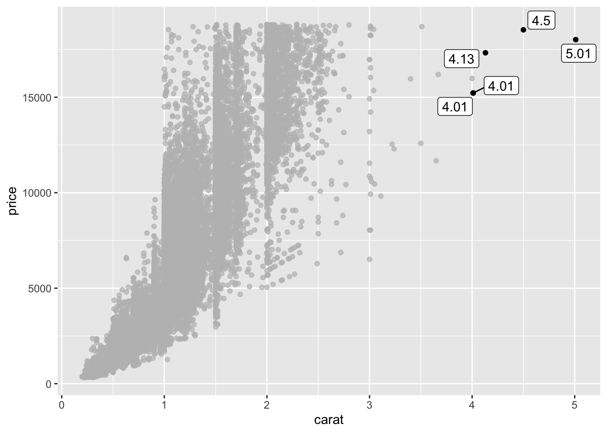

## Extensões do pacote ggplot2

O site [ggplot2 extensions](https://exts.ggplot2.tidyverse.org/) tem uma galeria com diversos pacotes que deixam o ggplot2 bem mais poderoso, indo de novos geoms até animações.


### ggpridges


```r
library(ggridges)

imdb %>%
  filter(ano > 2005) %>% 
  mutate(ano = as.factor(ano)) %>% 
  ggplot(aes(y = ano, x = receita, fill = ano)) +
  geom_density_ridges(na.rm = TRUE, show.legend = FALSE)
```

```
## Picking joint bandwidth of 17300000
```


