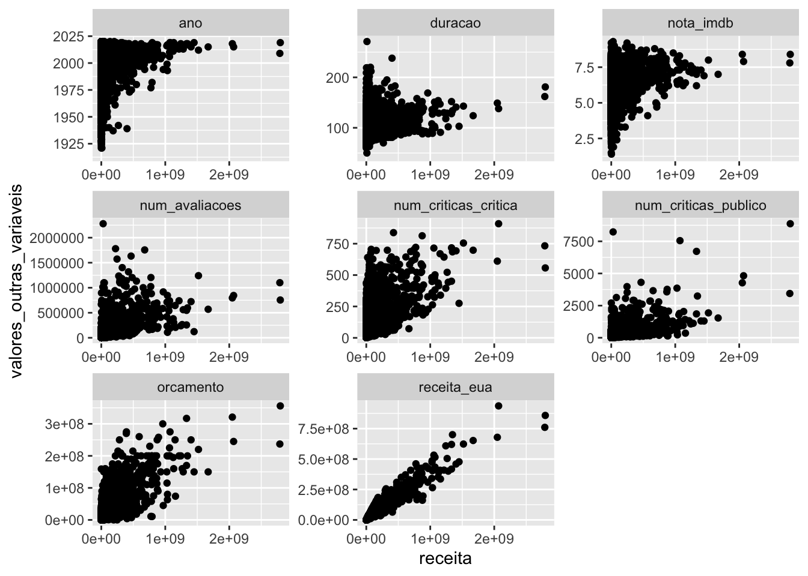

## O pacote tidyr


```r
library(dplyr)
library(tidyr)
library(ggplot2)
```


**1.** Crie 5 novas colunas de idiomas na base imdb, cada uma com um dos idiomas contidos na coluna `idioma`. Para os filmes com menos de 5 idiomas, substitua os valores `NA` pela string "Inexistente".


```r
imdb <- readr::read_rds("imdb.rds")
```


```r
imdb %>%
  separate(
    col = idioma,
    into = c("idioma1", "idioma2", "idioma3", "idioma4", "idioma5"),
    sep = ","
  ) %>% 
  mutate(across(starts_with("idioma"), ~ replace_na(., "Inexistente"))) %>% 
  select(titulo, starts_with("idioma"))
## Warning: Expected 5 pieces. Additional pieces discarded in 37 rows [139, 1323,
## 1489, 1837, 2562, 2929, 3444, 4491, 4652, 4770, 4982, 5038, 5192, 5223, 5483,
## 5546, 6251, 6297, 6455, 6962, ...].
## Warning: Expected 5 pieces. Missing pieces filled with `NA` in 11171 rows [1, 2,
## 3, 4, 5, 6, 7, 8, 9, 10, 11, 12, 13, 14, 15, 16, 17, 18, 19, 20, ...].
## # A tibble: 11,340 × 6
##    titulo                            idioma1 idioma2     idioma3 idioma4 idioma5
##    <chr>                             <chr>   <chr>       <chr>   <chr>   <chr>  
##  1 Broadcast News                    English " Spanish"  " Fren… " Germ… Inexis…
##  2 Murder, He Says                   English "Inexisten… "Inexi… "Inexi… Inexis…
##  3 Me, Myself & Irene                English " German"   "Inexi… "Inexi… Inexis…
##  4 Never Give a Sucker an Even Break English "Inexisten… "Inexi… "Inexi… Inexis…
##  5 Adam & Steve                      English "Inexisten… "Inexi… "Inexi… Inexis…
##  6 Henry Gamble's Birthday Party     English "Inexisten… "Inexi… "Inexi… Inexis…
##  7 No Way Out                        English " Russian"  "Inexi… "Inexi… Inexis…
##  8 Welcome Home, Roscoe Jenkins      English "Inexisten… "Inexi… "Inexi… Inexis…
##  9 Some Kind of Wonderful            English "Inexisten… "Inexi… "Inexi… Inexis…
## 10 The Family That Preys             English "Inexisten… "Inexi… "Inexi… Inexis…
## # … with 11,330 more rows
```


---

**2.** Substitua os "????" no código abaixo para criar uma tabela do lucro médio dos filmes ao longo dos anos de 2000 a 2020, com cada ano sendo uma coluna da base.


```r
imdb %>%
  mutate(lucro = receita - orcamento) %>%
  filter(ano %in% 2000:2020) %>%
  group_by(ano) %>%
  summarise(lucro_medio = mean(lucro, na.rm = TRUE)) %>%
  pivot_wider(names_from = ano, values_from = lucro_medio)
## # A tibble: 1 × 21
##     `2000` `2001` `2002` `2003` `2004` `2005` `2006` `2007` `2008` `2009` `2010`
##      <dbl>  <dbl>  <dbl>  <dbl>  <dbl>  <dbl>  <dbl>  <dbl>  <dbl>  <dbl>  <dbl>
## 1   3.49e7 3.16e7 4.47e7 5.18e7 7.17e7 4.09e7 3.70e7 5.30e7 4.98e7 6.66e7 6.41e7
## # … with 10 more variables: `2011` <dbl>, `2012` <dbl>, `2013` <dbl>,
## #   `2014` <dbl>, `2015` <dbl>, `2016` <dbl>, `2017` <dbl>, `2018` <dbl>,
## #   `2019` <dbl>, `2020` <dbl>
```


---


Para os exercícios 3, 4 e 5, vamos utilize a base `pokemon`, disponível no pacote `basesCursoR`.


```r
install.packages("remotes")
remotes::install_github("curso-r/basesCursoR")
pokemon <- basesCursoR::pegar_base("pokemon")
```


**3.** Utilize a função `unite()` para juntar as duas colunas de tipo em uma única coluna na base pokemon.


```r
pokemon %>% 
  unite("tipo", c(tipo_1, tipo_2), sep = ", ", na.rm = TRUE) %>% 
  select(pokemon, tipo)
## # A tibble: 949 × 2
##    pokemon    tipo           
##    <chr>      <chr>          
##  1 bulbasaur  grama, venenoso
##  2 ivysaur    grama, venenoso
##  3 venusaur   grama, venenoso
##  4 charmander fogo           
##  5 charmeleon fogo           
##  6 charizard  fogo, voador   
##  7 squirtle   água           
##  8 wartortle  água           
##  9 blastoise  água           
## 10 caterpie   inseto         
## # … with 939 more rows
```


---


**4.** Utilize a função `unite()` para juntar as três colunas de cor em uma única coluna na base pokemon. Faça isso sem remover as 3 colunas originais.


```r
pokemon %>% 
  unite("cor", c(cor_1, cor_2, cor_final), sep = ", ", na.rm = TRUE, remove = FALSE) %>% 
  select(pokemon, cor, cor_1, cor_2, cor_final)
## # A tibble: 949 × 5
##    pokemon    cor                       cor_1   cor_2   cor_final
##    <chr>      <chr>                     <chr>   <chr>   <chr>    
##  1 bulbasaur  #78C850, #A040A0, #81A763 #78C850 #A040A0 #81A763  
##  2 ivysaur    #78C850, #A040A0, #81A763 #78C850 #A040A0 #81A763  
##  3 venusaur   #78C850, #A040A0, #81A763 #78C850 #A040A0 #81A763  
##  4 charmander #F08030                   #F08030 <NA>    <NA>     
##  5 charmeleon #F08030                   #F08030 <NA>    <NA>     
##  6 charizard  #F08030, #A890F0, #DE835E #F08030 #A890F0 #DE835E  
##  7 squirtle   #6890F0                   #6890F0 <NA>    <NA>     
##  8 wartortle  #6890F0                   #6890F0 <NA>    <NA>     
##  9 blastoise  #6890F0                   #6890F0 <NA>    <NA>     
## 10 caterpie   #A8B820                   #A8B820 <NA>    <NA>     
## # … with 939 more rows
```

---


**5.** Utilizando a base `pokemon`, resolva os itens abaixo:

**a.** Utilize a função `pivot_longer()` para criar uma única coluna de tipo na base pokemon.


```r
tipos_pokemon <- pokemon %>% 
  pivot_longer(cols = c(tipo_1, tipo_2), names_to = "ordem_tipo", values_to = "tipo")

select(tipos_pokemon, pokemon, ordem_tipo, tipo)
## # A tibble: 1,898 × 3
##    pokemon    ordem_tipo tipo    
##    <chr>      <chr>      <chr>   
##  1 bulbasaur  tipo_1     grama   
##  2 bulbasaur  tipo_2     venenoso
##  3 ivysaur    tipo_1     grama   
##  4 ivysaur    tipo_2     venenoso
##  5 venusaur   tipo_1     grama   
##  6 venusaur   tipo_2     venenoso
##  7 charmander tipo_1     fogo    
##  8 charmander tipo_2     <NA>    
##  9 charmeleon tipo_1     fogo    
## 10 charmeleon tipo_2     <NA>    
## # … with 1,888 more rows
```


**b.** Utilize a base criada no item (a) e escreva um código para descobrir qual o tipo mais frequente na base, independentemente se ele é primário (tipo_1) ou secundário (tipo_2).


```r
tipos_pokemon %>% 
  drop_na(tipo) %>% 
  count(tipo, sort = TRUE) %>% 
  slice(1)
## # A tibble: 1 × 2
##   tipo      n
##   <chr> <int>
## 1 água    144
```


---


**6.** DESAFIO! Escreva uma função que receba uma base qualquer e o nome de uma coluna numérica dessa base e retorne uma figura com um gráfico de dispersão da coluna escolhida contra cada uma das outras variáveis numéricas da base.


```r
gerar_grafico <- function(base, var) {
  base %>%
    select(where(is.numeric)) %>%
    pivot_longer(
      cols = -all_of(var),
      names_to = "outras_variaveis",
      values_to = "valores_outras_variaveis"
    ) %>%
    ggplot() +
    geom_point(aes(x = .data[[var]], valores_outras_variaveis)) +
    facet_wrap( ~ outras_variaveis, scales = "free")
}

# exemplos de uso:
gerar_grafico(pokemon, "ataque")
## Warning: Removed 147 rows containing missing values (geom_point).
```


```r
gerar_grafico(imdb, "receita")
## Warning: Removed 42502 rows containing missing values (geom_point).
```



