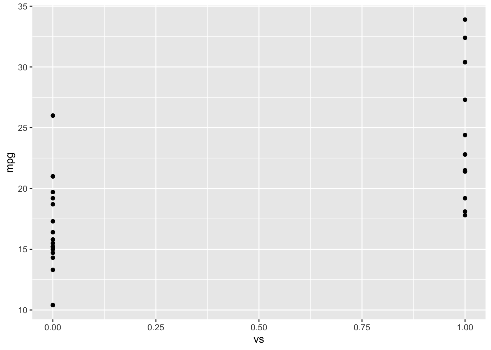
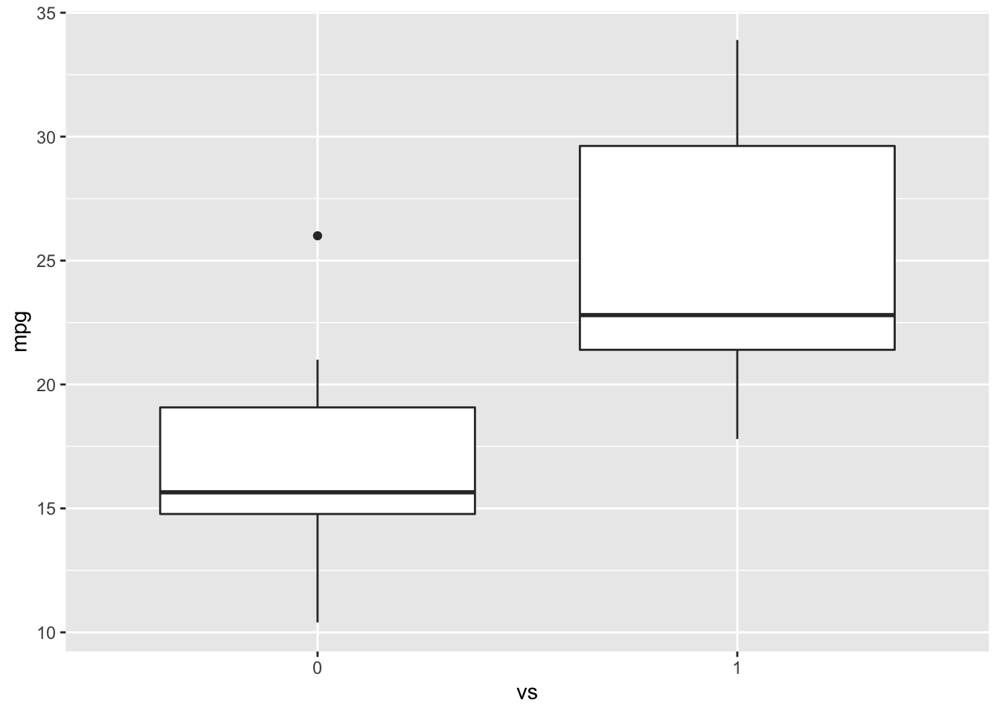
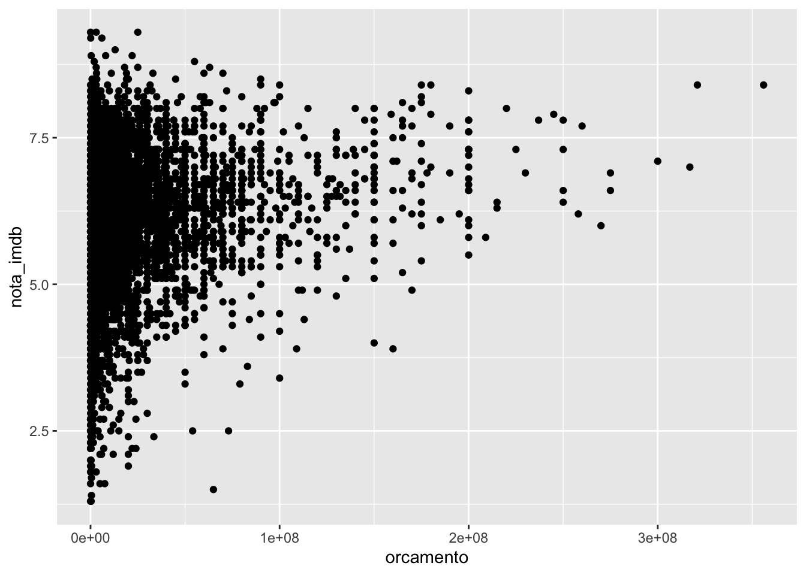
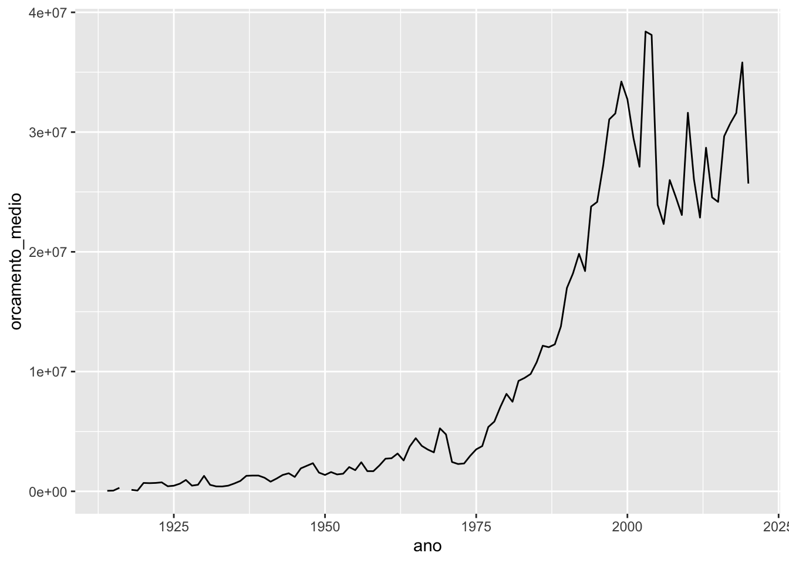
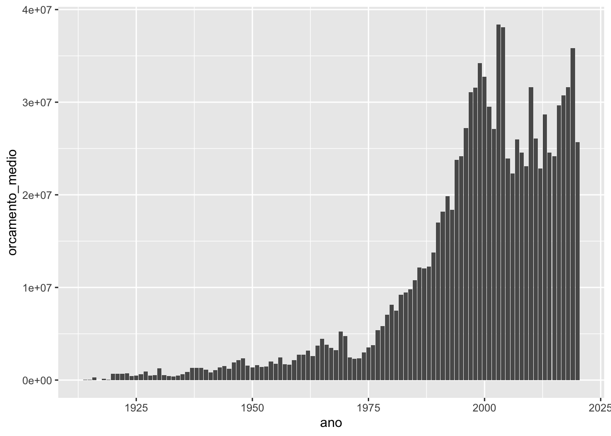

## O pacote ggplot2


**1.** O que acontece quando rodamos o código `ggplot(data = mtcars)`?

*A função `ggplot()` cria o nosso canvas, um quadro em branco onde vamos colocar todas as outras camadas do gráfico. Dentro do R, isso corresponde a uma lista com as informações necessárias para a criação do gráfico. Cada camada adicionada ao ggplot adiciona mais informações nessa lista. No exemplo acima, como passamos a base `mtcars` para a função `ggplot()`, a base mtcars é guardada dentro dessa lista, e será utilizada quando mapearmos variáveis ao gráfico.*

---

**2.** O que tem de errado no código abaixo? Por que os pontos não ficaram azuis?


```r
ggplot(data = mpg) + 
  geom_point(mapping = aes(x = displ, y = hwy, color = "blue"))
```


*Quando queremos definir o valor de um atributo estético, fazemos isso fora da função `aes()`. Usamos a função `aes()` apenas para mapear variáveis aos atributos estéticos do gráfico. O correto seria:*


```r
ggplot(data = mpg) + 
  geom_point(mapping = aes(x = displ, y = hwy), color = "blue")
```


---

**3.** Mapeie uma variável contínua para a cor, o tamanho e a forma de um gráfico de pontos. Como esses atributos estéticos se comportam diferente para variáveis categóricas vs contínuas?


```r
# Cor (var continua)
mtcars %>% 
  ggplot() +
  geom_point(aes(y = mpg, x = wt, color = carb))
```


```r
# Cor (var discreta)
mtcars %>% 
  mutate(carb = as.character(carb)) %>% 
  ggplot() +
  geom_point(aes(y = mpg, x = wt, color = carb))
```


```r
# Tamanho (var continua)
mtcars %>% 
  ggplot() +
  geom_point(aes(y = mpg, x = wt, size = carb))
```


```r
# Tamanho (var discreta)
mtcars %>% 
  mutate(carb = as.character(carb)) %>% 
  ggplot() +
  geom_point(aes(y = mpg, x = wt, size = carb))
```

```
## Warning: Using size for a discrete variable is not advised.
```


```r
# Forma (var continua)
# Não pode ser utilizada com variável contínua
mtcars %>% 
  ggplot() +
  geom_point(aes(y = mpg, x = wt, shape = carb))
```

```
## Error: A continuous variable can not be mapped to shape
```


```r
# Forma (var discreta)
mtcars %>% 
  mutate(carb = as.character(carb)) %>%
  ggplot() +
  geom_point(aes(y = mpg, x = wt, shape = carb))
```


---

**4.** Utilizando o `mtcars`, faça um gráfico de dispersão de `mpg` por `qsec`.


```r
mtcars %>% 
  ggplot() +
  geom_point(aes(y = mpg, x = qsec))
```


---

**5.** Utilizando o `mtcars`, o que acontece se você fizer um gráfico de dispersão de `vs` por `mpg`? Qual gráfico seria melhor para representar esses dados?


```r
mtcars %>% 
  ggplot(aes(y = mpg, x = vs)) +
  geom_point()
```


*Como os pontos ficam sobrepostos, um boxplot seria mais interessante nesse caso pois nos dá uma visão melhor da distribuição da variável `mpg` para cada categoria da variável `vs`.*


```r
mtcars %>% 
  mutate(vs = as.character(vs)) %>% 
  ggplot(aes(y = mpg, x = vs)) +
  geom_boxplot()
```



---

Para resolver os exercícios a seguir, utilize a base `imdb`.

**6.** Crie um gráfico de dispersão da nota do imdb pelo orçamento.


```r
imdb %>% 
  ggplot(aes(y = nota_imdb, x = orcamento)) +
  geom_point()
```

```
## Warning: Removed 298 rows containing missing values (geom_point).
```




---

**7.** Faça um gráfico de linhas do orçamento médio dos filmes ao longo dos anos.


```r
imdb %>% 
  group_by(ano) %>% 
  summarise(orcamento_medio = mean(orcamento, na.rm = TRUE)) %>% 
  ggplot(aes(x = ano, y = orcamento_medio)) +
  geom_line()
```

```
## Warning: Removed 1 row(s) containing missing values (geom_path).
```



---

**8.** Transforme o gráfico do exercício anterior em um gráfico de barras.


```r
imdb %>% 
  group_by(ano) %>% 
  summarise(orcamento_medio = mean(orcamento, na.rm = TRUE)) %>% 
  ggplot(aes(x = ano, y = orcamento_medio)) +
  geom_col()
```

```
## Warning: Removed 1 rows containing missing values (position_stack).
```




---

**9.** Descubra quais são os 5 atores que mais aparecem na coluna ator_1 e faça um boxplot do lucro dos filmes desses atores.


```r
atores <- imdb %>% 
  count(ator_1) %>% 
  top_n(5, n) %>% 
  pull(ator_1)

imdb %>% 
  filter(ator_1 %in% atores) %>% 
  mutate(lucro = receita - orcamento) %>% 
  ggplot(aes(x = ator_1, y = lucro)) +
  geom_boxplot()
```

```
## Warning: Removed 6 rows containing non-finite values (stat_boxplot).
```




---

**10.** Com base no código abaixo, resolva os itens a seguir.


```r
diretores <- c(
  "Steven Spielberg", 
  "Quentin Tarantino", 
  "Christopher Nolan",
  "Martin Scorsese"
)

imdb %>% 
  filter(diretor %in% diretores) %>% 
  group_by(ano, diretor) %>% 
  summarise(nota_media = mean(nota_imdb, na.rm = TRUE)) %>% 
  ggplot(aes(x = ano, y = nota_media)) +
  geom_point() +
  geom_line() +
  facet_wrap(vars(diretor))
```

```
## `summarise()` has grouped output by 'ano'. You can override using the `.groups` argument.
```


**a.** Analisando o gráfico gerado, descreva o que a função `facet_wrap()` faz.

*A função `facet_wrap()` replica o gráfico especificado para cada categoria de uma coluna.*

**.b** Utilize os argumentos nrow e `ncol` da função `facet_wrap()` para colocar os quatro gráficos em uma única coluna.


```r
imdb %>%
  filter(diretor %in% diretores) %>%
  group_by(ano, diretor) %>%
  summarise(nota_media = mean(nota_imdb, na.rm = TRUE)) %>%
  ggplot(aes(x = ano, y = nota_media)) +
  geom_point() +
  geom_line() +
  facet_wrap(vars(diretor), ncol = 1)
```

```
## `summarise()` has grouped output by 'ano'. You can override using the `.groups` argument.
```


---

**11.** Resovla os itens a seguir para fazer um gráfico de barras da frequência de filmes com nota maior que 8 ao longo dos anos.

**a.** Crie uma nova coluna na base IMDB indicando se a nota de um filme é maior que 8 ou não.


```r
imdb_notas_8 <- imdb %>%
  mutate(nota_maior_que_8 = ifelse(nota_imdb > 8, "Nota maior que 8", "Nota menor que 8"))
```


**b.** b. Utilizando a coluna criada em (a) crie uma tabela com o número anual de filmes com nota maior 8.


```r
tabela <- imdb_notas_8 %>%
  filter(nota_maior_que_8 == "Nota maior que 8") %>%
  count(ano)

tabela
```

```
## # A tibble: 65 x 2
##      ano     n
##  * <dbl> <int>
##  1  1925     1
##  2  1934     1
##  3  1936     1
##  4  1939     3
##  5  1940     1
##  6  1942     1
##  7  1946     2
##  8  1952     2
##  9  1954     1
## 10  1957     1
## # … with 55 more rows
```


**c.** Utilize a tabela criada em (b) para fazer um gráfico de barras do número de filmes com nota maior que 8 ao longo dos anos.


```r
tabela %>%
  ggplot(aes(x = ano, y = n)) +
  geom_col()
```

```
## Warning: Removed 1 rows containing missing values (position_stack).
```


