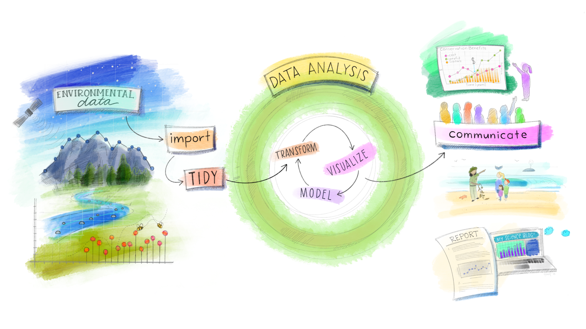

--- 
title: "Ciência de Dados em R"
author: "Curso-R"
date: "Última atualização: 09/09/2020"
github-repo: "curso-r/livro-material"
site: bookdown::bookdown_site
documentclass: book
cover-image: "assets/img/logo.png"
# bibliography: [assets/book.bib, packages.bib]
biblio-style: apalike
link-citations: yes
favicon: "assets/img/favicon.ico"
description: "Livro com os tutoriais e material dos cursos sobre ciência de dados da Curso-R."
---

# Sobre {-}

Este livro está em **construção** e em **revisão aberta**. Fique à vontade para corrigir qualquer tipo de erro que encontrar no nosso material.

Todo o conteúdo deste livro é gratuito e aberto.

Autores:

- [Athos Damiani](https://twitter.com/athos_damiani)
- [Caio Lente](https://lente.dev/)
- [Daniel Falbel](https://twitter.com/dfalbel)
- [Fernando Correa](https://twitter.com/Azeloc)
- [Julio Tricenti](https://twitter.com/jtrecenti)
- [Nicole Luduvice](http://linkedin.com/in/nicole-luduvice-9a6379197)
- [William Amorim](https://twitter.com/Williamorim89)

#### A Curso-R {-}

A Curso-R é o braço de Educação da R6 Consultoria, uma empresa de treinamentos e consultoria em Ciência de Dados e linguagem de programação R. Surgimos em 2015, com cursos de introdução ao R no Programa de Cursos de Verão do Instituto de Matemática e Estatística da Universidade de São Paulo (IME-USP).

- Conheça os nossos cursos: https://www.curso-r.com/cursos/

- Conheça o nosso blog: https://www.curso-r.com/blog/

- Conheça o restante do nosso material: https://www.curso-r.com/material/

- Saiba mais sobre a Curso-R: https://www.curso-r.com/sobre/

#### O R e o RStudio {-}

O R é uma linguagem de programação *open source* para análise de dados que fornece uma grande variedade de ferramentas estatísticas e gráficas.

O RStudio é o ambiente de desenvolvimento mais utilizado para programação em R. Ele possui diversas ferramentas que facilitam a utilização do R para se fazer análise de dados.

#### Este livro {-}

Este livro tem como objetivo guiar o leitor por todas as etapas de uma análise de dados, utilizando o R como ferramenta. Nele, você encontrará ferramentas para importar, arrumar, manipular, visualizar e modelar bases de dados. E também ferramentas para comunicar e automatizar resultados.

(\#fig:allison-env)Arte por Allison Horst (@allison_horst). Veja nas Referências onde encontrá-la.

#### Comunidade {-}

Seja bem-vinda(o) ao #rstats.

Compartilhe seu desenvolvimento! Poste seus avaços nas redes sociais, compartilhe suas dúvidas em fóruns, procure e participe dos grupos e comunidades de programadores.

- Comunidade RLadies: https://benubah.github.io/r-community-explorer/rladies.html

- Fórum de dúvidas da Curso-R: https://discourse.curso-r.com/

- Grupo de divulgação da Curso-R no Telegram: https://t.me/r6cursor

- Grupo R Brasil no Telegram: https://t.me/rbrasiloficial

(\#fig:allison-twitter)Arte por Allison Horst (@allison_horst). Veja nas Referências onde encontrá-la.

